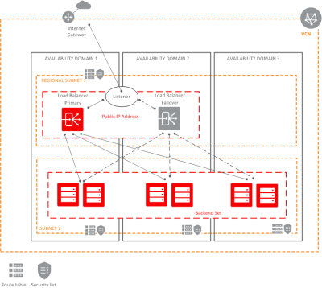

# Introduction

## About this Workshop

This workshop involves multiple components of the Oracle Cloud, including the OCI Load Balancing Service, Networking, Compute, and Oracle Cloud Shell.

Estimated time: 60 minutes

### Objectives

In this lab, you will:

- Generate an SSH keys using Cloud Shell
- Deploy HA application using Load Balancers

### Prerequisites

- An Oracle Cloud Account - Please view this workshop's LiveLabs landing page to see which environments are supported

> **Note:** If you have a **Free Trial** account, when your Free Trial expires your account will be converted to an **Always Free** account. You will not be able to conduct Free Tier workshops unless the Always Free environment is available. **[Click here for the Free Tier FAQ page.](https://www.oracle.com/cloud/free/faq.html)**

### About Load Balancers

The Oracle Cloud Infrastructure Load Balancing service provides automated traffic distribution from one entry point to multiple servers reachable from your virtual cloud network (VCN). The service offers a load balancer with your choice of a public or private IP address and provisioned bandwidth.

A load balancer improves resource utilization, facilitates scaling, and helps ensure high availability. You can configure multiple load balancing policies and application-specific health checks to ensure that the load balancer directs traffic only to healthy instances. The load balancer can reduce your maintenance window by draining traffic from an unhealthy application server before you remove it from service for maintenance.

To accept traffic from the internet, you create a public load balancer. The service assigns it a public IP address that serves as the entry point for incoming traffic. You can associate the public IP address with a friendly DNS name through any DNS vendor.

Watch the video below for a demo of public Load Balancers on OCI.

> **Note:** Screens and flow may have changed.

### About Virtual Compute Networks

The Networking service uses virtual versions of traditional network components you might already be familiar.

A virtual, private network that you set up in Oracle data centers closely resembles a traditional network, with firewall rules and specific types of communication gateways that you can choose to use. A VCN resides in a single Oracle Cloud Infrastructure region and covers a single, contiguous IPv4 CIDR block of your choice.

A public IP address is an IPv4 address that is reachable from the internet. If a resource in your tenancy needs to be directly reachable from the internet, it must have a public IP address. You will be assigning your compute instance a public IP address.

Watch the video below for a discussion on VCNs on Oracle Cloud.

### About Oracle Compute Instances

Oracle Cloud Infrastructure Compute lets you provision and manage compute hosts, known as instances . You can launch instances as needed to meet your compute and application requirements. After you launch an instance, you can access it securely from your compute or the Oracle Cloud Shell, restart it, attach and detach volumes, and terminate it when you're done with it.

### About Oracle Cloud Shell

Oracle Cloud Infrastructure(OCI) Cloud Shell is a web browser-based terminal accessible from the Oracle Cloud Console. Cloud Shell is free to use (within monthly tenancy limits), and provides access to a Linux shell, with a pre-authenticated Oracle Cloud Infrastructure CLI, a pre-authenticated Ansible installation, and other useful tools for following Oracle Cloud Infrastructure service tutorials and labs. Cloud Shell is a feature available to all OCI users, accessible from the Console. Your Cloud Shell will appear in the Oracle Cloud Console as a persistent frame of the console and will stay active as you navigate to different console pages.

## Learn More

- [OCI Training](https://cloud.oracle.com/en_US/iaas/training)

- [Familiarity with OCI console](https://docs.us-phoenix-1.oraclecloud.com/Content/GSG/Concepts/console.htm)

- [Overview of Networking](https://docs.us-phoenix-1.oraclecloud.com/Content/Network/Concepts/overview.htm)

- [Familiarity with Compartments](https://docs.us-phoenix-1.oraclecloud.com/Content/GSG/Concepts/concepts.htm)

- [Connecting to a Compute Instance](https://docs.us-phoenix-1.oraclecloud.com/Content/Compute/Tasks/accessinginstance.htm)

*Please proceed to the next lab.*

## Acknowledgements

- **Author** - Kay Malcolm, Director, Product Management
- **Adapted by** -  Yaisah Granillo, Cloud Solution Engineer, NA Cloud
- **Contributors** - Anoosha Pilli, Product Manager, Oracle Database, Jaden McElvey, Technical Lead - Oracle LiveLabs Intern
- **Last Updated By/Date** - Anoosha Pilli, November 2021

