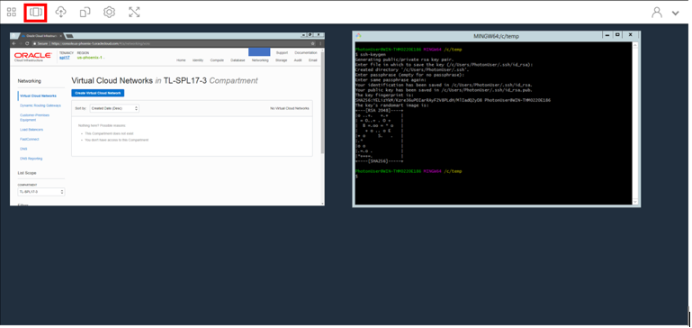
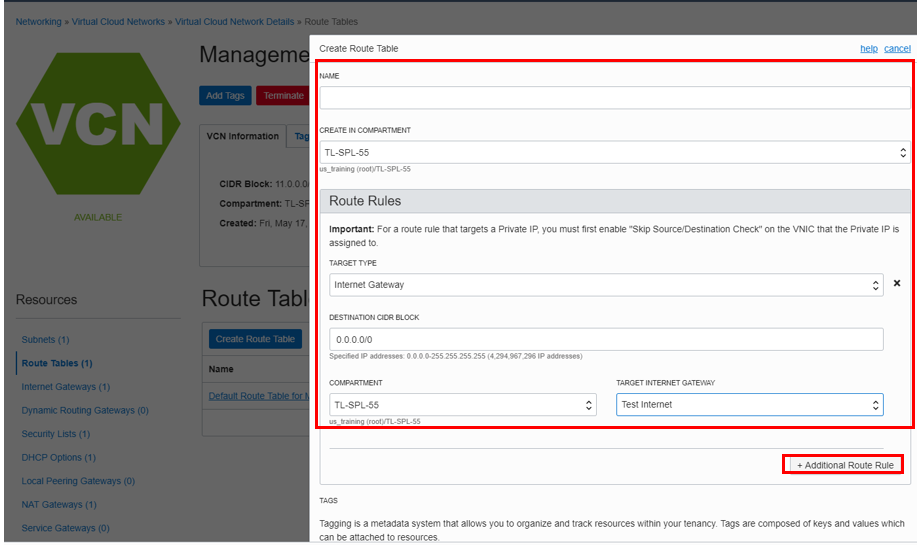
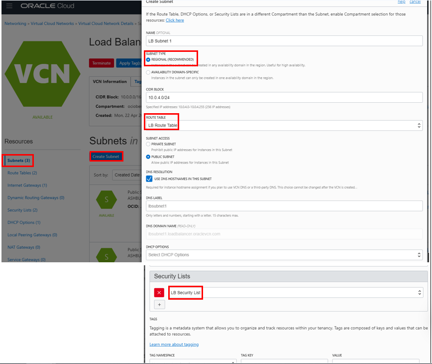
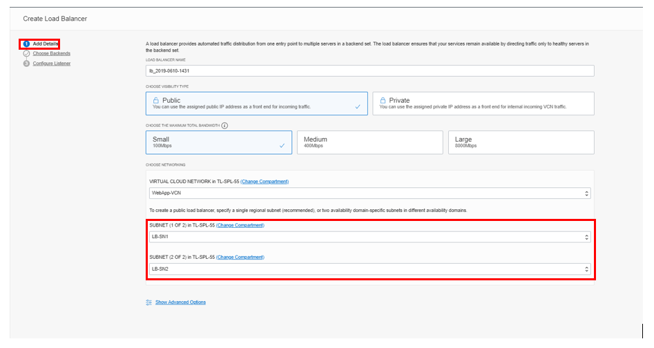
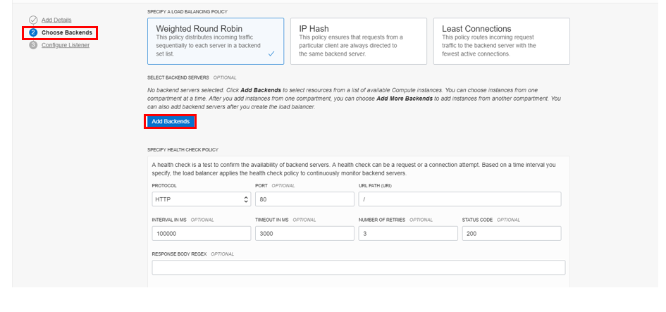
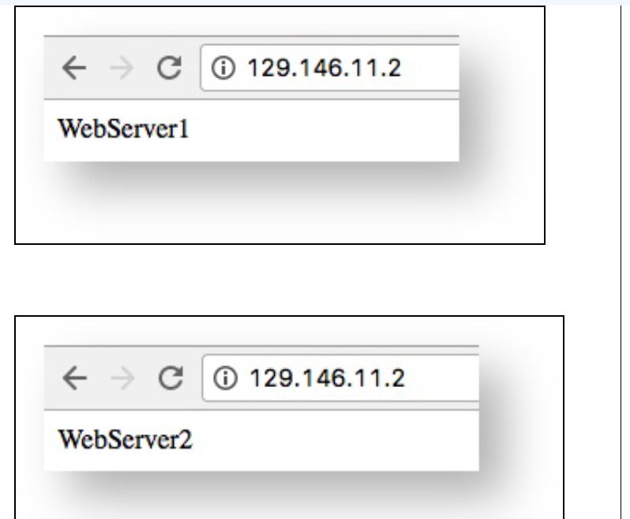
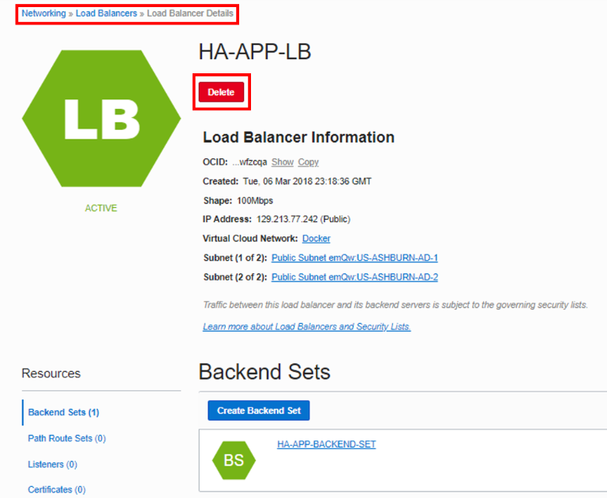
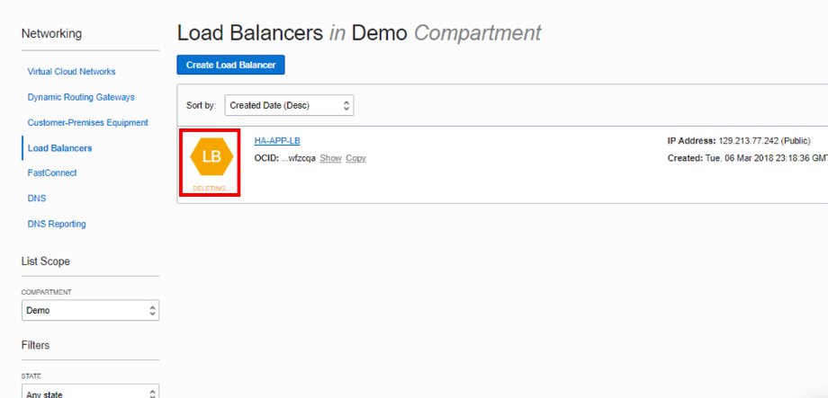

# Deploy HA Application using Load Balancers

## Introduction

In this lab you will deploy web servers on two compute instances in Oracle Cloud Infrastructure (OCI), configured in High Availability mode by using a Load Balancer.

Estimated time: 1 hour

### OCI Load Balancing Service

The Load Balancing Service provides automated traffic distribution from one entry point to multiple servers within your Virtual Cloud Network (VCN). The service offers a Public load balancer with a public IP address, provisioned bandwidth, and high availability. The Load Balancing Service provisions the public IP address across two subnets within a VCN to ensure accessibility even during an Availability Domain outage.

### Objectives
- Create a Virtual Cloud Network (VCN)
- Create an OCI Compute Instance
- Modify VCN
- Create Load Balancer

### Prerequisites
Lab 1: Login to Oracle Cloud
Lab 2: Create SSH Keys - Cloud Shell

### Recommended Resources

1. [OCI Training](https://cloud.oracle.com/en_US/iaas/training)
2. [Familiarity with OCI console](https://docs.us-phoenix-1.oraclecloud.com/Content/GSG/Concepts/console.htm)
3. [Overview of Networking](https://docs.us-phoenix-1.oraclecloud.com/Content/Network/Concepts/overview.htm)
4. [Familiarity with Compartments](https://docs.us-phoenix-1.oraclecloud.com/Content/GSG/Concepts/concepts.htm)
5. [Connecting to a compute instance](https://docs.us-phoenix-1.oraclecloud.com/Content/Compute/Tasks/accessinginstance.htm)

## Task 1: Create a Virtual Cloud Network

1. From the OCI Services menu, click **Virtual Cloud Networks** under Networking. Select the compartment assigned to you from drop down menu on left part of the screen under Networking and Click **Start VCN Wizard**

    **NOTE:** Ensure the correct Compartment is selected under COMPARTMENT list

2. Choose **VCN with Internet Connectivity** and click **Start VCN Wizard**

3. Fill out the dialog box:

      - **VCN NAME**: Provide a name
      - **COMPARTMENT**: Ensure your compartment is selected
      - **VCN CIDR BLOCK**: Provide a CIDR block (10.0.0.0/16)
      - **PUBLIC SUBNET CIDR BLOCK**: Provide a CIDR block (10.0.1.0/24)
      - **PRIVATE SUBNET CIDR BLOCK**: Provide a CIDR block (10.0.2.0/24)
      - Click **Next**

4. Verify all the information and  Click **Create**.

5. This will create a VCN with followig components.

    *VCN, Public subnet, Private subnet, Internet gateway (IG), NAT gateway (NAT), Service gateway (SG)*

6. Click **View Virtual Cloud Network** to display your VCN details.


## Task 2: Create two compute instances and install web server

1. Switch to the OCI console. From OCI services menu, Click **Instances** under **Compute**.

2. Click **Create Instance**. Fill out the dialog box:

      - **Name your instance**: Enter a name
      - **Choose an operating system or image source**: For the image, we recommend using the Latest Oracle Linux available.
      - **Availability Domain**: Select availability domain
      - **Instance Type**: Select Virtual Machine
      - **Instance Shape**: Select VM shape

      **Under Configure Networking**
      - **Virtual cloud network compartment**: Select your compartment
      - **Virtual cloud network**: Choose the VCN
      - **Subnet Compartment:** Choose your compartment.
      - **Subnet:** Choose the Public Subnet under **Public Subnets**
      - **Use network security groups to control traffic** : Leave un-checked
      - **Assign a public IP address**: Check this option

     

    - **Boot Volume:** Leave the default
    - **Add SSH Keys:** Choose 'Paste SSH Keys' and paste the Public Key you created in Cloud Shell earlier. *Ensure when you are pasting that you paste one line*

3. Click **Create**.

    **NOTE:** If 'Service limit' error is displayed choose a different shape from VM.Standard2.1, VM.Standard.E2.1, VM.Standard1.1, VM.Standard.B1.1  OR choose a different AD.

4.  Repeat steps 1 - 3 to launch a **second** Compute instance and note down its public IP address.

5.  Wait for Instances to be in **Running** state.
6.  Launch the Cloud Shell if it is not running.  When running, enter the command below:

    ```
    <copy>
    cd .ssh
    </copy>
    ```
7.  Enter **ls** and verify your key file exists.

8.  Ssh to  the **first** compute instance. Enter command:

    ```
    <copy>
    bash
    ssh -i <<sshkeyname>> opc@<PUBLIC_IP_OF_COMPUTE_1>
    </copy>
    ```
    **NOTE:** User name is ‘opc’.

    **HINT:** If 'Permission denied error' is seen, ensure you are using '-i' in the ssh command. You MUST type the command, do NOT copy and paste ssh command

9.  Enter 'Yes' when prompted for security message.

     

10. Verify opc@`<COMPUTE_INSTANCE_NAME>` appears on the prompt.

11. Open up a second tab of Oracle Cloud.  Launch a second cloud shell window using the steps above and connect via SSH into the **second** Compute instance (using the same steps as above)


     

    *HINT: Ensure to use the IP address of the second Compute instance in the SSH command.*

12. Go back to the 1st tab cloud shell for the first Compute instance and install a Web server, using the commands below:

    ```
    <copy>
    sudo yum -y install httpd </copy>(Install Apache HTTP Server)

    ```

    ```
    <copy>
    sudo firewall-cmd --permanent  --add-port=80/tcp
    </copy>
    ```

    (Open port 80 on the firewall to allow http and https traffic).

    **NOTE:** --add-port flag has no spaces.

    ```
    <copy>
    sudo firewall-cmd --reload
    </copy>
    ```
    (Reload the firewall to activate the rules).

    ```
    <copy>
    sudo systemctl start httpd
    </copy>
    ```
    (Start the web server).

    ```
    <copy>
    sudo su
    </copy>
    ```
    (Change user privilege)

    ```
    <copy>
    echo 'WebServer1' >>/var/www/html/index.html
    </copy>
    ```
    (create index.html file. The content of the file will be displayed when the web server is accessed.)

13. Bring up the SSH session for the second Compute instance and repeat commands:

    ```
    <copy>
    sudo yum -y install httpd (Install Apache HTTP Server)
    </copy>
    ```

    ```
    <copy>
    sudo firewall-cmd --permanent  --add-port=80/tcp
    </copy>
    ```
    (Open port 80 on the firewall to allow http and https traffic).

    **NOTE:** --add-port flag has no spaces.

    ```
    <copy>
    sudo firewall-cmd --reload
    </copy>
    ```
    (Reload the firewall to activate the rules).

    ```
    <copy>
    sudo systemctl start httpd
    </copy>
    ```
    (Start the web server).

    ```
    <copy>
    sudo su
    </copy>
    ```
    (Change user privilege)

    ```
    <copy>
    echo 'WebServer2' >>/var/www/html/index.html
    </copy>
    ```
    (create index.html file. The content of the file will be displayed when the web server is accessed.)

14. Switch back to OCI Console window.

We now have two Compute instances with Web servers installed and a basis index.html file. Before we create the load balancer we will need to create a new security list, route table and subnet that theload balancer will use.

Load balancers should always reside in different subnets than your application instances. This allows you to keep your application instances secured in private subnets, while allowing public Internet traffic to the load balancers in the public subnets.

## Task 3: Create Security List Route table and additional subnet

In this section we will create a new security list. This security list will be used by the load balancer (that will be created later on). This will ensure all traffic to the two web servers is routed properly.

1. From OCI Services menu, Click **Virtual Cloud Network** under **Networking**. This displays the list of VCNs in current compartment.

    **HINT:** If there are multiple Networks, scroll down to locate the one you just created.

2. Click your VCN name, then **Security Lists** and then **Create Security List** (You will be creating a new security list).

      - CREATE IN COMPARTMENT: Select the compartment assigned to you (if not already selected).
      - SECURITY LIST Name: Specify a name (for example, LB Security List).
      - Click **Create Security List**

3. Verify the New Security List got created.

    **We now have a Security List that will be used by the load balancer. Next we will create a Route table that will be used by two new subnets (that will be used by the load balancer, once created).**

4. Click your Virtual Cloud Network name.

5. Click **Route Tables** (You will be creating a new route table), then **Create Route Table**. Fill out the dialog box:

    - Name: Enter a name (for example, LB Route Table).
    - Create in Compartment: This field defaults to your current compartment. Make sure correct Compartment is selected.

    **Click +Additional Route Rules**


    - Target Type: Select **Internet Gateway**
    - Destination CIDR Block: 0.0.0.0/0
    - Compartment: Make sure the correct Compartment is selected
    - Target Internet Gateway: Select the Internet Gateway for your VCN.

        

6. Click **Create Route Table**.

7. Ensure the new route table appears in the list (Under Create Route Table).

    **We now have a route table that allows all traffic. Next we will attach this route table to two new subnets that we will create (This subnet will be used by the Load Balancer).**

8. Create First subnet:

    **First Subnet:** (Your Virtual Cloud Network should be visible in OCI Console window.)

9. Click **Subnets**.

10. Click **Create Subnet**. Fill out the dialog box:

    - **Name**: Enter a name (for example, LB-Subnet-1).
    - **Subnet Type**: Regional

     **(When using a regional subnet, OCI selects two AD's. If you would like to control which two AD's are used, you would want to create individual AD-speicfic subnets)**

    - **CIDR Block**: Enter 10.0.4.0/24
    - **Route Table**: Select the Route Table you created earlier.
    - **Subnet access**: select Public Subnet.
    - **DHCP Options**: Select the default.
    - **Security Lists**: Select the Security List you created earlier.

11. Leave all other options as default, Click **Create Subnet**.

     


## Task 4: Create Load Balancer and update Security List

When you create a load balancer, you choose its shape (size) and you specify subnet (created earlier) from different Availability Domains. This ensures that the load balancer is highly available and is only active in one subnet at a time.

1. From OCI Services menu, Click **Load Balancers** under **Networking**.

2. Click **Create Load Balancer**. Fill out the dialog box:

    **Under Add Details**

    - **LOAD BALANCER NAME**: Enter a name for your load balancer.
    - **CHOOSE VISIBILITY TYPE**: Public
    - **CHOOSE THE MAXIMUM TOTAL BANDWIDTH**: Small, 100Mbps. (This specifies the bandwidth of the load balancer.)

    **NOTE:** Shape cannot be changed later.


    - **VIRTUAL CLOUD NETWORK**: Choose your Virtual Cloud Network
    - **SUBNET**: Choose the Regional Subnet we created (10.0.4.0 in this lab)

     

    **Under Choose Backends:**


    - **SPECIFY A LOAD BALANCING POLICY**: Weighted Round Robin
    - Click **Add Backend** and choose the two backend compute instance created earlier

    

    ***Under SPECIFY HEALTH CHECK POLICY***

    - PROTOCOL: HTTP
    - Port: Enter 80
    - URL PATH (URI): /

    ***Leave other options as default***

    **Under Configure Listener**

    - SPECIFY THE TYPE OF TRAFFIC YOUR LISTENER HANDLES: HTTP
    - SPECIFY THE PORT YOUR LISTENER MONITORS FOR INGRESS TRAFFIC: 80

    ***Leave other options as default***

3. Click **Create Load Balancer**.

4. Wait for the load balancer to become active and then note down it’s Public IP address.

    **We now have a load balancer that will manage the subnet we created earlier.**

5. From OCI Services menu, Click **Virtual Cloud Network** under Networking. Locate the VCN you created.

6. Click  VCN name to display VCN detail page.

7. Click **Security Lists**, and locate the Load Balancer Security List created earlier.

8. Click Load Balancer Security List created earlier, Click **Add Ingress Rule**.
Click **+Additional Ingress Rule** and enter the following ingress rule; Ensure to leave STATELESS flag un-checked.

      - **Source Type**: CIDR
      - **Source CIDR**: Enter 0.0.0.0/0.
      - **IP Protocol**: Select TCP.
      - **Source Port Range**: All.
      - **Destination Port Range**: Enter 80 (the listener port).

9. Click **Add Ingress Rule**.

10. Click **Egress Rule** under Resources. Click **Add Egress Rule**,  Click **+Additional Egress Rule** and enter the following Egress rule; Ensure to leave STATELESS flag un-checked.

    - **Destination Type**: CIDR
    - **Destination CIDR**: 0.0.0.0/0
    - **IP Protocol**: Select TCP.
    - **Destination Port Range**: All.

11. Click **Add Egress Rule**.

12. Click **Security Lists**, and locate the Default Security List of the VCN Click **Add Ingress Rule**.  Click **+Additional Ingress Rule** and Add below 2 Rules for Ingress; Ensure to leave STATELESS flag un-checked.:

    **First Rule**

    - Source Type: CIDR
    - Source CIDR: 10.0.4.0/24
    - IP Protocol: Select TCP.
    - Source Port Range: All
    - Destination Port Range: 80

13. Click **+Additional Ingress Rule** and enter the following Ingress rule; Ensure to leave STATELESS flag un-checked.

    **Second Rule**

    - Source Type: CIDR
    - Source CIDR: 10.0.5.0/24
    - IP Protocol: Select TCP
    - Destination Port Range: 80

14. Click **Add Ingress Rule**.

We now have the set-up configured with 2 Compute instances running http server with a index.html file, Load Balancer with all relevant policies and components.

We will now test the Load Balancer functionality (load balance using round robin). In case one of the http server in High Availability configuration is un-available, Load Balancer will automatically route the traffic to the available http server.

**Note:** Be sure to take note of the "Health" field in the Networking > Load Balancers dashboard. If the health is "Critical," the load balancer may not work as intended, and the best course of action may be to create a new one. This is likely the result of something being mis-configured, and it should only happen rarely.

## Task 5: Verify High Availability of HTTP Servers

In this section we will access the two Web servers configured earlier using Load Balancer’s Public IP address and demonstrate Load Balancer’s ability to route traffic on round robin basis(Per the Policy Configured). In case one of the web server becomes un-available the web content will be available via the second server (High Availability)

1. Open a web browser and enter load balancer's public IP address.

2. Verify the text in index.html file on the 2 servers (WebServer1, WebServer2)  displayed.

3. Refresh the browser multiple times and Observer Load Balancer Balancing traffic between the 2 web servers.

     

    **NOTE:** In case one of the server goes down the Application will be accessible via Load Balancer’s Public IP address.

This Lab is not intended to test Failover and Recovery of Backend Servers. User can test that functionality at their own discretion. Any trouble shooting in case any issue is encountered is out of scope of this lab

##  Step 6: Delete the resources

Delete Load Balancer and associated components:

1. From OCI Services menu, Click **Load Balancers**, under Networking. Click your Load Balancer Name.

2. Click **Delete**.

     

3. Step 3. Click **OK** in the Confirm Window. Wait for Load Balancer to fully delete.

     

4. From OCI services menu Click **Instances** under Compute.

5. Locate first compute instance, Click Action icon and then **Terminate**

     

6. Make sure **Permanently delete the attached Boot Volume** is checked, Click **Terminate Instance**. Wait for instance to fully Terminate.

     

7. Repeat the step to delete the second compute instance.

8. From OCI services menu Click **Virtual Cloud Networks** under Networking, list of all VCNs will
appear.

9. Locate your VCN , Click Action icon and then **Terminate**. Click **Delete All** in the Confirmation window. Click **Close** once VCN is deleted.

     

*Congratulations! You have successfully completed the lab.*

## Acknowledgements

- **Author** - Flavio Pereira, Larry Beausoleil
- **Adapted by** -  Yaisah Granillo, Cloud Solution Engineer
- **Last Updated By/Date** - Kay Malcolm, October 2020

