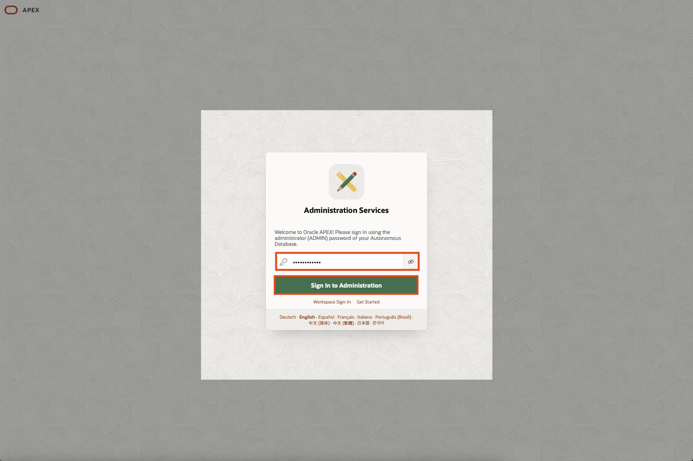
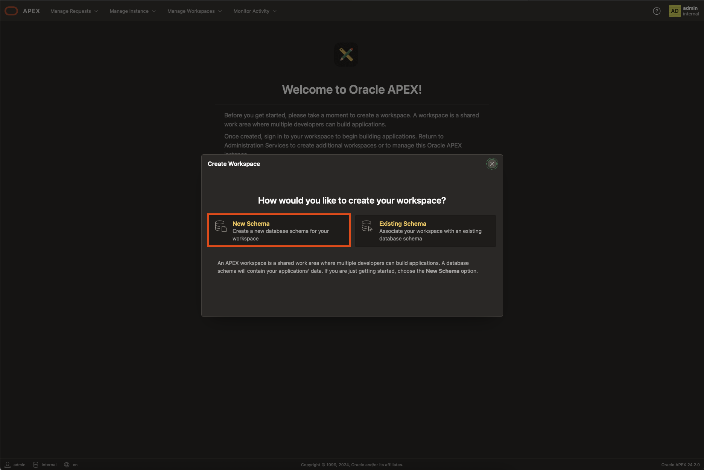
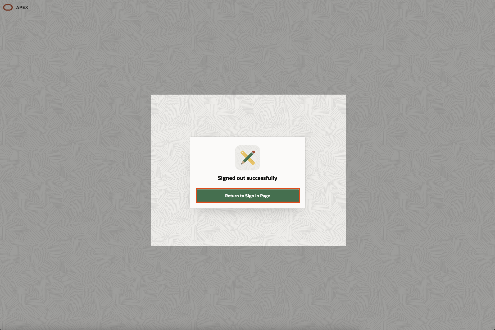
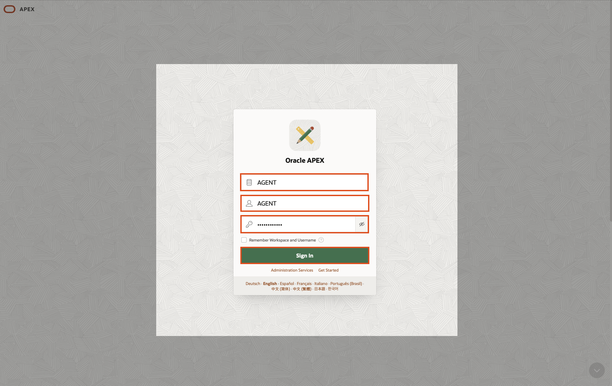

# Deploy APEX service
## Introduction

In this lab, we will learn how to deploy Oracle APEX service.

Estimated Time: 5 minutes

### Objectives

In this lab, you will:
- Deploy the APEX service on the Autonomous Database.

### Prerequisites

- This lab requires completion of the **Create an Autonomous Database with Oracle Database 23ai** section in the Contents menu on the left.

- Have an Autonomous Database with its admin password (i.e. *Oracle123!!!*).

## Task 1: Configure APEX 

1. Click the navigation menu on the upper left to show top-level navigation choices and then click **Oracle Database > Autonomous Database**.

    

2. Click on *KO2_ADB* database name.

3. Click on the button **Database Actions / View All Database Actions**
    

4. Choose **APEX**. Click **Open**
    

5. If you have already an existing APEX workspace, go to next step. If not, create one with **APEX Administration Services**.
    - Log into the **Administration Service**, enter your database admin password (i.e. *Oracle123!!!*).

    

6. In Welcome to Oracle APEX!, click **Create Workspace**    
    

    - Choose **New Schema**

    
    
    - In **Create Workspace** dialog add the following: (Keep note of it!)
         - Workspace Name: **AGENT**
         - Workspace Username: **AGENT**
         - Workspave Password: **##YOUR_PASSWORD##**
         - Click **Create Workspace**

        

7. Your workspace is created. Click the top-right icon **Admin**. Then **Sign Out** and then **Return to Sign In Page**.
    
     
 
8. Log into your **APEX workspace**:
    - Workspace: **AGENT**
    - USER: **AGENT**
    - Password: **##YOUR_PASSWORD##**
    - Click **Sign In**

    
     

_Congratulations! You have successfully completed the lab._

## Learn More
- [Autonomous Database Documentation](https://docs.oracle.com/en-us/iaas/digital-assistant/getting-started.htm)

## Acknowledgements

* **Author** - Cristian Manea - May 2025

* **Last Updated By/Date** - Cristian Manea - May 2025
