# Create an Autonomous Database with Oracle Database 23ai

## Introduction

Oracle Autonomous Data Warehouse Cloud provides an easy-to-use, fully autonomous database that scales elastically, delivers fast query performance, and requires no database administration. 
The purpose of this lab is to get familiar with Oracle Autonomous Data Warehouse primitives. 

At the end of this lab, you will be familiar with launching an Autonomous Data Warehouse database, using a secure network access control list, and connecting to the instance via the SQL Developer tool.

Autonomous Database with Oracle Database 23ai offers many new innovative autonomous features and provides developer-oriented functionality.

If you use Autonomous Database with Oracle Database 23ai, then many of the concepts and features of this service are further documented here:

- [Oracle Database 23ai](https://docs.oracle.com/en/database/oracle/oracle-database/23/index.html)

- [Oracle Database New Features](https://docs.oracle.com/en/database/oracle/oracle-database/23/nfcoa/introduction.html#GUID-about141)

**Parent** topic: [Autonomous Database with Oracle Database 23ai](https://docs.oracle.com/en-us/iaas/autonomous-database-serverless/doc/autonomous-always-free-23ai.html#GUID-8C78E94F-917D-4F66-B020-2A0E9342EC80)

Estimated Time: 30 minutes

### Objectives

In this lab, you will:

-   Provision a new Autonomous Database instance with Oracle Database 23ai
-   Connect to the Autonomous Database instance via SQL Developer
### Prerequisites

* This lab requires completion of the **Get Started** section in the Contents menu on the left.
* [Familiarity with OCI console](https://docs.oracle.com/en-us/iaas/Content/GSG/Concepts/console.htm)
* [Overview of Networking](https://docs.oracle.com/en-us/iaas/Content/Network/Concepts/overview.htm)
* [Oracle Cloud basics](https://docs.oracle.com/en-us/iaas/Content/GSG/Concepts/concepts.htm)
* Your **Oracle Cloud Account** - During this workshop, we will create a Level 100 environment for you to use on your tenancy.

## Task 1: Choose Autonomous Database from the Services Menu

1. Log in to the [Oracle Cloud Console](https://cloud.oracle.com/).
2. Once you log in, you arrive at the cloud services dashboard where you can see all the services available to you. Click the navigation menu in the upper left to show top-level navigation choices and then click **Autonomous Database**.

    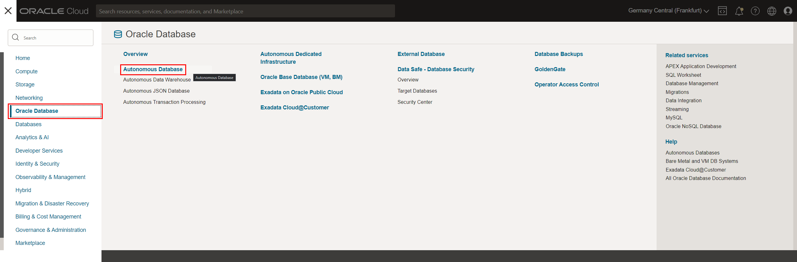

## Task 2: Create the Autonomous Database instance

1. Click **Create Autonomous Database** to start the instance creation process.

    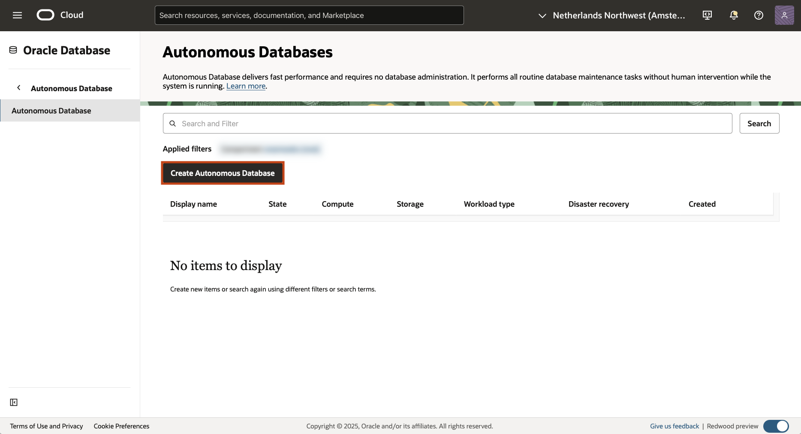

2.  This brings up the __Create Autonomous Database__ screen where you will specify the configuration of the instance.

 
3. Give basic information for the Autonomous Database:

    - __Choose a compartment__ - Choose the compartment **Sandbox** created in __Kick off your Oracle Cloud - Part 1__. See [the documentation](https://docs.oracle.com/en-us/iaas/Content/Identity/Tasks/managingcompartments.htm) if you want to learn more about compartments.
    - __Display Name__ - Enter a memorable name for the database for display purposes. For this lab, use __KO2_ADB__.
    - __Database Name__ - Use letters and numbers only, starting with a letter. Maximum length is 14 characters. (Underscores not initially supported.) For this lab, use __KO2ADB__.

    


4. Choose __Transaction Processing__ workload type:

    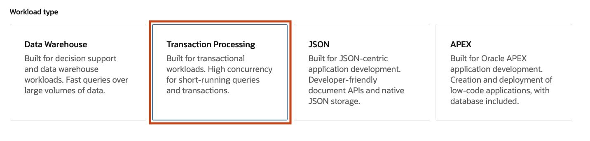

5. Configure the database:

    - __Always Free__ - If your Cloud Account is an Always Free account, you can select this option to create an always free autonomous database. An always-free database comes with 1 CPU and 20 GB of storage. For this lab, we recommend you leave Always Free unchecked.
    - __Choose database version__ - Select __23ai__ as the database version.
    - __OCPU count__ - Number of CPUs for your service. For this lab, specify __1 CPU__. If you choose an Always Free database, it comes with 1 CPU.
    - __Storage (TB)__ - Select your storage capacity in terabytes. For this lab, specify __1 TB__ of storage. Or, if you choose an Always Free database, it comes with 20 GB of storage.
    - __Auto Scaling__ - For this lab, keep auto-scaling enabled, to enable the system to automatically use up to three times more CPU and IO resources to meet workload demand.
    
    >**Note:** You cannot scale up/down an Always Free autonomous database.

    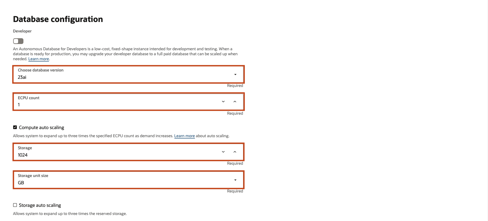

6. Create administrator credentials:

    - __Password and Confirm Password__ - Specify the password for the **ADMIN** user of the service instance. The password must meet the following requirements:
    - The password must be between 12 and 30 characters long and must include at least one uppercase letter, one lowercase letter, and one numeric character.
    - The password cannot contain the username.
    - The password cannot contain the double quote (") character.
    - The password must be different from the last 4 passwords used.
    - The password must not be the same password that you set less than 24 hours ago.
    - Re-enter the password to confirm it. Make a note of this password.
    - Example: *Oracle123!!!*

    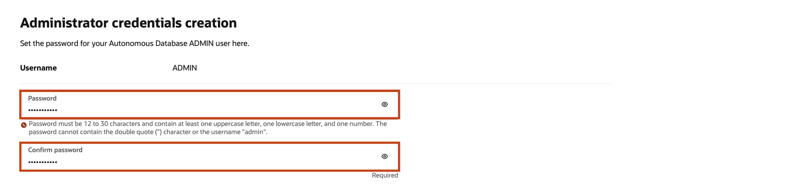

7. Choose network access:
    
    - If you want to allow traffic from everywhere, select **Secure access from everywhere**.
    - If you want to allow traffic only from the IP addresses and VCNs you specify - where access to the database from all public IPs or VCNs is blocked, select **Secure access from allowed IPs and VCNs only** in the Choose network access area.
    - If you want to restrict access to a private endpoint within an OCI VCN, select **Private endpoint access only** in the Choose network access area.
    - If the **Require mutual TLS (mTLS) authentication** option is selected, mTLS will be required to authenticate connections to your Autonomous Database. TLS connections allow you to connect to your Autonomous Database without a wallet if you use a JDBC thin driver with JDK8 or above. See the [documentation for network options](https://docs.oracle.com/en/cloud/paas/autonomous-database/adbsa/support-tls-mtls-authentication.html#GUID-3F3F1FA4-DD7D-4211-A1D3-A74ED35C0AF5) for options to allow TLS, or to require only mutual TLS (mTLS) authentication.

    - For this lab, select, **Secure access from allowed IPs and VCNs only**. Then under the __IP notation type__ choose **Virtual Cloud Network** and select the **KO2_VCN** created in *Lab 1: Create a Virtual Cloud Network*. 
    - Check **Add my IP address(_your IP address_) to IP value** to connect to the database from your machine.

    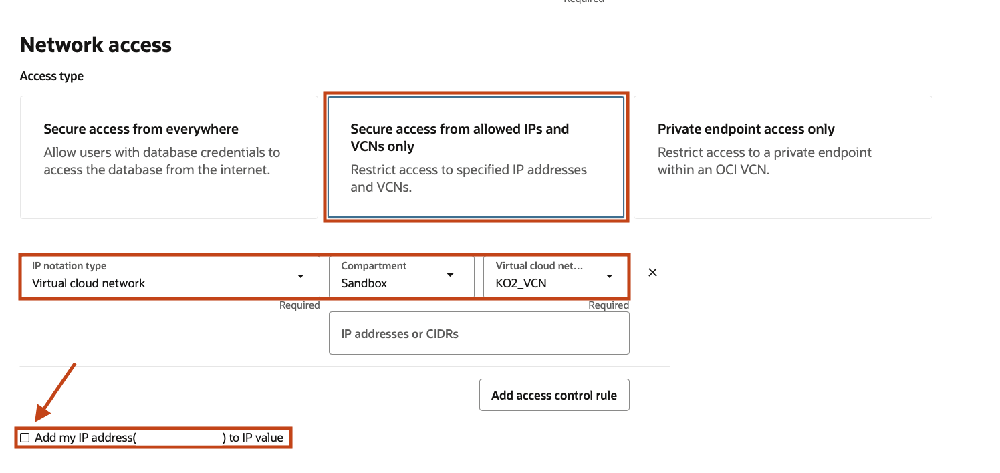

8. For this lab, do not provide a contact email address. The "Contact Email" field allows you to list contacts to receive operational notices and announcements as well as unplanned maintenance notifications.

9. Click __Create Autonomous Database__.

 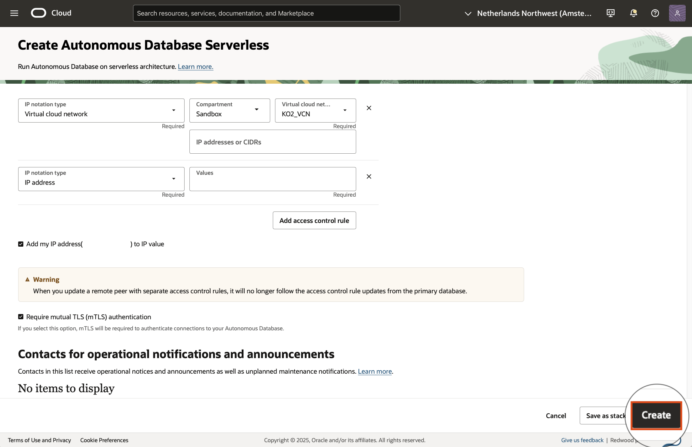

10.  Your instance will begin provisioning. In a few minutes, the state will turn from Provisioning to Available. At this point, your Autonomous Database is ready to use! Have a look at your instance's details here including its name, database version, OCPU count, and storage size.

    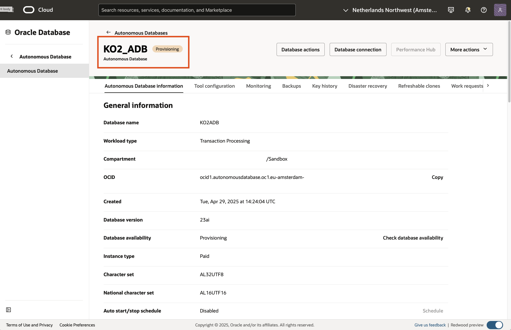

11. After the instance is provisioned (state changes from **Provisioning** to **Available**), click on **Database connection**:

    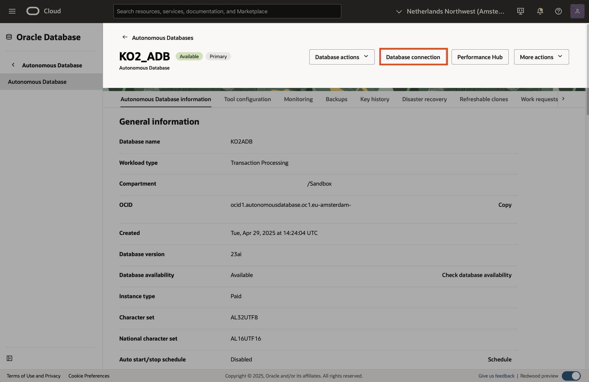

12. Under **Wallet type**, choose **Instance Wallet** and  click on **Download wallet**. 

    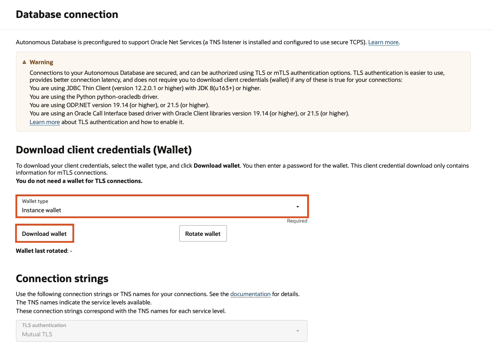

13. Please create a **password** for this wallet. Some database clients will require that you provide both the wallet and password to connect to your database (other clients will auto-login using the wallet without a password).

    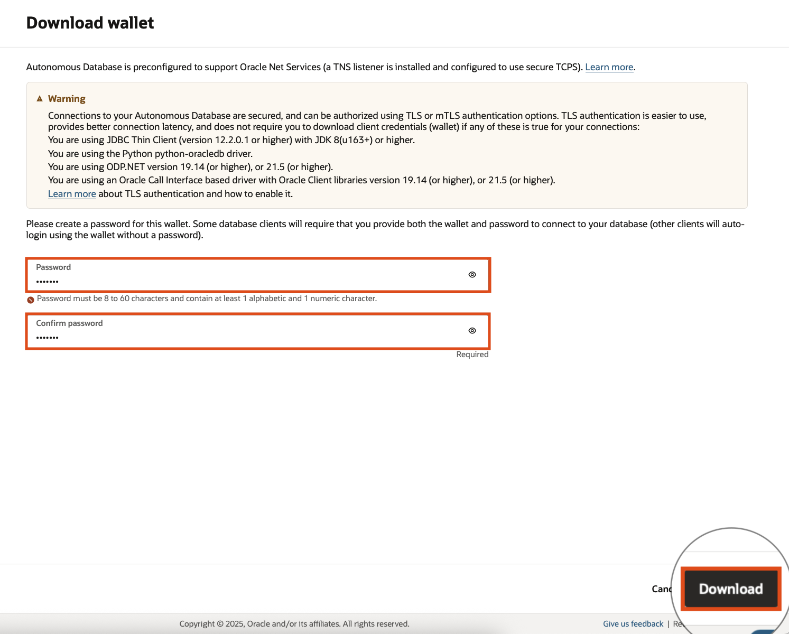

    Choose a location to save the *wallet.zip* file.

    Click the **Cancel** button at the bottom of the screen.
## Task 3: Connect to the Autonomous Database instance via SQL Developer

Oracle SQL Developer is a free integrated development environment that simplifies the development and management of an Autonomous Database.

SQL Developer can connect to Autonomous Database and contains enhancements for key Autonomous Database features. You can download the latest version of Oracle SQL Developer for your platform from the Download link on this page: [Oracle SQL Developer](https://www.oracle.com/database/technologies/appdev/sql-developer.html).
    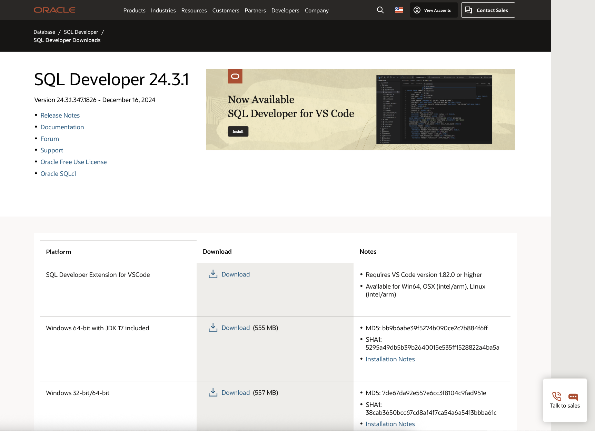


For connecting with mTLS authentication, Oracle SQL Developer provides support for wallet files using the Cloud Wallet Connection Type. Oracle recommends that you use version 18.2 (or later); however, earlier versions of SQL Developer will work with Autonomous Database using an Oracle Wallet.

For connecting with TLS authentication, Oracle SQL Developer provides support using the Custom JDBC Connection Type. See [Connect with Oracle SQL Developer with TLS Authentication](https://docs.oracle.com/en/cloud/paas/autonomous-database/adbsa/connect-sqldev-tls.html#GUID-811258A7-E975-4854-A37F-CF268EA99C82) for details on connecting using TLS authentication.

To create a new mTLS connection to Autonomous Database, do the following:


1. Open the SQL Developer tool, and click on the **green cross** to add a new/select database connection:

    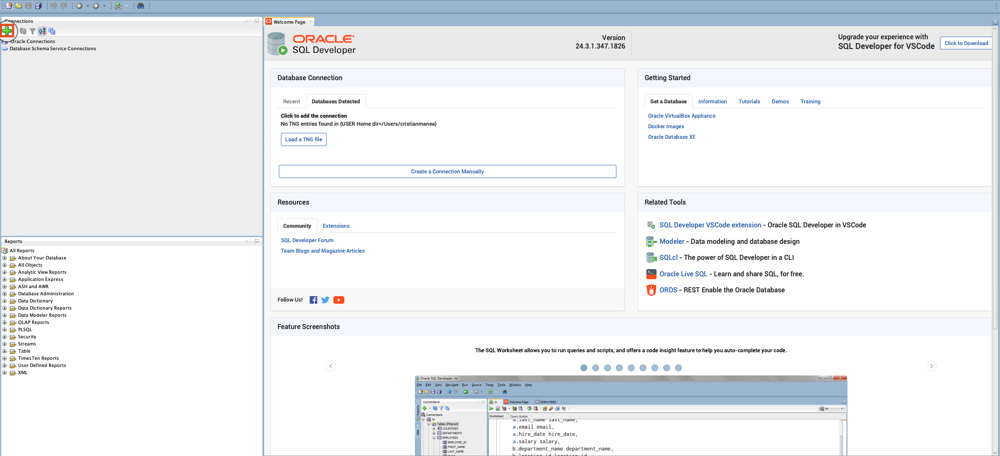

    See [the documentation](https://docs.oracle.com/en-us/iaas/autonomous-database-shared/doc/connect-sql-dev182.html#GUID-14217939-3E8F-4782-BFF2-021199A908FD) if you want to learn more about connecting to Oracle SQL Developer.


2. Configure the database connection:

    - __Name__ - Enter the name for this connection (i.e. *KO2_ADB*)
    - __Add the credentials__ - Fill in the database username *ADMIN* and password (*Oracle123!!!*) chosen when we provisioned the database (__*Task 2, Step 6*__)
    - __Connection Type__ - For this lab, specify __Cloud Wallet__ (if you are using SQL Developer 18.2, this is **Cloud PDB**). Browse the location where you saved the *wallet.zip* in __*Task 2, Step 13*__ and **select the .zip file**.
    - __Service__ - Enter the database TNS name. The client credentials file includes a *tnsnames.ora* file that provides database TNS names with corresponding services.
    - __Auto Scaling__ - For this lab, keep auto-scaling enabled, to enable the system to automatically use up to three times more CPU and IO resources to meet workload demand.
    
    Click **Test** to test the database connection. If *Status:Success* then click **Connect** to connect to the database.

    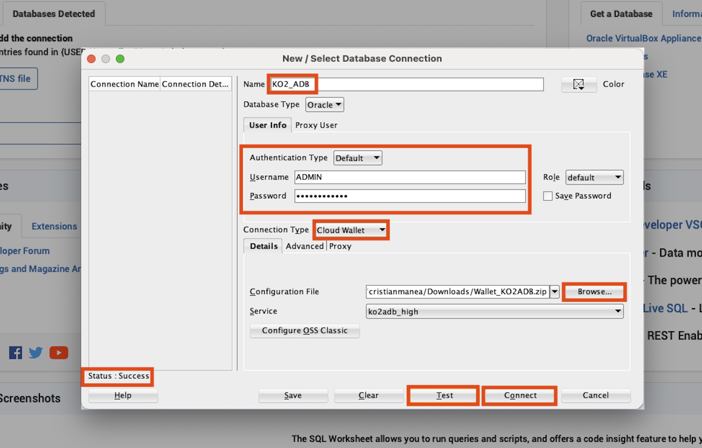

## Task 4: Run a Sample Query on the Autonomous Database instance via SQL Developer


1. Click on the **"+"** next to the database connection *KO2_ADB* on the left side to expand the database content and start testing it.

    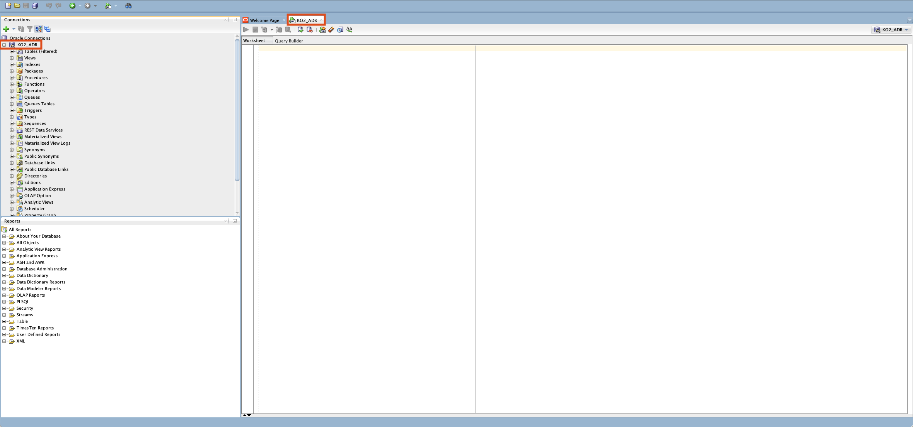

2. Click on the **Copy** button below to copy **Sample Sales History Data Set** Query and **Paste** it into the SQL Developer worksheet:

    ```
    <copy>
SELECT channel_desc, TO_CHAR(SUM(amount_sold),'9,999,999,999') SALES$,
   RANK() OVER (ORDER BY SUM(amount_sold)) AS default_rank,
   RANK() OVER (ORDER BY SUM(amount_sold) DESC NULLS LAST) AS custom_rank
FROM sh.sales, sh.products, sh.customers, sh.times, sh.channels, sh.countries
WHERE sales.prod_id=products.prod_id AND sales.cust_id=customers.cust_id
  AND customers.country_id = countries.country_id AND sales.time_id=times.time_id
  AND sales.channel_id=channels.channel_id
  AND times.calendar_month_desc IN ('2000-09', '2000-10')
  AND country_iso_code='US'
GROUP BY channel_desc;
    ```
3. Click the green **"Play"** button to run the statement.
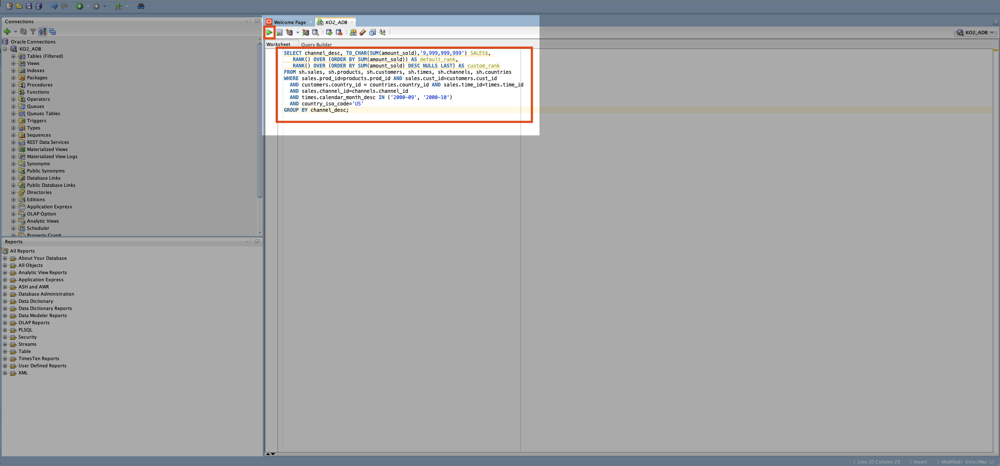

4. Check the **Query Result**.

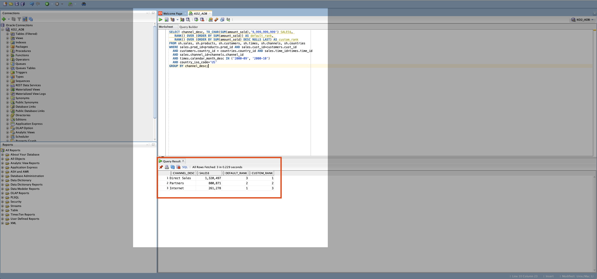


    

See this [tutorial](https://www.oracle.com/webfolder/technetwork/tutorials/obe/cloud/adwc/OBE_Running%20a%20Query%20on%20Sample%20Data/running_a_query_on_sample_data.html#QuerytheSampleStarSchemaBenchmarkDataSet) to test the performance of different Autonomous Data Warehouse configurations.

*Congratulations! You have successfully completed the lab.*
Please *proceed to the next lab*.

## Learn more

See the [documentation](https://docs.oracle.com/en/cloud/paas/autonomous-data-warehouse-cloud/user/autonomous-workflow.html#GUID-5780368D-6D40-475C-8DEB-DBA14BA675C3) on the typical workflow for using Autonomous Data Warehouse.


## Acknowledgements

- **Author** - Cristian Manea
- **Last Updated By/Date** - Cristian Manea, May 2025

