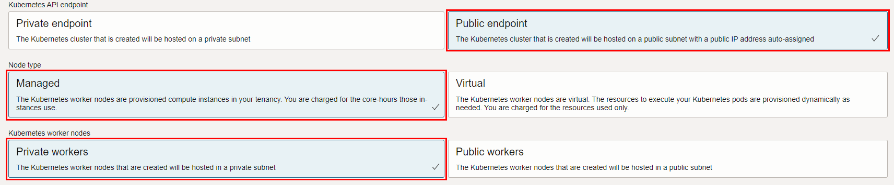
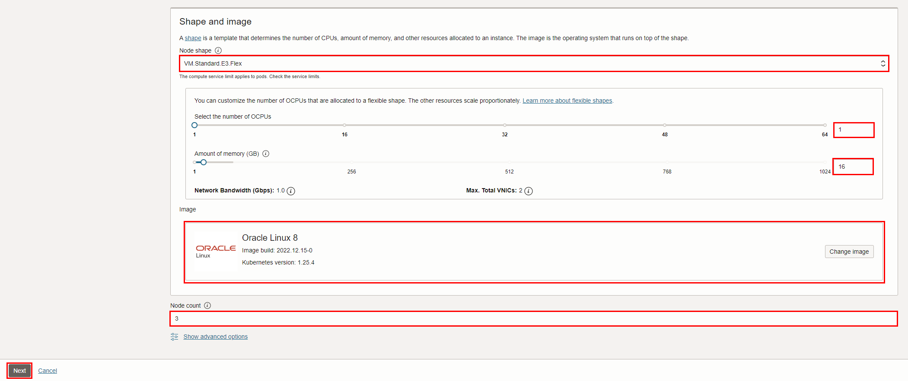
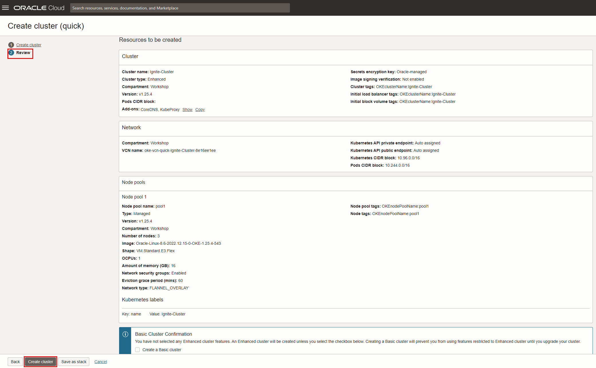
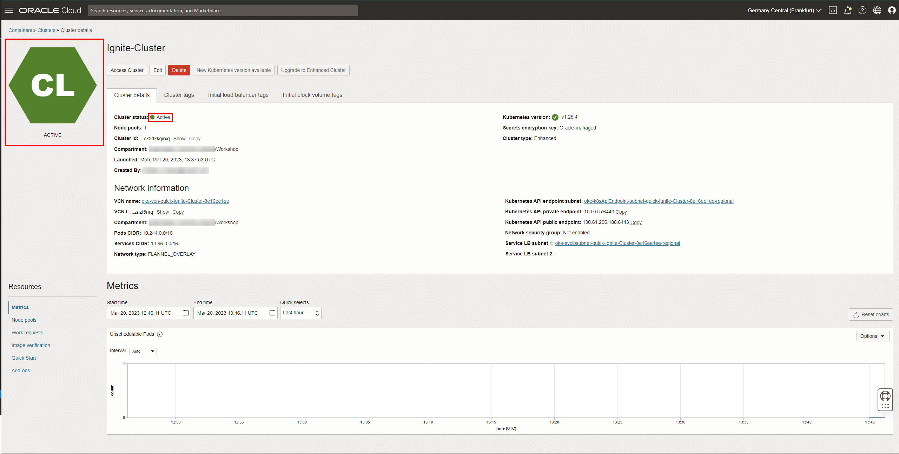

# Create a Kubernetes Cluster

## Introduction

In this lab, you will create a Kubernetes Cluster to deploy a **Hello World** application.

Estimated time: 20-25 min

### Objectives

* Learn how to create a Kubernetes Cluster
* Deploy a sample Hello World app

### Prerequisites

* This lab requires completion of the **Get Started** section in the Contents menu on the left.
* [Familiarity with OCI console](https://docs.oracle.com/en-us/iaas/Content/GSG/Concepts/console.htm)
* [Overview of Networking](https://docs.oracle.com/en-us/iaas/Content/Network/Concepts/overview.htm)
* [Oracle Cloud basics](https://docs.oracle.com/en-us/iaas/Content/GSG/Concepts/concepts.htm)
* [Connecting to a compute instance](https://docs.oracle.com/en-us/iaas/Content/Compute/Tasks/accessinginstance.htm)
* Your **Oracle Cloud Account** - During this workshop, we will create a Level 100 environment for you to use on your tenancy.
## Task 1: Create Kubernetes Cluster (OKE)

1. To create an **OKE cluster**, open up the navigation menu in the top-left corner of the Console and go to the **Developer Services** section, then click on **Kubernetes Clusters**.

  

2. Check that the **Workshop** compartment is selected under **List Scope**. Then click **Create Cluster**:

  

3. Choose **Quick Create** as it will create the new cluster along with the new network resources such as Virtual Cloud Network (VCN), Internet Gateway (IG), NAT Gateway (NAT), Regional Subnet for worker nodes, and a Regional Subnet for load balancers. 

  Click on **Submit**.

  

4.  This brings up the __Create Cluster (quick)__ screen where you will specify the configuration of the cluster.

 
5. Give basic information for the OKE cluster:

    - __Choose a compartment__ - Choose the compartment **Workshop** created in __Ignite Basics__. See [the documentation](https://docs.oracle.com/en-us/iaas/Content/Identity/Tasks/managingcompartments.htm) if you want to learn more about compartments.
    - __Name__ - Enter a memorable name for the database for display purposes. For this lab, use __Ignite-Cluster__.
    - __Kubernetes version__ - Leave the default option.    

    

6. Choose the **Public Endpoint** in the Kubernetes API endpoint to easily access the kubectl. *If you use a Bastion or an admin instance to access the kubectl commands, select the **Private Endpoint**.*

  Select **Managed** for the **Node type**, and **Private workers** for the **Kubernetes worker nodes**.

    *Optionally choose the visibility of the Kubernetes Worker Nodes to Public Workers if you want public access to your nodes and the number of nodes to 2 or 1 if you want a reduced number of nodes*

  
  
7. Select *AMD Rome E3 Flex*, then select **1** as the number of OCPUs, and **16 GB** as the amount of memory, and under **Node Count** select **3** as the number of nodes. 

  Click **Next** at the bottom of the window.

  

8. Review the resources to be created then click __Create cluster__.

 

  On the next page, make sure all the components are checked then click **Close**.
 

 >**Note**: The cluster creation process can take a few minutes.

9.  Your cluster will begin provisioning. In a few minutes, the state will turn from Provisioning to Available. At this point, your OKE cluster is ready to use! Have a look at your cluster's details here including its name, node pools, Kubernetes version, and metrics.

  
  


## Task 2: Access the OKE Cluster and Deploy a Hello World application

1. On the cluster view, click on the **Access Cluster** button.

  

2. Leave the **Cloud Shell Access** selected. If Cloud Shell is not already open, click on **Launch Cloud Shell**, then **copy** the OCI CLI command to create the kubeconfig and **paste** it into the Cloud Shell Terminal.

  

3. Check the **version** of your kubectl client and Kubernetes server with kubectl:

    ```
    <copy> kubectl version
    ```

3. Deploy a sample **Hello World** application by running the following command in your terminal:

    ```
    <copy> kubectl create -f https://k8s.io/examples/application/deployment.yaml
    ```

4. The following command creates a **Deployment** and an associated **ReplicaSet**. The ReplicaSet has five Pods each of which runs the **Hello World** application.

    ```
    <copy> kubectl apply -f https://k8s.io/examples/service/load-balancer-example.yaml

    ```

5. Create a **Service** object that exposes the deployment:

    ```
    <copy> kubectl expose deployment hello-world --type=LoadBalancer --name=my-service

    ```

6. Display information about the **Service**:

    ```
    <copy> kubectl get services my-service

    ```

 >**Note:** The *type=LoadBalancer* service is backed by external cloud providers, which is not covered in this example, please refer to this [page](https://kubernetes.io/docs/concepts/services-networking/service/#loadbalancer) for the details. 
  If the external IP address is shown as *pending*, wait for a minute and enter the same command again.

7. Use the **external IP address** (LoadBalancer Ingress) to access the **Hello World** application:

    ```
    <copy> curl http://<_external-ip>:<_port>

    
    ```


_Congratulations! You have successfully completed the lab._

## Learn More

* [Oracle Developer Cloud Service Documentation](https://docs.oracle.com/en/cloud/paas/developer-cloud/index.html)
* [Oracle Container Engine for Kubernetes Documentation](https://docs.cloud.oracle.com/en-us/iaas/Content/ContEng/Concepts/contengoverview.htm)

## Acknowledgements
* **Authors** -  Cristian Manea - Oracle DCX Team
* **Last Updated By/Date** - Cristian Manea, August 2023
