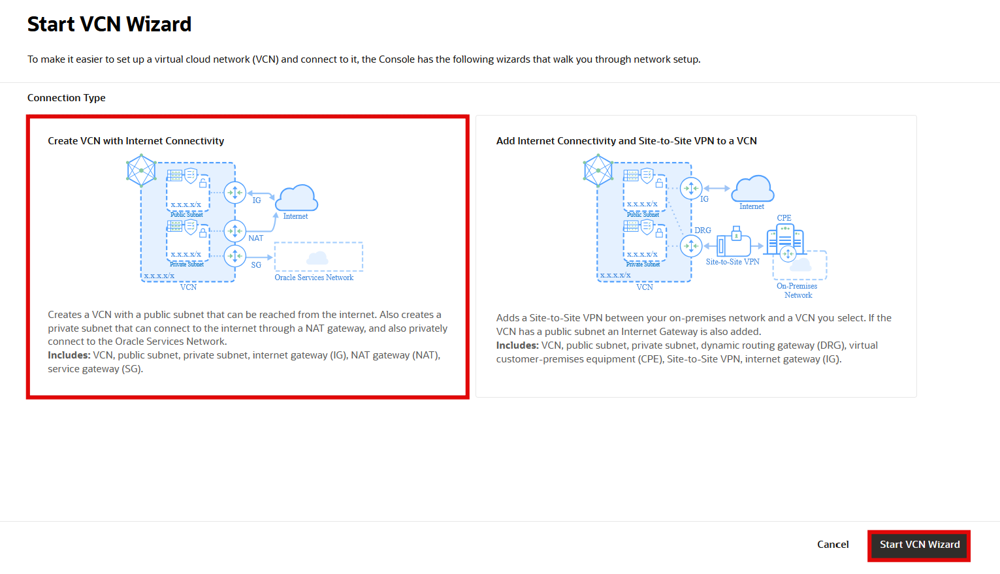
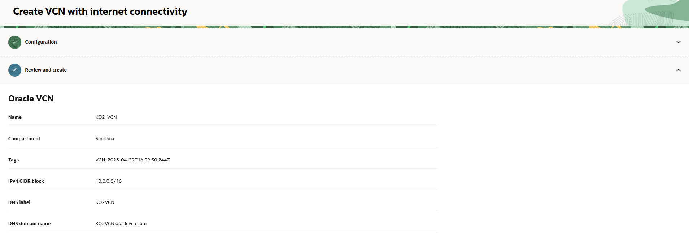
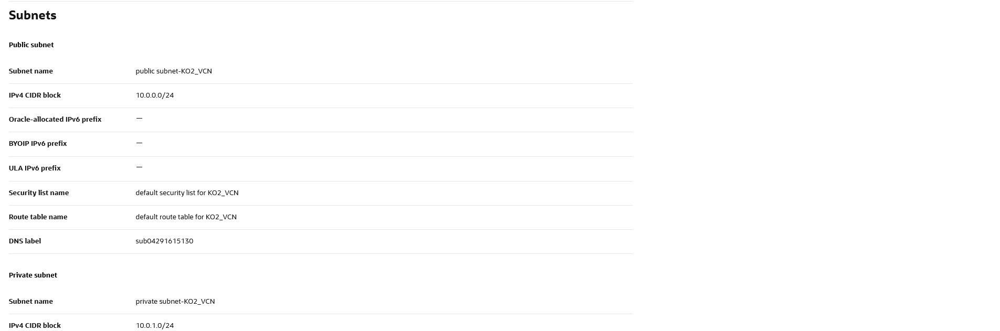
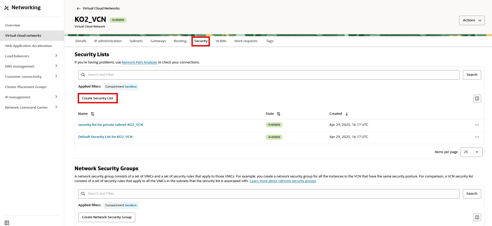
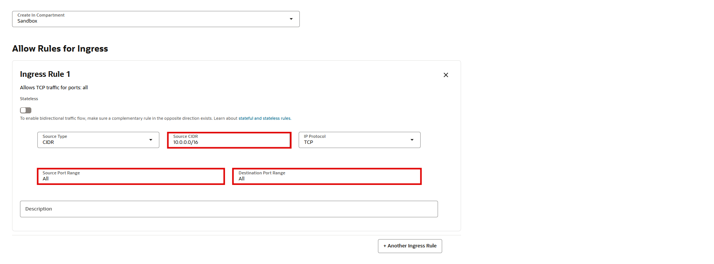
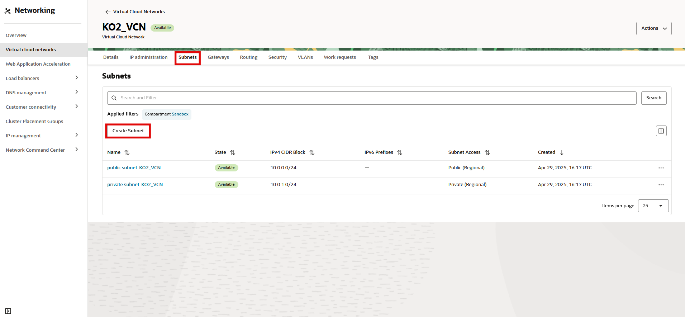

# Create a Virtual Cloud Network

## Introduction

Oracle Cloud Infrastructure (OCI) Compute lets you create multiple Virtual Cloud Networks (VCNs). These VCNs will contain security lists, compute instances, load balancers, and many other types of network assets.

Be sure to review [Overview of Networking](https://docs.cloud.oracle.com/iaas/Content/Network/Concepts/overview.htm) to gain a full understanding of the network components and their relationships.

Estimated Time: 25 minutes

### Objectives

In this lab, you will:
- Create a virtual cloud network configured for a database use case.

### Prerequisites

* This lab requires completion of the **Get Started** section in the Contents menu on the left.
* [Familiarity with OCI console](https://docs.oracle.com/en-us/iaas/Content/GSG/Concepts/console.htm)
* [Overview of Networking](https://docs.oracle.com/en-us/iaas/Content/Network/Concepts/overview.htm)
* [Oracle Cloud basics](https://docs.oracle.com/en-us/iaas/Content/GSG/Concepts/concepts.htm)
* Your **Oracle Cloud Account** - During this workshop, we will create a basic environment for you to use on your tenancy.

## Task 1: Create a VCN

To create a VCN on Oracle Cloud Infrastructure:

1. On the Oracle Cloud Infrastructure Console Home page, under the **Launch Resources** header, click **Set up a network with a wizard**.

    

2. Select **Create VCN with Internet Connectivity**, and then click **Start VCN Wizard**.

    

3. Complete the following fields:

    |                  **Field**              |    **Value**  |
    |----------------------------------------|:------------:|
    |VCN Name |KO2_VCN|
    |Compartment |  Choose the ***Sandbox*** compartment
    |VCN CIDR Block|10.0.0.0/16|
    |Public Subnet CIDR Block|10.0.0.0/24|
    |Private Subnet CIDR Block|10.0.1.0/24|
    |Use DNS Hostnames In This VCN| Checked|

    Your screen should look similar to the following:

    
    

     Click the **Next** button at the bottom of the screen.

4. Review your settings to be sure they are correct. Click the **Create** button to create the VCN. 
    
    
    

5. It will take a moment to create the VCN and a progress screen will keep you apprised of the workflow.

    

6. Once you see that the creation is complete (see previous screenshot), click the **View VCN** button.
## Task 2: Create a Route Table

1. In the newly created VCN, navigate to the Route Tables menu, and click **Create Route Table**.
2. Complete the following fields:

    |                  **Field**              |    **Value**  |
    |----------------------------------------|:------------:|
    | Name |RT_ADB|
    |Compartment |  Choose the ***Sandbox*** compartment
    |Target Type|NAT Gateway|
    |Destination CIDR Block|0.0.0.0/0|
    |Compartment|Workshop|
    |Target NAT Gateway| NAT Gateway-KO2_VCN|

    
    

    Then add Another Route Table and complete the following fields:

    |                  **Field**              |    **Value**  |
    |----------------------------------------|:------------:|
    | Target Type|Service Gateway|
    |Destination Service |  Choose "all ***Region_name*** services in Oracle Service Network"
    |Compartment|Workshop|
    |Target Service Gateway| Service Gateway-KO2_VCN|

    

    Then go with **Create**.

## Task 3: Create a Security List

1. In the VCN, navigate to the Security Lists menu, and click **Create Security List**.
2. Complete the following fields 

    |                  **Field**              |    **Value**  |
    |----------------------------------------|:------------:|
    | Name |SL_ADB|
    |Compartment |  Choose the ***Sandbox*** compartment
    |Source CIDR Block|10.0.0.0/16|
    |IP Protocol|TCP
    |Destination Port Range|ALL|

      
      

    Then add Another Egress Rule and complete the following fields

    |                  **Field**              |    **Value**  |
    |----------------------------------------|:------------:|
    |Destination CIDR Block|0.0.0.0/0|
    |IP Protocol|TCP
    |Destination Port Range|ALL|

    

    Then go with **Create Security List**. 

## Task 4: Create a Subnet to access Autonomous Database

1. In the VCN, navigate to the Subnets menu, and click **Create Subnet**.
2. Complete the following fields:

    |                  **Field**              |    **Value**  |
    |----------------------------------------|:------------:|
    | Name |Subnet_ADB|
    |Compartment |  Choose the ***Sandbox*** compartment
    |Subnet Type|Regional|
    |IPv4 CIDR Block|10.0.3.0/24|
    |Route Table|RT_ADB
    |Subnet Access|Private Subnet|
    |Security List|SL_ADB

    

    

    

    Then go with **Create Subnet**. 

### Summary

This VCN will contain all of the other assets that you will create during this set of labs. In real-world situations, you would create multiple VCNs based on their need for access (which ports to open) and who can access them.

_Congratulations! You have successfully completed the lab._

Please *proceed to the next lab*.

## Acknowledgements

- **Author** - Radu Chiru
- **Last Updated By/Date** - Radu Chiru, Cristian Manea, May 2025

