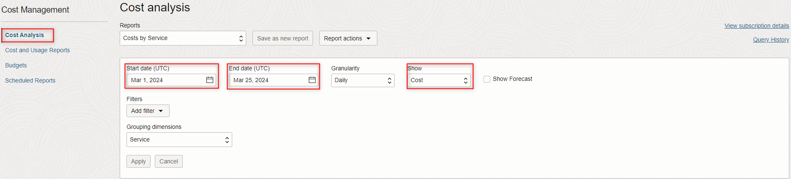
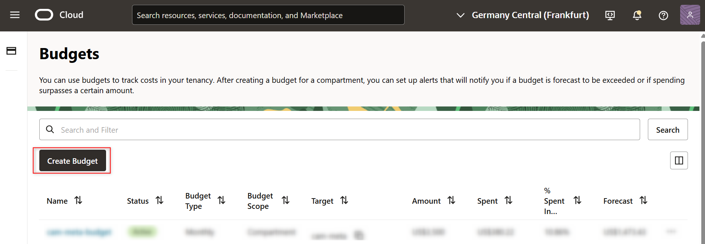
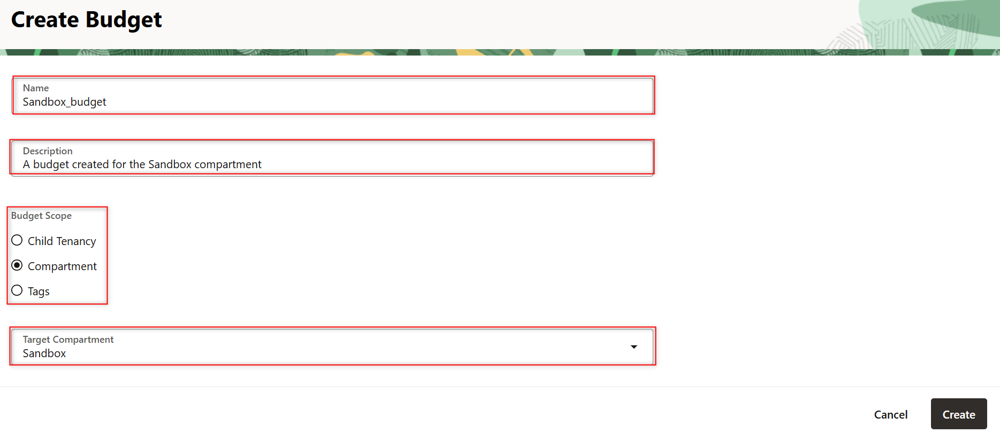
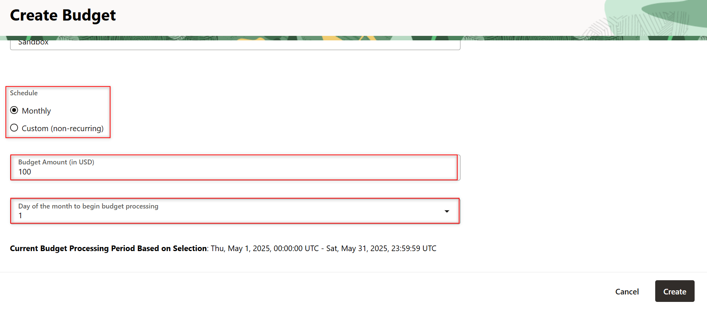

# Cost Management

<if type="livelabs">
## Introduction

Oracle Cloud Infrastructure provides various billing and cost management tools that make it easy to manage your service costs. You can estimate costs, create budgets to set spending thresholds, view usage, and visualize your spending with charts and reports. View your subscription details, invoices, payment history, manage your payment method, and earn rewards.

There are multiple ways to visualize and manage costs such as:

- **Cost Analysis**

    Cost Analysis provides easy-to-use visualization tools to help you track and optimize your Oracle Cloud Infrastructure spending.

- **Budgets**

    Use Budgets to set thresholds for your Oracle Cloud Infrastructure spending. You can set alerts on your budget to let you know when you might exceed your budget, and you can view all of your budgets and spending from one single place in the Oracle Cloud Infrastructure Console.

- **Cost and Usage Reports**

    A cost report is a comma-separated value (CSV) file that is similar to a usage report, but also includes cost columns. The report can be used to obtain a breakdown of your invoice line items at resource-level granularity. As a result, you can optimize your Oracle Cloud Infrastructure spending, and make more informed cloud spending decisions.

    A usage report is a comma-separated value (CSV) file that can be used to get a detailed breakdown of resources in Oracle Cloud Infrastructure for audit or invoice reconciliation.

- **Cost Estimator**

 The Cloud Cost Estimator helps you figure out your estimated monthly usage and costs for Oracle's Infrastructure and Platform Cloud services, before you commit to an amount. See [Estimate your monthly costs](https://www.oracle.com/cloud/costestimator.html) for more information.

You are running this workshop in a LiveLabs environment. Our LiveLabs environments do not allow to read/manage the **Billing & Cost Management** section, so you will not follow this workshop. However, you can see how to manage your costs by watching these short videos:

 [Cost analysis in Oracle Cloud](youtube:n-pDlNorogQ)

 [Estimate Your Monthly Costs Now](youtube:bZHKGFA7Hs0)

 [Cost Management & Budgets](youtube:oyzSjskTsVY)
</if>

<if type="tenancy">
## Introduction

Oracle Cloud Infrastructure provides various billing and cost management tools that make it easy to manage your service costs. You can estimate costs, create budgets to set spending thresholds, view usage, and visualize your spending with charts and reports. View your subscription details, invoices, payment history, manage your payment method, and earn rewards.

There are multiple ways to visualize and manage costs such as:

- **Cost Analysis**

    Cost Analysis provides easy-to-use visualization tools to help you track and optimize your Oracle Cloud Infrastructure spending.

[Cost analysis in Oracle Cloud](youtube:n-pDlNorogQ)

- **Budgets**

    Use Budgets to set thresholds for your Oracle Cloud Infrastructure spending. You can set alerts on your budget to let you know when you might exceed your budget, and you can view all of your budgets and spending from one single place in the Oracle Cloud Infrastructure Console.

[Cost Management & Budgets](youtube:oyzSjskTsVY)

- **Cost and Usage Reports**

    A cost report is a comma-separated value (CSV) file that is similar to a usage report, but also includes cost columns. The report can be used to obtain a breakdown of your invoice line items at resource-level granularity. As a result, you can optimize your Oracle Cloud Infrastructure spending, and make more informed cloud spending decisions.

    A usage report is a comma-separated value (CSV) file that can be used to get a detailed breakdown of resources in Oracle Cloud Infrastructure for audit or invoice reconciliation.

- **Cost Estimator**

 The Cloud Cost Estimator helps you figure out your estimated monthly usage and costs for Oracle's Infrastructure and Platform Cloud services, before you commit to an amount. See [Estimate your monthly costs](https://www.oracle.com/cloud/costestimator.html) for more information.

[Estimate Your Monthly Costs Now](youtube:bZHKGFA7Hs0)

## Task 1: Cost Analysis

1. On the Oracle Cloud Infrastructure Console Home page, under the **Billing & Cost Management** header, click **Cost Analysis**.

    

2. By default, you will see the costs generated from the beginning of the curent month up until the present day.

    

3. You will be presented with an easy to read graphic diagram that contains all the services that generate consumption. 

    

## Task 2: Budgets & Budget Alert Rule

 1. On the Oracle Cloud Infrastructure Console Home page, under the **Billing & Cost Management** header, click **Budgets**.

    

2. While in the **Budgets** menu, click **Create Budget**.

    

3. After clicking **Create Budget** provide the following details:

- **Budget Scope:** Compartment
- **Name:** Sandbox_budget
- **Description:** A budget created for the Sandbox compartment
- **Target Compartment:** Sandbox
- **Schedule:** Monthly
- **Budget Amount (in USD):** 100
- **Day of the month to begin budget processing:** 1

  
  

4. **Do not click on create yet.** Scroll lower and set up an **Budget Alert Rule**.

- **Threshold Metric:** Actual Spend
- **Threshold Type:** Percentage of Budget
- **Threshold:** 90
- **Email Recepients:** The admins that you want to alert
- **Email Message:** An informative message about the threshold that has been reached
- After you configured your **Budget Alert Rule**, click on **Create**

     
     

</if>

## Acknowledgements

- **Author** - Radu Birsan, Alexandra Iancu
- **Contributors** - Cristian Manea, Radu Chiru, Birsan Radu, Alexandra Iancu
- **Last Updated By/Date** - Radu Birsan, Alexandra Iancu, February 2025