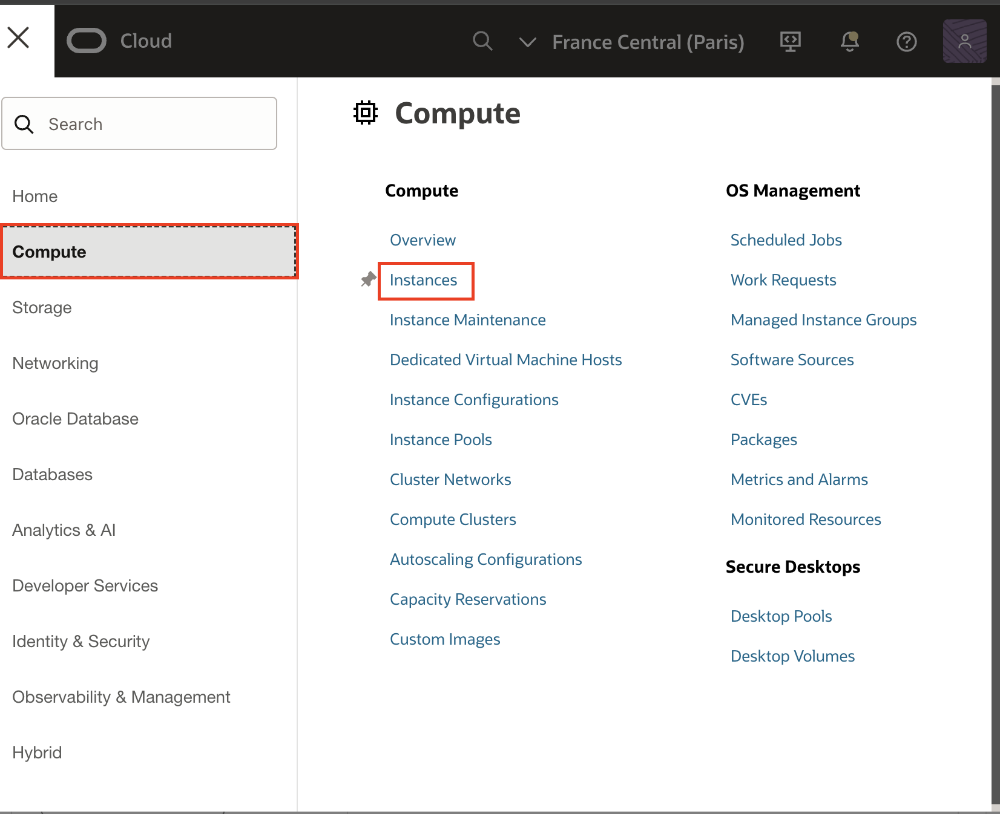
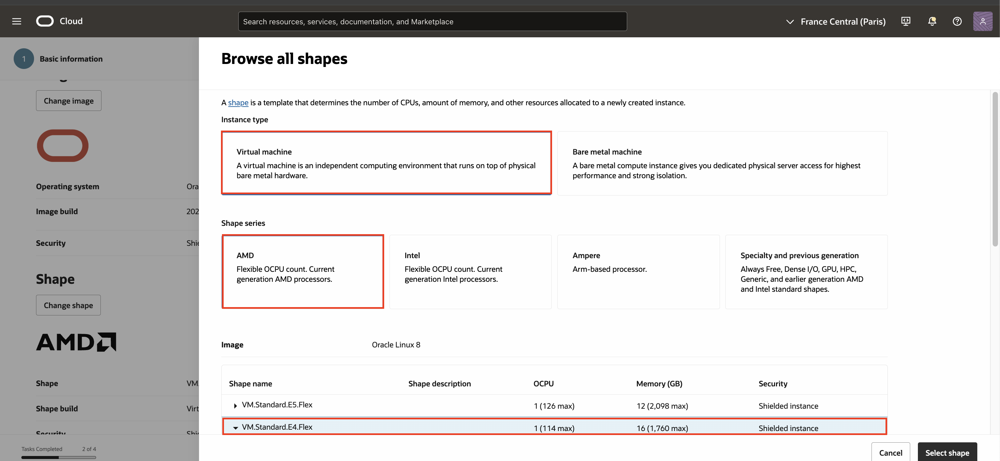
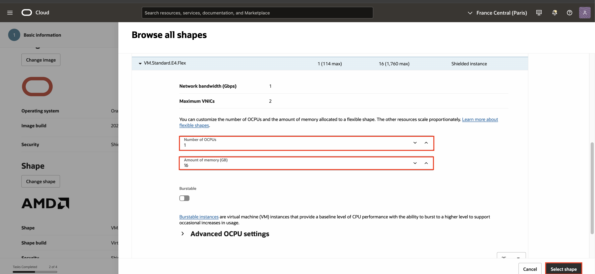
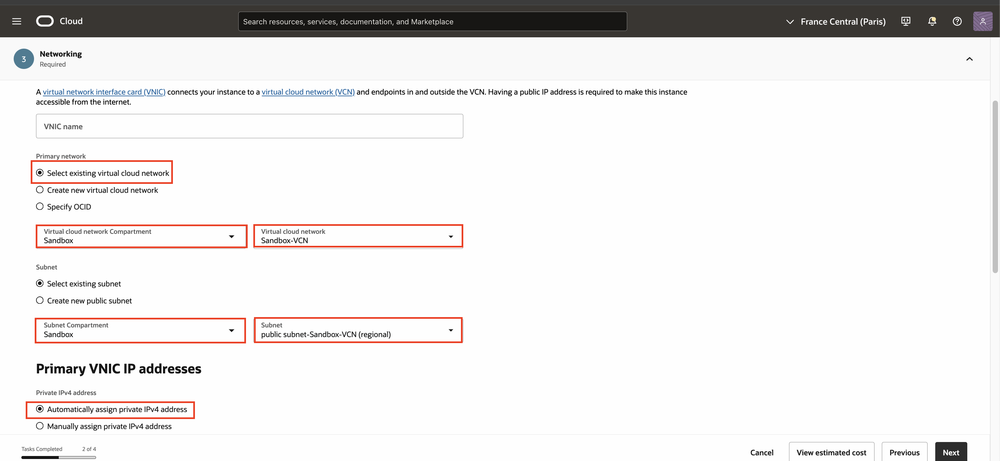
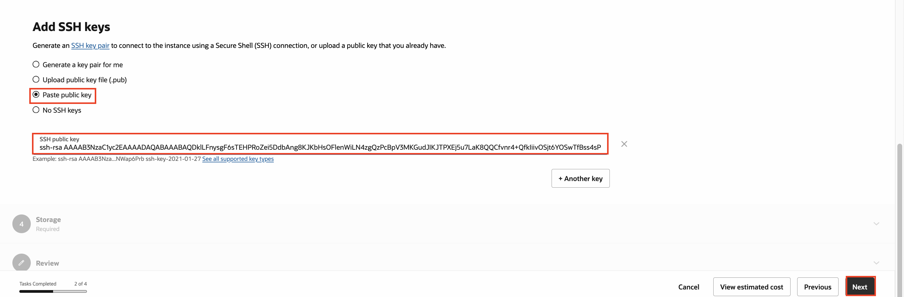
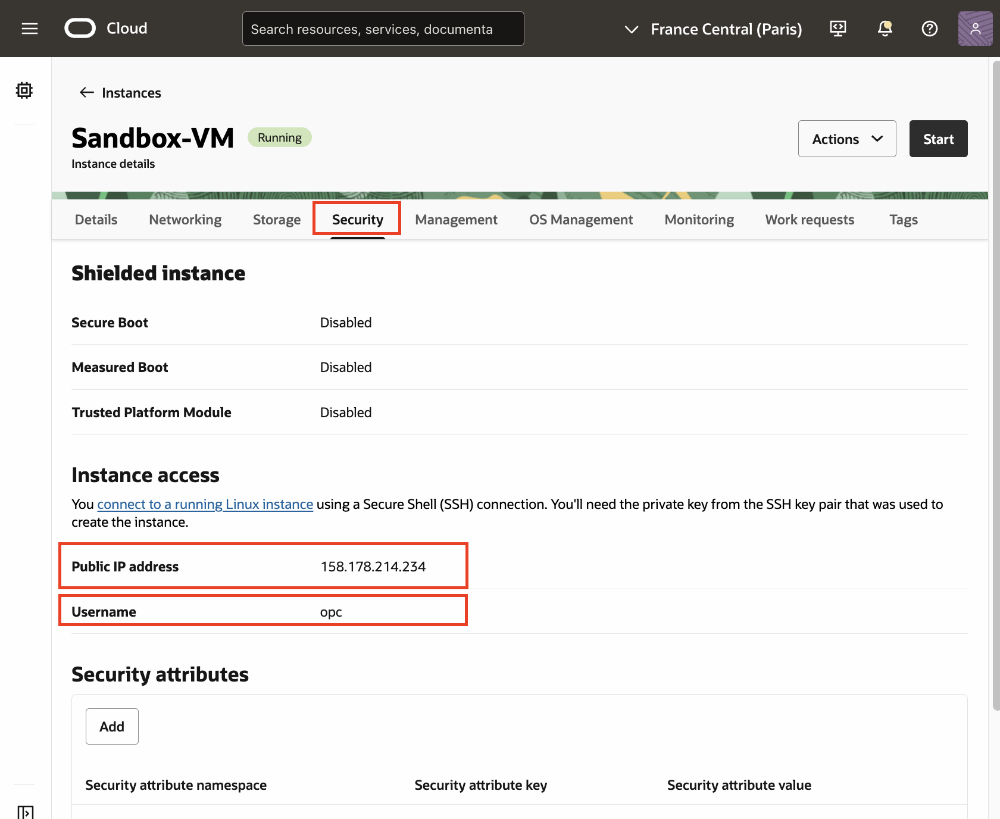
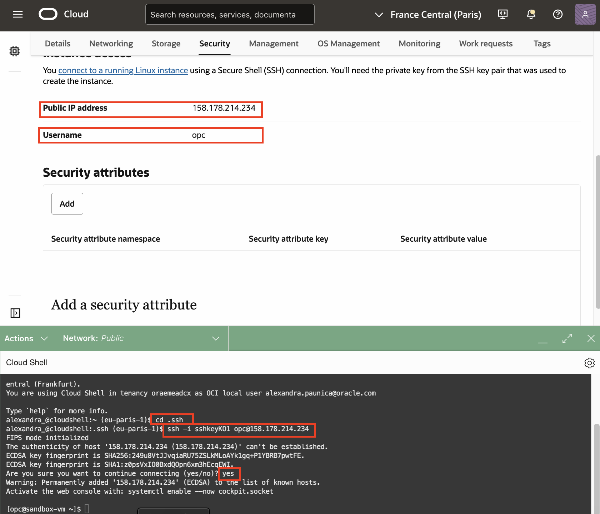

# Create a Compute Service

## Introduction

Oracle Cloud Infrastructure Compute lets you provision and manage compute hosts, known as instances. You can launch instances as needed to meet your compute and application requirements. After you launch an instance, you can access it securely from your computer, restart it, attach and detach volumes, and terminate it when you're done with it. Any changes made to the instance's local drives are lost when you terminate it. Any saved changes to volumes attached to the instance are retained.

Be sure to review [Best Practices for Your Compute Instance](https://docs.cloud.oracle.com/iaas/Content/Compute/References/bestpracticescompute.htm) for important information about working with your Oracle Cloud Infrastructure Compute instance.

Estimated Time: 20 minutes

### Objectives
In this lab, you will:
- Create a compute instance
- Connect to the compute instance

### Prerequisites

Your **<font color="red">Oracle Cloud Account</font>** - During this workshop we will create a basic environment to get you started with Oracle Cloud.


## Task 1: Create a Compute Instance
Oracle Cloud Infrastructure  offers both Bare Metal and Virtual Machine instances:

- **Bare Metal**  - A bare metal compute instance gives you dedicated physical server access for highest performance and strong isolation.
- **Virtual Machine**  - A Virtual Machine (VM) is an independent computing environment that runs on top of physical bare metal hardware. The virtualization makes it possible to run multiple VMs that are isolated from each other. VMs are ideal for running applications that do not require the performance and resources (CPU, memory, network bandwidth, storage) of an entire physical machine.

An Oracle Cloud Infrastructure VM compute instance runs on the same hardware as a Bare Metal instance, leveraging the same cloud-optimized hardware, firmware, software stack, and networking infrastructure.

1. Click the **Navigation Menu** in the upper left. Navigate to **Compute**, and select **Instances**.

	


2. Select the *Sandbox* Compartment that you created in *"Create a Compartment" Lab*. Then click **Create Instance**. We will launch a VM instance for this lab.

 
  


3. The *Create Compute Instance* wizard will launch.
    Enter **Sandbox-VM** as the name of the server. 
        
   
    
       
4. Click *Change Shape* to choose a VM shape.


    

5. Select *AMD Rome E4 Flex*, then select **1** as number of OCPUs, and **16 GB** as the amount of memory, and click **Select Shape**.

    

    
    

7. Click on **Next**. The Security section does not need any changes. Click **Next** again. In the Networking section, most of the defaults are perfect for our purposes. However, you will need to scroll down and select the **Assign a public IPv4 address** option.
 
    

    >**Note:** You need a public IP address, so that you can SSH into the running instance later in this lab.

8. Scroll down to the **Add SSH keys** area of the page. Select **Paste public keys** and paste the SSH key that you created earlier in ***Generate SSH Keys*** Lab. Click on **Next**. The Storage options remain unchanged. Click again on **Next**. Review the information and press the **Create** button to create your instance.

    

    Launching an instance is simple and intuitive with few options to select. The provisioning of the compute instance will complete in less than a minute, and the instance state will change from *PROVISIONING* to *RUNNING*.

9. Once the instance state changes to *RUNNING*, you can SSH to the Public IP address of the instance. The Public IP address is noted under *Security* on the Instance information page. 

    
    

## Task 2: Connect to the Instance 

>**Note**: You may need to log in as the *admin* user to use cloud shell.

1. To connect to the instance, use Cloud Shell and enter the following command:

    >**Note:** For Oracle Linux VMs, the default username is **opc**

    ```
    <copy>ssh -i <private_ssh_key> opc@<public_ip_address></copy>
    ```

    If you receive the message "Are you sure you want to continue connecting (yes/no)?", please write **yes**

    


_Congratulations! You have successfully completed the lab._

## Acknowledgements

- **Author** - Rajeshwari Rai, Prasenjit Sarkar 
- **Contributors** - Arabella Yao, Rajeshwari Rai, Prasenjit Sarkar, Cristian Manea, Radu Chiru, Alexandra Iancu, Radu Birsan
- **Last Updated By/Date** - Birsan Radu, Alexandra Iancu, February 2025