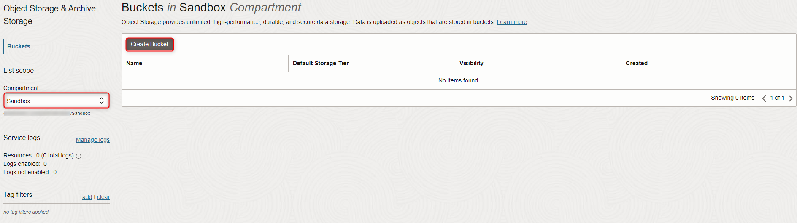
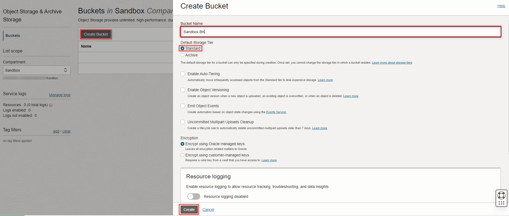
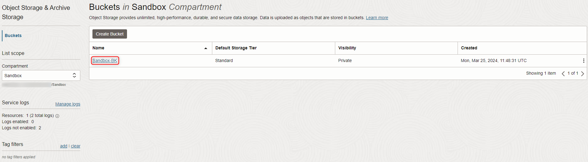
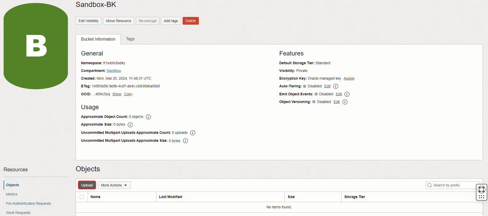
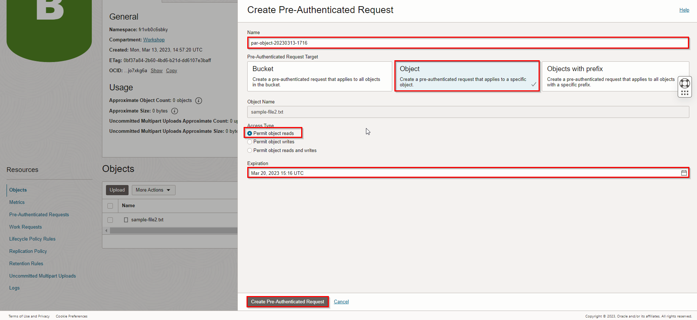
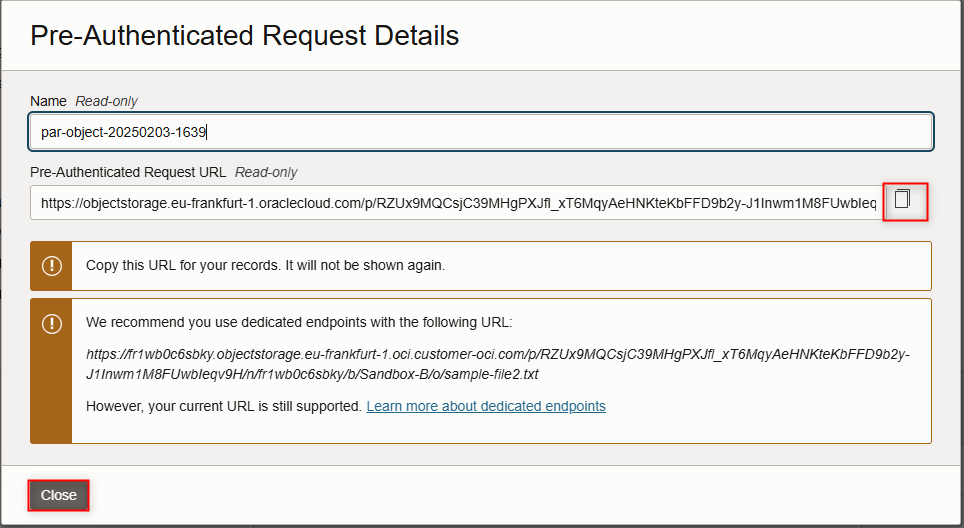

# Create an Object Storage Service

## Introduction

Oracle Cloud Infrastructure (OCI) Object Storage service is an Internet-scale, high-performance storage platform that offers reliable and cost-efficient data durability. The Object Storage service can store an unlimited amount of unstructured data of any content type, including analytic data and rich content, like images and videos.

With Object Storage, you can safely and securely store or retrieve data directly from the Internet or from within the cloud platform. Object Storage offers multiple management interfaces that let you easily manage storage at scale.

Object Storage is a regional service and is not tied to any specific compute instances. You can access data from anywhere inside or outside the context of Oracle Cloud Infrastructure.

Estimated Time: 10 minutes

**Object storage offers 2 tiers:**

1. Use *Standard* for data to which you need fast, immediate, and frequent access. Data accessibility and performance justify a higher price point to store data in the Object Storage

2. Use *Archive* for data to which you seldom or rarely access, but that must be retained and preserved for long periods of time. The cost efficiency of the Archive Storage tier offsets the long lead time required to access the data

The purpose of this lab is to give you an overview of the Object Service and an example scenario to help you understand how the service works.

### Objectives

In this lab, you will:
- Create an Object Storage Bucket
- Upload a sample Object to the Storage Bucket
- Create a pre-authenticated link to access that Object

### Prerequisites

Your **Oracle Cloud Account** - During this workshop we will create a basic environment to get you started with Oracle Cloud.

## Task 1: Create Object Storage Bucket

1. Click the **Navigation Menu** in the upper left, navigate to **Storage**, and select **Buckets**.

	

2. Select the compartment that you want to create your bucket in. 
 
  Click **Create Bucket**.
  

3. Fill out the dialog box:

    - Bucket Name: Provide a name
    - Default Storage Tier: Standard

  Click **Create**.

  

## Task 2: Upload Object and Create Pre-Authenticated Link

1. Create a .txt file of your own where you will write a simple text such as "Hello, world!" or something similar. Save it on your local machine as you will be using it later to upload it on the OCI bucket.

2. Switch to OCI window and click the Bucket Name.

  

3. Bucket detail window should be visible. Click **Upload**.

  

4. Click **select files** and select the .txt file you created at the first step.  Click **Upload** in the Dialog box, then click **Close**.
  

5. File should be visible under Objects. Click Action icon and click **Create Pre-Authenticated Request**. This will create a web link that can be used to access the object without requiring any additional authentication.

  

6. Fill out the dialog box:

    - Name: Use an easy-to-remember name
    - Pre-Authenticated Request Target: **Object**
    - Access Type: **Permit object reads**
    - Expiration: Specify link expiration date

7. Click **Create Pre-Authenticated Request**.

  

8. Click **Copy** to copy the link.

    >**Note:** The link must be copied and saved once the window is closed. The link cannot be retrieved again.
  
    

9. Click **Close**.

10. Open a new browser window and paste the Pre-Authenticated link.
  

11. As this is a text file, it will open in your browser page.

_Congratulations! You have successfully completed the lab._

## Acknowledgements

- **Author** - Flavio Pereira, Larry Beausoleil 
- **Contributors** - Arabella Yao, Rajeshwari Rai, Prasenjit Sarkar, Cristian Manea, Radu Chiru, Birsan Radu, Alexandra Iancu
- **Last Updated By/Date** - Birsan Radu, Alexandra Iancu, February 2025

