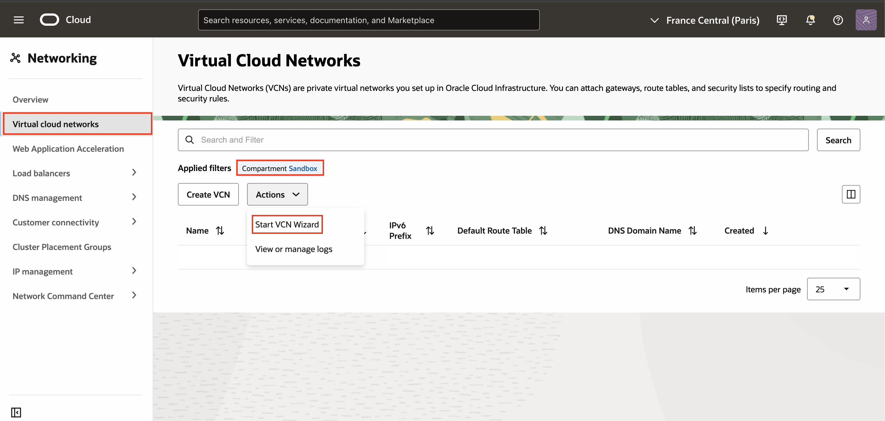
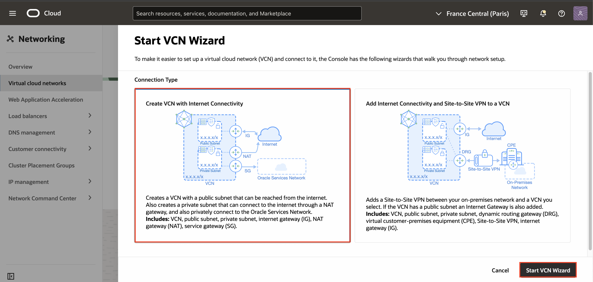
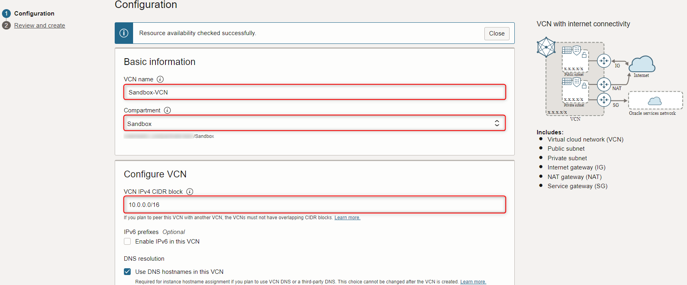
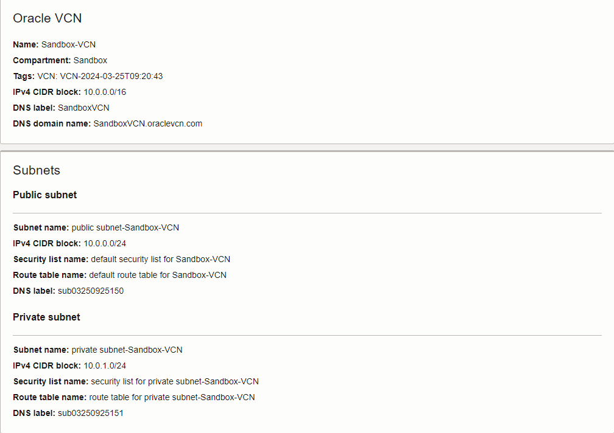
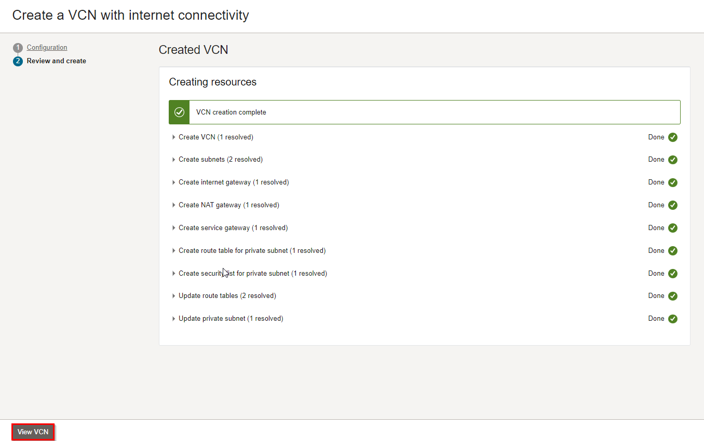

# Create Virtual Cloud Networks

## Introduction

Oracle Cloud Infrastructure (OCI) Compute lets you create multiple Virtual Cloud Networks (VCNs). These VCNs will contain security lists, compute instances, load balancers and many other types of network assets.

Be sure to review [Overview of Networking](https://docs.cloud.oracle.com/iaas/Content/Network/Concepts/overview.htm) to gain a full understanding of the network components and their relationships, or take a look at this video:

Estimated Time: 10 minutes

### Objectives
In this lab, you will:
- Create a virtual cloud network

### Prerequisites

Your **Oracle Cloud Account** - During this workshop we will create a basic environment to get you started with Oracle Cloud.

<if type="livelabs">
You are running this workshop in a LiveLabs environment. Our LiveLabs environments use a pre-configured Virtual Cloud Network (VCN), so you will not create a VCN in this workshop. However, you can see how a VCN is created in Oracle Cloud Infrastructure by watching this short video:

 
 </if>

<if type="tenancy">

## Task 1: Create Your VCN

Here is an instructional video, going through the process of making a VCN:

 

To create a VCN on Oracle Cloud Infrastructure:

1. On the Oracle Cloud Infrastructure Console Home page, under the **Launch Resources** header, click **Set up a network with a wizard**.

    

2. Select **Create VCN with Internet Connectivity**, and then click **Start VCN Wizard**.

    

3. Complete the following fields:

    |                  **Field**              |    **Value**  |
    |----------------------------------------|:------------:|
    |VCN Name |VCN-Workshop|
    |Compartment |  Choose the ***Workshop*** compartment you created in the ***"Create a Compartment" Lab***
    |VCN CIDR Block|10.0.0.0/16|
    |Public Subnet CIDR Block|10.0.0.0/24|
    |Private Subnet CIDR Block|10.0.1.0/24|
    |Use DNS Hostnames In This VCN| Checked|

    Your screen should look similar to the following:

    
    

     Click the **Next** button at the bottom of the screen.

4. Review your settings to be sure they are correct. Click the **Create** button to create the VCN. 
    

5. It will take a moment to create the VCN and a progress screen will keep you apprised of the workflow.

    

6. Once you see that the creation is complete (see previous screenshot), click the **View VCN** button.
 </if>

### Summary

This VCN will contain all of the other assets that you will create during this set of labs. In real-world situations, you would create multiple VCNs based on their need for access (which ports to open) and who can access them. Both of these concepts are covered in the next lab ***Create a Compute Service***.

_Congratulations! You have successfully completed the lab._

## Acknowledgements

- **Author** - Rajeshwari Rai, Prasenjit Sarkar 
- **Contributors** - Oracle LiveLabs QA Team (Kamryn Vinson, QA Intern, Arabella Yao, Product Manager, DB Product Management)
- **Last Updated By/Date** - Radu Chiru, August 2023

