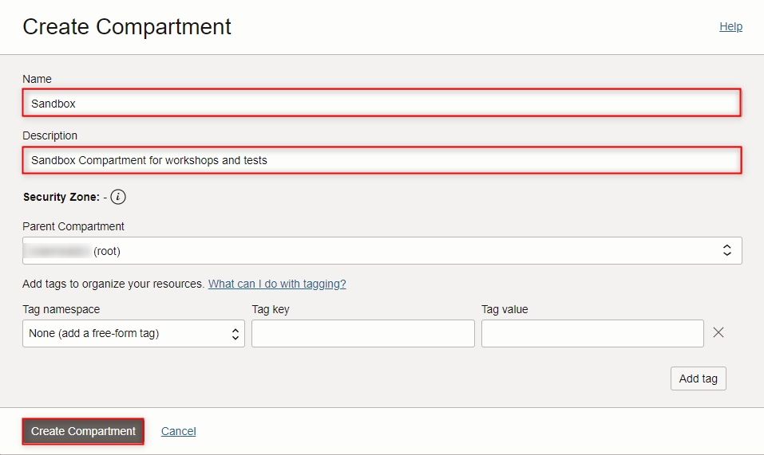
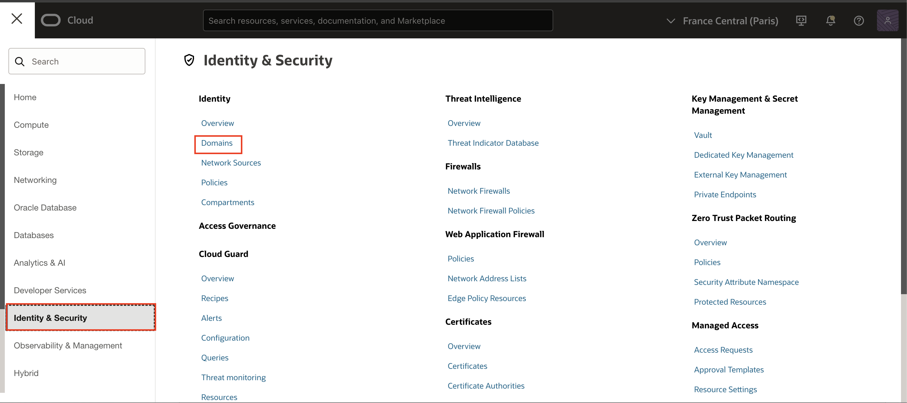
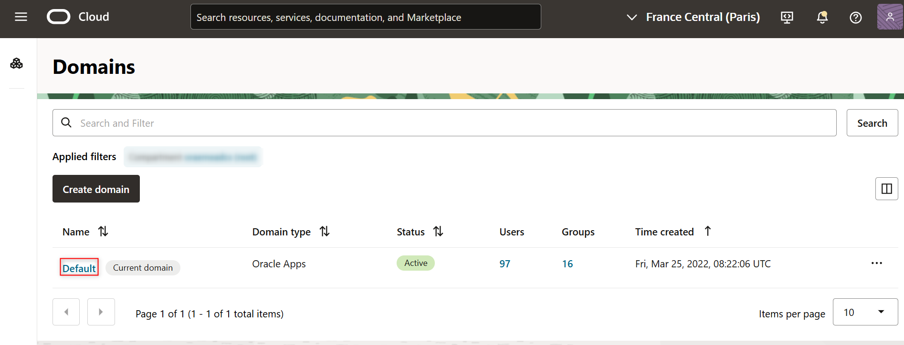
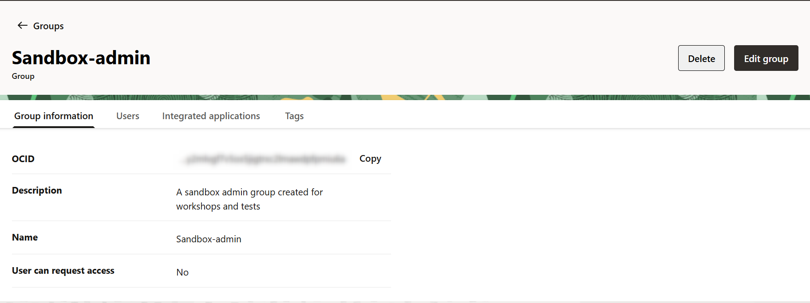
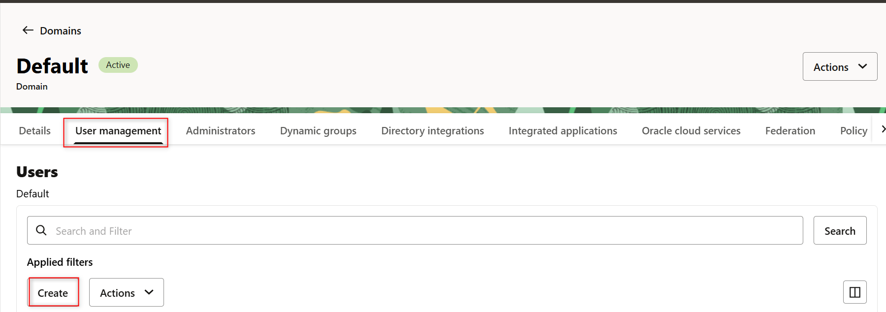
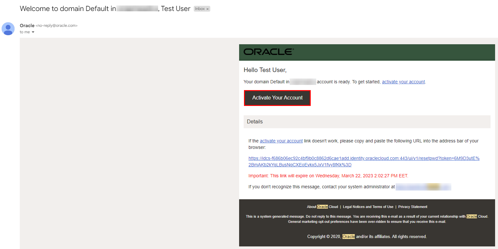
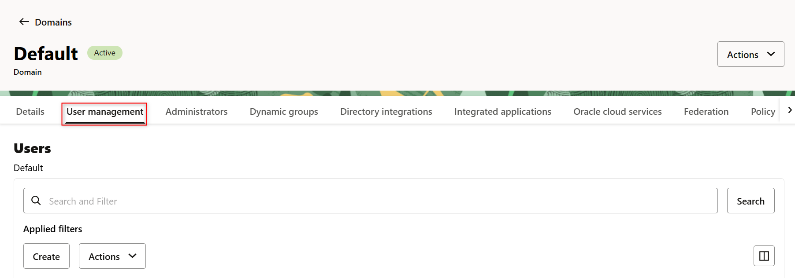
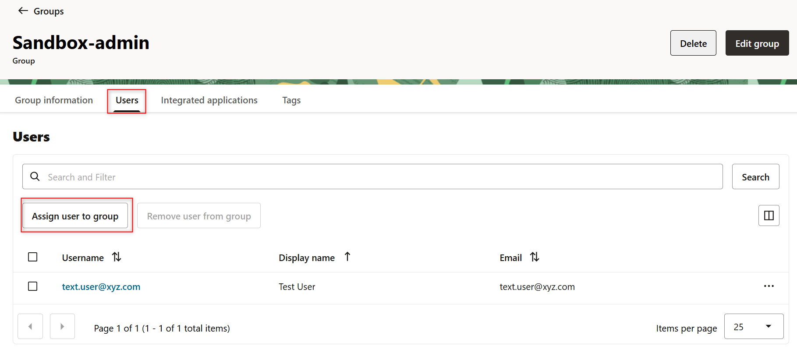
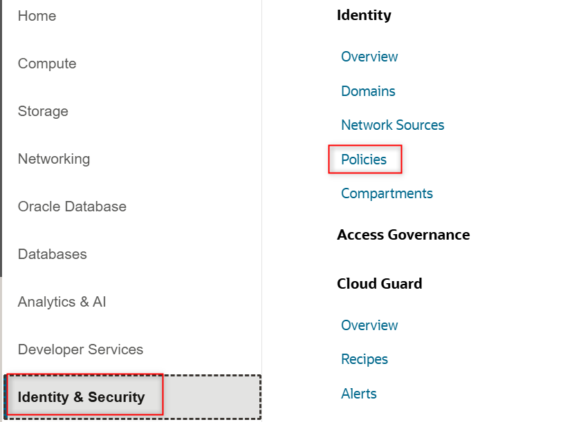
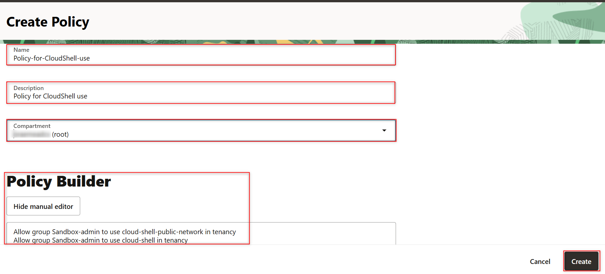

# Identity and Access Management

## Introduction

Oracle Cloud Infrastructure (OCI) Identity and Access Management (IAM) Service lets you control who has access to your cloud resources. You control the types of access a group of users has and to which specific resources. Moreover, with the inclusion of Identity Domains, OCI IAM and Oracle IDCS were unified into a single cloud service.

The purpose of this lab is to give you an overview of the IAM Service components with Identity domains and an example scenario to help you understand how they work together.

Estimated time: 5 minutes

These videos provide an overview over **Identity and Access Management**:

[](youtube:Op5TLTBBABI)

[](youtube:zLU04HSYOOY)

### Objectives

<if type="livelabs">
You are running this workshop in a LiveLabs environment. Our LiveLabs environments use a pre-configured Identity and Access Management environment, so you will not be able to create a compartment, or to manage a user's access in this workshop. However, you can see how a compartment is created in Oracle Cloud Infrastructure by watching this short video:

[](youtube:FSjQP5gqLAc)
</if>

<if type="tenancy">
In this lab, you will:

- Create a compartment
- Create a user
- Create a group
- Add user to the group
- Create a policy associated to the group


### Prerequisites

Your **<font color="red">Oracle Cloud Account</font>** - During this workshop we will create a basic environment to get you started with Oracle Cloud.

You can see how a compartment is created in Oracle Cloud Infrastructure by watching this short video:
[](youtube:FSjQP5gqLAc)

## Task 1: Create Compartments

A compartment is a collection of cloud assets, like compute instances, load balancers, databases, etc. By default, a root compartment was created for you when you created your tenancy (i.e. when you registered for the trial account). It is possible to create everything in the root compartment, but Oracle recommends that you create sub-compartments to help manage your resources more efficiently.

1. Click the **Navigation Menu** in the upper left, navigate to **Identity & Security** and select **Compartments**.

 

1. Click **Create Compartment**.


   

1. Name the compartment **Sandbox** and provide a short description. Be sure your root compartment is shown as the parent compartment. Press the blue **Create Compartment** button when ready.

   

1. You have just created a compartment for all of your work in this *Workshop*.

##  Task 2: Manage Users, Groups, and Policies to Control Access

A user's permissions to access services comes from the _groups_ to which they belong. The permissions for a group are defined by policies. Policies define what actions members of a group can perform, and in which compartments. Users can access services and perform operations based on the policies set for the groups of which they are members.

We'll create a user, a group, and a security policy to understand the concept.

In 2022, OCI IAM introduced Identity Domains. An identity domain is a container for managing users and roles, federating and provisioning of users, secure application integration through Oracle Single Sign-On (SSO) configuration, and OAuth administration.

1. Click the **Navigation Menu** in the upper left. Navigate to **Identity & Security** and select **Domains**

For IAM with Identity Domains, what was identified before as IAM users and groups, now is under the default domain.

   

1. Select the default domain

   

1. Select **User Management** and scroll down to **Groups**

   

1. Click **Create Group**.

   In the **Create Group** dialog box, enter the following:

     - **Name:** Enter a unique name for your group, such as **Sandbox-admin**   
     - **Description:** Enter a description, such as **A sandbox admin group created for workshops and tests**
     - Click **Create**

    

1. Click your new group to display it. Your new group is displayed.

   

1. Create a New User

   a) Click on **<- Groups**

   

   You can also click the **Navigation Menu** in the upper left, navigate to **Identity & Security** and select **Domains**, select the default domain and then go to **Users**

   b) Select **Users**

   

   c) Click **Create User**.

   In the **Create User** dialog box, enter the following:

      - **First Name** - your first name
      - **Last NameName** - your last name
      - **Email:**  Preferably use a personal email address to which you have access (GMail, Yahoo, etc) and different from any email already in use in the tenancy.
      - **Use the email address as the username:** Leave checked unless if you want to use an username that is not the email. It can be used if you want to use the same email already in use in the tenancy.
      - Check the box besides **Sandbox-admin**

    Click **Create**.

      
      
      - Scroll lower, check the box besides **Sandbox-admin**

    Click **Create**.

      

   After creating the user, you will be directed to the user details.

   The newly created user will receive an email with an activation link like this:

      

1. If the user did not receive the email, in the user details, you have a reset password button that will send a password reset link.

      

   After clicking in the reset button, your will be prompted for confirmation before the reset link is sent.

1. Add User to a Group.

     

      a) Click the **Navigation Menu** in the upper left. Navigate to **Identity & Security** and select **Domains**. From the **Users** list, click the user account that you just created (for example, `Test User`)  to go to the User Details page.
         

      b) Select the default domain.
         


      c) Go to **User Management** and scroll down to your **Sandbox-admin** group.
         

      d) Select **Users** and click on **Assign user to group**.
         

  

1. Now, let’s create a security policy that gives your group permissions in your assigned compartment and another one that allows users to use the CloudShell tool.


   a) Click the **Navigation Menu** in the upper left. Navigate to **Identity & Security** and select **Policies**.

   

   b) Select **Sandbox** compartment. After you have selected the **Sandbox** compartment, click **Create Policy**.

   

      >**Note:** You may need to click on the + sign next to your main compartment name to be able to see the sub-compartment ***Sandbox***. If you do, and you still don't see the sub-compartment, ***refresh your browser***. Sometimes your browser caches the compartment information and does not update its internal cache.
    
   
   c) Enter a unique **Name** for your policy (for example, "Policy-for-Sandbox-admin").
      >**Note:** the name can NOT contain spaces.

   d) Enter a **Description** (for example, "Policy for Sandbox-admin Group").

   e) Select **Sandbox** for compartment.

   f) Click **Show manual editor** and enter the following **Statement**:

     ```
     <copy>Allow group Sandbox-admin to manage all-resources in compartment Sandbox</copy>
     ```

     Note: If you do not include the *identity_domain_name* before the *group_name*, then the policy statement is evaluated as though the group belongs to the default identity domain.

   g) Click **Create**.

   

   For the CloudShell policy, please create a new one, set a name for it (for example, "Policy for CloudShell use") and make sure it's created inside the root compartment. Paste the following policy statements in the textbox:

   ```
     <copy>Allow group Sandbox-admin to use cloud-shell-public-network in tenancy
      Allow group Sandbox-admin to use cloud-shell in tenancy</copy>
     ```

   


Note : Please keep in mind that Cloud Shell does not support policies at the compartment level, only at the tenancy level.


    


</if>

_Congratulations! You have successfully completed the lab._

## Acknowledgements

- **Author** - Cristian Manea
- **Contributors** - Cristian Manea, Birsan Radu, Alexandra Iancu
- **Last Updated By/Date** - Birsan Radu, Alexandra Iancu, February 2025
