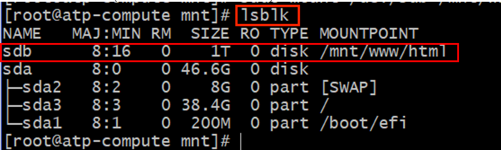
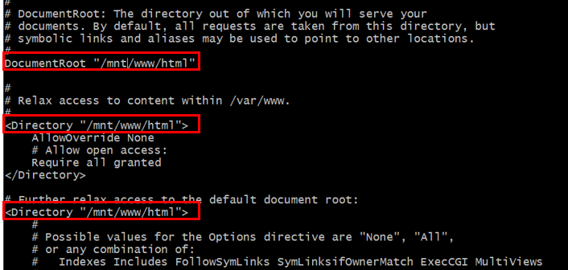
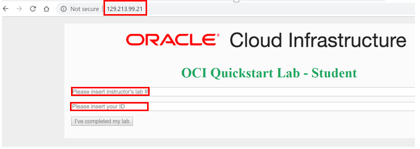

# Create Compute instance, Block Volume and install an app.

## Introduction

In this lab we will create a compute instance, install httpd server, attach block volume to it, and install an app on the Block Volume. We will then create a second compute instance using the boot volume of the first compute instance and move the Block Volume to the second compute instance (with the app installed).

## Objectives
- Demonstrate launching VCN
- Compute Instance
- Use Boot volume of compute instance
- Move additional storage with applications/tools installed between compute instances.

## Task 1: Create VCN

1. From the OCI Services menu, click **Virtual Cloud Networks** under **Networking**. Select the compartment assigned to you from drop down menu on left part of the screen
2. Click **Start VCN Wizard**.

   **NOTE:** Ensure the correct Compartment is selected under COMPARTMENT list.
   

3. Click **VCN with Internet Connectivity** and click **Start VCN Wizard**.

4. Fill out the dialog box:

      - **VCN NAME**: Provide a name
      - **COMPARTMENT**: Ensure your compartment is selected
      - **VCN CIDR BLOCK**: Provide a CIDR block (10.0.0.0/16)
      - **PUBLIC SUBNET CIDR BLOCK**: Provide a CIDR block (10.0.1.0/24)
      - **PRIVATE SUBNET CIDR BLOCK**: Provide a CIDR block (10.0.2.0/24)
      - Click **Next**

5. Verify all the information and  Click **Create**.

6. This will create a VCN with following components.

    *VCN, Public subnet, Private subnet, Internet gateway (IG), NAT gateway (NAT), Service gateway (SG)*

7. Click **View Virtual Cloud Network** to display your VCN details.

8. We will open port 80 on this VCN to provide http access to app on the compute instance(to be installed later on. Scroll down and Click **Security List** under **Resources** and then **Default Security list for`<YOUR_VCN_NAME>`**


9. Click **Add Ingress Rule**

10. Add the following rule under **Ingress Rules**:

      - **Make sure STATELESS is un-checked**
      - **SOURCE TYPE:** CIDR
      - **SOURCE CIDR:** 0.0.0.0/0
      - **IP PROTOCOL:** TCP
      - **SOURCE PORT RANGE:** ALL
      - **DESTINATION PORT RANGE:** 80

    Then, Click **Add Ingress Rules** at the bottom.

## Task 2: Compute instance.

1. Launch **Cloud Shell** by clicking the icon next to region name on top right of OCI console. ('<=' icon)

2. Once cloud Shell is launched. Enter command **ssh-keygen**, press enter for all prompts. This will create a ssh key pair. Enter command;
```
 <copy>
ssh-keygen
</copy>
```

```
 <copy>
bash
cd .ssh
cat id_rsa.pub
</copy>
```
Copy the key displayed. Thsi will be used when creating the compute instance.

3. From OCI services menu, Click **Instances** under **Compute**.
 
4. On the left sidebar, select the **Compartment** in which you placed your VCN under **List Scope**. The, Click **Create Instance**.
 
5. Enter a **Name** for your Instance and the **Compartment** in which you placed your VCN. Fill out the dialog box. Leave **Image or Operating System** and **Availability Domain** as the default values.

6. Leave Shape  **Shape** as default value.

7. Scroll Down to **Configure Networking** and verify the following.
      - Your Compartment is selected
      - The VCN created is populated
      - The subnet created is populated 
      - **Assign a public IP address**: Checked

8. Ensure **PASTE PUBLIC KEYS** is slected under **Add SSH Keys**. Paste the public key copied earlier.
 
   **NOTE:** If 'Service limit' error is displayed choose a different shape from VM.Standard2.1, VM.Standard.E2.1, VM.Standard1.1, VM.Standard.B1.1 OR choose a different AD.

9. Click **Create** and wait for Instance to be in **Running** state. Note down the public IP address of the compute instance.


10. Enter the following command replacing SSH-KEY-NAME with the name of your ssh private key(in this case id_rsa) and replacing PUBLIC-IP-OF-COMPUTE1 with the IP address of the first compute instance you created.
  *Note: Your SSH-KEY-NAME name should NOT end in .pub*

      ```
      <copy>
      bash
      ssh -i SSH-KEY-NAME opc@PUBLIC-IP-OF-COMPUTE-1
      </copy>
      ```

      Ex: ssh -i id_rsa opc@193.122.146.136

      *Note: If a "Permission denied error" is seen, ensure you are using '-i' in the ssh command. Also make sure that you correctly copied the name of your ssh key and the public IP of your compute instance.*

11. Enter 'Yes' when asked 'Are you sure you want to continue connecting (yes/no)?'.

12. Verify opc@`<COMPUTE_INSTANCE_NAME>` appears on the prompt.

  Ex: [opc@quickstart_instance ~]

## Task 3: Attach block volume to compute instance.

1. From OCI services menu Click **Block Volumes** under **Block Storage**, then Click **Create Block Volume**.

2. Fill out the dialog box:

    - **Name:** Enter a name for the block volume. (e.g. "block_vm)
    - **Create in Compartment:** Select the same compartment as your VCN and Instance.
    - **Availability Domain:** Select the first available domain (must be same as Compute).
    - **Volume and Size Performance:** Select default.
    - **Compartment for Backup Policy:** Leave as default setting.
    - **Backup Policy:** Leave empty.
    - **Encryption:** Select "Encrypt Using Oracle-Managed Keys"

    Click **Create Block Volume**.

3.  Wait for Block Volume state to change from 'Provisioning' to 'Available'.

4. Attach Block volume to your compute instance. From OCI services menu Click **Instance** under **Compute**.

5. Click the Compute instance name created earlier to see instance details page. Scroll down and Select the **Attached Block Volumes** under  **Resources** on the left side of the page. Click **Attach Block Volume**

6. Fill out the dialog box:

    - **Volume Attachment Type:** Leave the default
    - **Block Volume In:** Click the drop down and choose the block volume created earlier
    - **Device Path:** Select a device path

    **NOTE:** Selecting the device path /dev/oracleoci/oraclevdb would result in the same device path as the screenshots in  the rest of the lab.
    

7. Click **Attach**.

8. Verify Block volume is attached on compute instance details page (Refresh the screen if needed).


## Task 4: Install httpd on compute instance and an app on block volume.

1. Switch to ssh session to compute instance (Cloud Shell). Install httpd server, Enter Command:

      ```
      <copy>
      sudo yum -y install httpd
      </copy>
      ```

      
      
      


2. Configure Compute instance firewall, Enter commands:

      ```
      <copy>
      sudo firewall-cmd --permanent --add-port=80/tcp
      </copy>
      ```
      (Open port 80 on the firewall to allow http and https traffic).

      *NOTE: Despite the line wrapping, the --add-port flag has no spaces.*
      ```
      <copy>
      sudo firewall-cmd --reload
      </copy>
      ```
      (Reload the firewall to activate the rules).

      

*NOTE: The above screenshot shows parts 2-5*

3. Start httpd, Enter command:

      ```
      <copy>
      sudo systemctl start httpd
      </copy>
      ```

4. Enter command lsblk to verify the Block volume storage is initialized.

      ```
      <copy>
      lsblk
      </copy>
      ```

     

      **HINT:** The name of the block volume storage will start with 'sd'. In this case it is sdb, but could change for your specific attachment (i.e sdc, sda). In the above example this volume is called sdb, shown by its 50GB volume (the size of the compute instance created in Step 2).

5. To format the block volume, Enter Command:


      ```
      <copy>
      bash            
      sudo fdisk /dev/VOLUME_NAME -l
      </copy>
      ```
      *NOTE: VOLUME_NAME should be replaced by the string starting with 'sd' that you identified as the block volume storage in part 4.*

      **For example: sudo fdisk /dev/sdb -l**   
      Wait for formatting to complete

6. Create a file system on the block volume, Enter Command:    

      ```
      <copy>
      bash
      sudo mkfs.ext4 -L datapartition /dev/VOLUME_NAME
      </copy>
      ```  
      *NOTE: VOLUME_NAME should be replaced by the string starting with 'sd' that you identified as the block volume storage in part 4.*

      This will create the file system on the entire disk. Enter **y** when prompted with **Proceed anyway (y/n)?**. (For this lab we will not be creating additional partitions.)


      
      
      *NOTE: The above screenshot shows parts 6 & 7.*

7. Create a directory where the disk will be mounted,Enter commands:

      ```
      <copy>
      sudo mkdir -p /mnt/www/html   
      </copy>         
      ```

8. Mount the disk to the newly created directory. Enter command:

      ```
      <copy>
      sudo mount  /dev/VOLUME_NAME  /mnt/www/html
      </copy>
      ```
      *NOTE: VOLUME_NAME should be replaced by the string starting with 'sd' that you identified as the block volume storage in part 4.*

      

      *NOTE: The above screenshot shows parts 8 & 9.*

9. Verify /dev/`<VOLUME_NAME>` volume is now mounted to /mnt/www/html directory, Enter command:

      ```
      <copy>
      lsblk
      </copy>
      ```
      (in this case the volume is called sdc)

     

10. Next we will download an app and install it. Enter command:

      ```
      <copy>
      cd /home/opc
      </copy>
      ```
      
      
      
      *NOTE: The above screenshot shows parts 10 & 11.*

11. Enter Command:

      ```
      <copy>
      wget https://github.com/snafuz/oci-quickstart-lab/archive/master.zip
      </copy>
      ```
12. Enter Command:

      ```
      <copy>
      unzip master.zip
      </copy>
      ```
      
      
      
      *NOTE: The above screenshot shows parts 12-14.*

13. Enter Command:

      ```
      <copy>
      sudo cp -R oci-quickstart-lab-master/static/* /mnt/www/html/
      </copy>
      ```

14. Modify httpd.conf file, Enter Command:
      ```
      <copy>
      sudo nano  /etc/httpd/conf/httpd.conf
      </copy>
      ```

15. Search for string /var/www and replace it with /mnt/www/html. This will be done in 3 locations

      ```
      <copy>
      /mnt/www/html
      </copy>
      ```

      


16. To Save and Exit, Control+X. When asked 'Save modified buffer?', type y for yes. Then press enter to preserve the name of the file.

17. Enter command:

      ```
      <copy>
      sudo chcon -R --type=httpd_sys_rw_content_t /mnt
      </copy>
      ```
      
      
      
      *NOTE: The above screenshot shows parts 17-19.*

18. Restart httpd server, Enter command:

      ```
      <copy>
      sudo systemctl restart httpd
      </copy>
      ```

19. Launch a web browser and Enter compute Instance's public IP:

      ```
      <copy>
      bash
      </copy>
      ```

20. Open a new tab and enter **http://PUBLIC-IP** where PUBLIC-IP is the IP address of the compute instance from STEP 2 and a screen like below should appear.

     

We have initialized httpd.conf file. Next we will create a second compute instance using the boot volume of the first compute instance and attach Block Volume to it

## Task 5:(OPTIONAL): Detach the block volume and launch second compute instance using boot volume and attach Block Volume

In this section we will detach the block volume, Stop the compute instance, use its boot volume to launch a second compute instance and delete the second compute instance.

1. In ssh session to the compute instance unmount the directory from block volume, Enter command:

      ```
      <copy>
      bash
      sudo umount /dev/VOLUME_NAME
      </copy>
      ```

      

2. In OCI console window, Click your compute instance name and in **Attached Block Volume** section  Click the action icon and **Click Detach**. Then, verify the detachment by pressing **Continue Detachment** and **OK** in the Confirm Window.

      

3. Stop your compute instance by Clicking **Stop** in compute instance details page. Then, click **Stop Instance** in the Confirm window.

4. Once the instance is in Stopped state, Click **Boot Volume**, Click action icon and Click **Detach**. Click **Detatch Boot Volume** in Confirm window.


5. Once the Boot volume is detached, Click **Terminate** to Terminate the instance. Then, click **Terminate Instance** in the Confirm window.

6. Click the action icon, Click **View Boot Volume Details**.

      

7. In the Boot Volume Details window Click **Create Instance:**

8. Repeat the settings detailed in **STEP 2** to create an instance.

9. Wait for the instance to be in Running state. Then, use the instructions from **STEP 3** to attach the block volume and ssh to compute instance.

  *NOTE: Ensure to use Paravirtualized mode and wait for the block volume to change from 'Attaching' to 'Attached'.*

10. To compute instance and mount the block volume as before, Enter Command:
  *NOTE: <VOLUME_NAME> should be replaced by the string starting with 'sd' that you identified as the block volume storage in the previous step. *
      ```
      <copy>
      bash
      sudo mount  /dev/DEVICE_PATH  /mnt/www/html
      </copy>
      ```
      
      

*NOTE: This screenshot shows steps 10 & 11.*


11. To restart httpd, Enter command

      ```
      <copy>
      sudo systemctl restart httpd
      </copy>
      ```

12. Launch a web browser and Enter compute Instance's public IP, **`http://<COMPUTE_INSTANCE_PUBLIC_IP>`**

13. Screen like below should appear, Enter the required information.

     

We have now successfully launched a compute instance using another instance's boot volume and re-attached a block volume that was attached to another instance. The block volume preserved all the data on it during this process. Moreover the compute instance launched using the boot volume had httpd server and fire wall configuration already present.

## Task 6: Delete the resources

1. Switch to  OCI console window.

2. If your Compute instance is not displayed, From OCI services menu Click **Instances** under **Compute**.

3. Locate the compute instance, Click Action icon and then **Terminate**.

4. Make sure Permanently delete the attached Boot Volume is checked, Click Terminate Instance. Wait for instance to fully Terminate.


5. From OCI services menu Click **Block Volumes** under Block Storage.

6. Find the storage block volume you created.

   **HINT:** If multiple storage block volumes are listed, scroll down to find the one you created.   

7. Click the Action icon and select **Terminate**.

8. Click OK in the confirmation window.

9. From OCI services menu Click **Virtual Cloud Networks** under Networking, list of all VCNs will
appear.

10. Locate your VCN , Click Action icon and then **Terminate**. Click **Delete All** in the Confirmation window. Click **Close** once VCN is deleted.


***Congratulations! You have successfully completed the lab.***

## Learn More
1. [OCI Training](https://cloud.oracle.com/en_US/iaas/training)
2. [Familiarity with OCI console](https://docs.us-phoenix-1.oraclecloud.com/Content/GSG/Concepts/console.htm)
3. [Overview of Networking](https://docs.us-phoenix-1.oraclecloud.com/Content/Network/Concepts/overview.htm)
4. [Familiarity with Compartment](https://docs.us-phoenix-1.oraclecloud.com/Content/GSG/Concepts/concepts.htm)
5. [Connecting to a compute instance](https://docs.us-phoenix-1.oraclecloud.com/Content/Compute/Tasks/accessinginstance.htm)

## Acknowledgements

- **Author** - Flavio Pereira, Larry Beausoleil
- **Adapted by** -  Yaisah Granillo, Cloud Solution Engineer
- **Last Updated By/Date** - Umair Siddiqu, November 2020
- **Contributors** - Marilyn Isabella Kessinger, QA Intern, Arabella Yao, Product Manager Intern, DB Product Management

