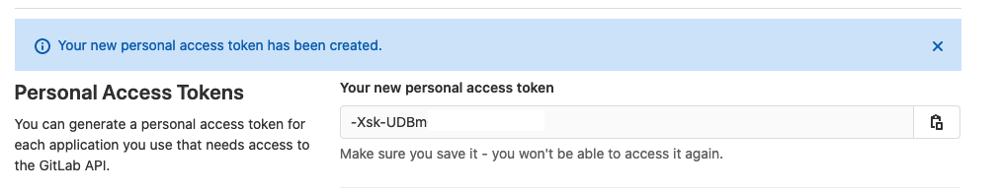
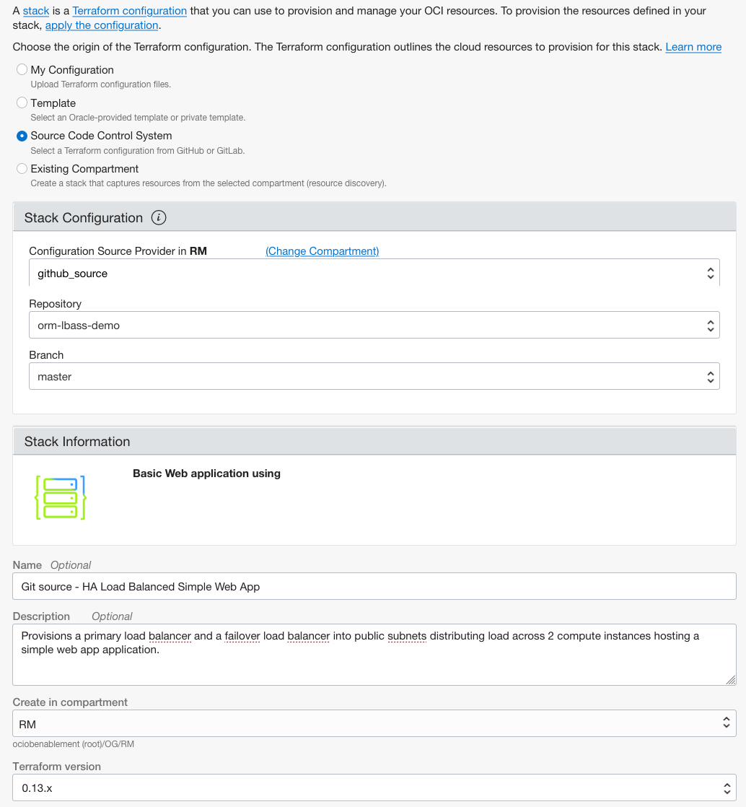
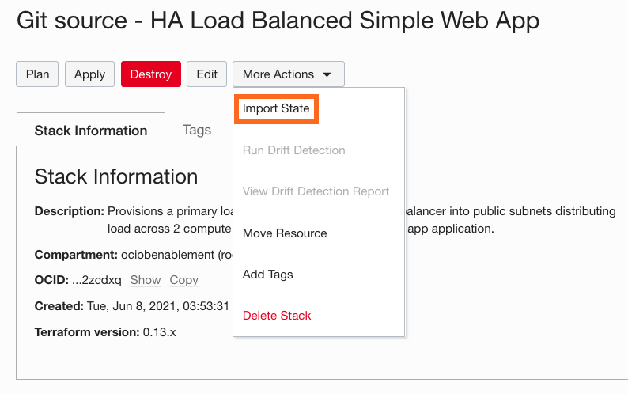

## Task 1: (OPTIONAL) Migrate source code to GitHub

As you often hear Terraform referred to as Infrastructure is Code, an optimal strategy includes the use of source control for all Terraform configuration.  With resource manager, you can integrate directly to your source control through the use of **Configuration Source Providers**.  In this section you will create a new configuration source provider using Github and store your configuration.  To test it out, you will make a small change to your code and apply (update) the stack.  Watch as ORM pulls directly from GitHub.

**Important** This exercise requires some working experience with Git, and an account with gitlab.com.  You can set up a free account here:
https://github.com/join

1. In order to create a configuration source provider, you will need an **Personal access token** for GitHub.com.  First you need to login to your GitHub Account and, once logged into gitlab.com, navigate to: "https://github.com/settings/tokens".  Choose **Generate Token** and enter the following details:

    

      - Note
      - Select Scopes: **read:packages**

    Click **Create token**

1. The screen wil display your personal access token at the top of the page. Copy and save the token.

   

1. Return to the resource manager console and navigate to configuration source providers.  Click **Create Configuration Source Provider**.

1. Complete the required fields as follows and click **Create**:

    

    ...pasting the PAT created in step 1.

    *Important* The configuration source provider need only reference your GitHub account.  You will specify a particular repository and branch at the Stack level.

1. Create a new Rrepository in GitHub. Again, we are using *Sample ORM Source* for this guide.

    https://docs.github.com/en/github/getting-started-with-github/quickstart/create-a-repo

1. Populate the repo with the files in the zip file that we used to create the first stack. [HA Load Balanced Simple Web App](https://objectstorage.us-ashburn-1.oraclecloud.com/p/Jp3iMGo_6czdM4qk45cBROd9hO5R1BhtTKkFm2kjoB8MoiyZk6NBSa-5JUb6fSIW/n/ociobenablement/b/hol-labs/o/orm-lbass-demo.zip)

1. Click the **Navigation Menu** in the upper left, navigate to **Developer Services**, and select **Stacks**.

	    

1. Click **Create Stack**.

      - Select **Source Code Control Systemn**, choose the compartment, then pick your repository and branch **Browse**.

       

      - **Name:** Git source - HA Load Balanced Simple Web App
      - **Description:** Provisions a primary load balancer and a failover load balancer into public subnets distributing load across 2 compute instances hosting a simple web app application.
      - **Create in Compartment:** Select an existing compartment
      - **Terraform Version:** Select 0.13.x

    

1. Click **Next**.   
      - **Configure Variables:** Configure the variables for the infrastructure resources that this stack will create when you run the apply job for this execution plan.
        - **Select a Flex Load Balancer with Minimum and Maximum Bandwidth:** 10Mbps for both minimum and maximum bandwidth
        - **Select Compute Shape:** VM.Standard2.1
        - **Select Availability Domain:** <*Pick one Avaiability Domain*>
        - **SSH Key Configuration:** <*Enter the content of your public ssh key*>
      - **Virtual Cloud Network Configuration:** 
        - **Enter your VCN Name:** vcn01
        - **Enter your CIDR Block:** 10.0.0.0/16
        - **Enter your Subnet Name:** subnet

        

1. Click **Next**.
      - **Verify your configuration variables**
      - Click **Create**

     

1. On the breadcrumb, click on **Stacks**, and select the first stack by clinking on its hyperlinked name (**HA Load Balanced Simple Web App**)

1. Select the Apply Job, clicking on **HA LB App Apply**

1. Click on **Donwload Terraform State** and save the JSON file.

1. On the breadcrumb, click on **Stacks**, and select the second stack by clinking on its hyperlinked name (**Git source - HA Load Balanced Simple Web App**)

1. Click on **More Actions** button and select **Import State**

     

1. Enter the following information:

      - **Name:** HA LB App Import
      - **Apply Job Plan Resolution** HA LB App Plan (you can select the latest succeed plan job to apply)
      - Click **Import**

1. Lets execute a plan by clicking on **Plan** and enter the following information:

      - **Name:** HA LB App Plan
      - Click **Plan**

    

    

    **Note:** Once the modal closes, notice the job's state appears as "Accepted" - which indicates that the platform is spinning up resources needed for executing the command  - followed by "In Progress" and then either "Succeeded" or "Failed".

    

  Your new source (GitHub) should contain the same code that was used to create the stack initially.  Therefore, the plan will result in ZERO changes.

1.  **EXPERIMENT** Now you can update the code in Gitlab and Plan/Apply them directly to your stack.

- Return to the folder where you unzipped the stack and created the local Git repo.  
- Modify the **compute.tf** file by changing the display name of the Web-Server-01 to Web-Server-03:
  
  ``display_name = "Web-Server-01"``

  to

  ``display_name = "Web-Server-03"``

- Save the file / Add / Commit / Push to Gitlab
- Plan and Apply the changes to your stack

   
1. Once the apply action succeeds, verify the resources have been provisioned by reading the Terraform output and checking thar **Webserver 01** was renamed to **Webserver 03** 