# Creating Compute Instance using Custom Image

## Introduction

In this lab we will use Custom image feature of OCI. Using this feature an existing Compute instance with software packages and updates installed can be used to created additional compute instance.  These new compute instances will come with all the software packages and updates pre-installed.

Estimated Time: 45 minutes

## Task 1: Sign in to OCI Console and create VCN

1. From the OCI Services menu, click **Networking** > **Virtual Cloud Networks**. 

    

2. Select the compartment assigned to you from the drop down menu on the left part of the screen and click **Start VCN Wizard**.

    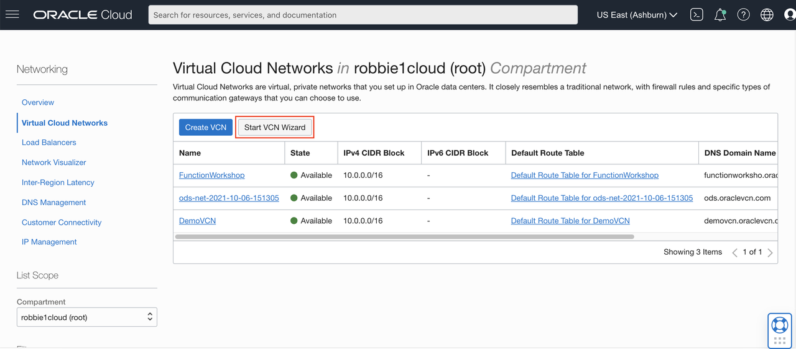

3. Click **Create VCN with Internet Connectivity** and click **Start VCN Wizard**.

    

4. Fill out the dialog box:

      - **VCN NAME**: Provide a name
      - **COMPARTMENT**: Ensure your compartment is selected
      - **VCN CIDR BLOCK**: Provide a CIDR block (10.0.0.0/16)
      - **PUBLIC SUBNET CIDR BLOCK**: Provide a CIDR block (10.0.1.0/24)
      - **PRIVATE SUBNET CIDR BLOCK**: Provide a CIDR block (10.0.2.0/24)
      - Click **Next**

    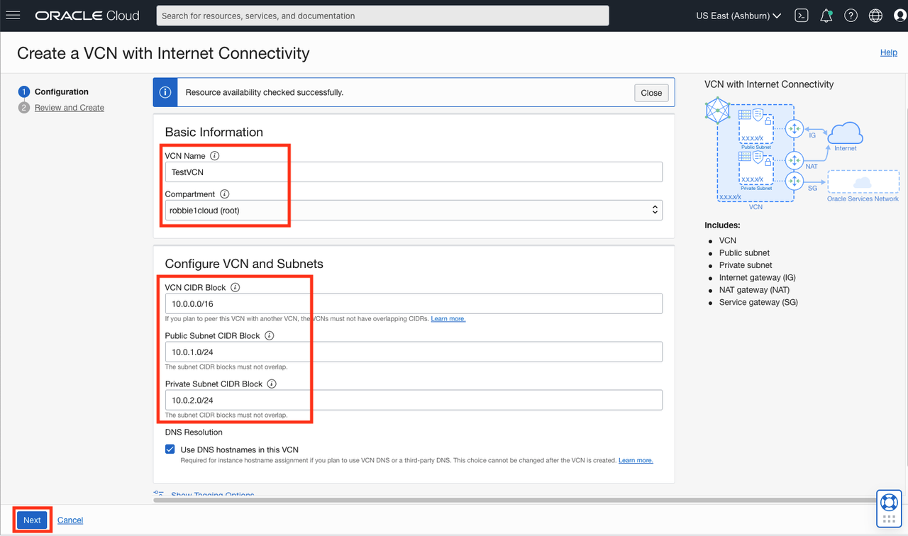

5. Verify all the information and  Click **Create**.

    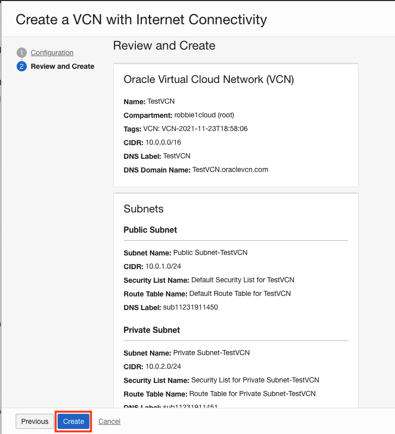

    This will create a VCN with the following components.

    *VCN, Public subnet, Private subnet, Internet gateway (IG), NAT gateway (NAT), Service gateway (SG)*

6. Click **View Virtual Cloud Network** to display your VCN details.

    

## Task 2: Create a compute instance

1. Go to the OCI console. From the OCI services menu, click **Compute** > **Instances**.

    

2. Click **Create Instance**. 

    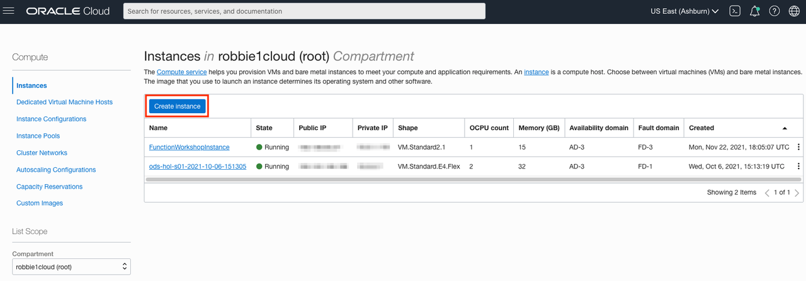

3. Enter a name for your instance and select the compartment you used earlier to create your VCN. Select the **Edit** button in the Image and shape section.

    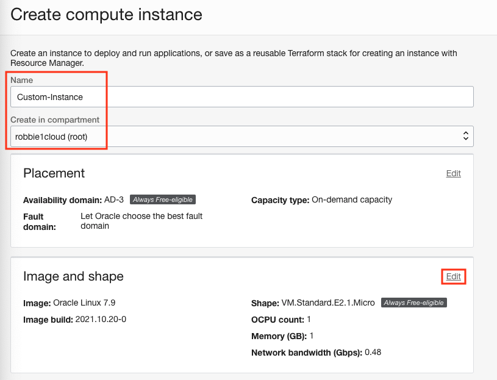  

4. Click **Change Shape**.

    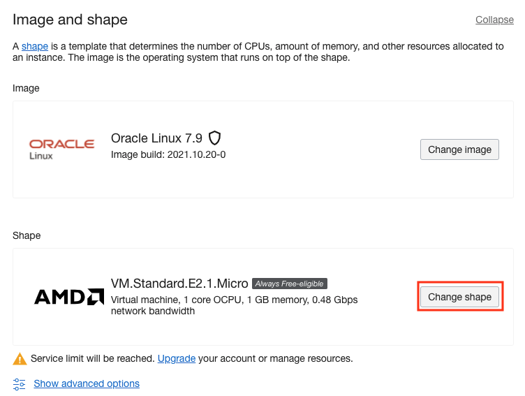       

5. In the **Browse All Shapes** dialog:

      - **Instance Type**: Select Virtual Machine
      - **Shape Series**: Intel
      - **Instance Shape**: Select VM.Standard2.1

      Click **Select Shape**.

      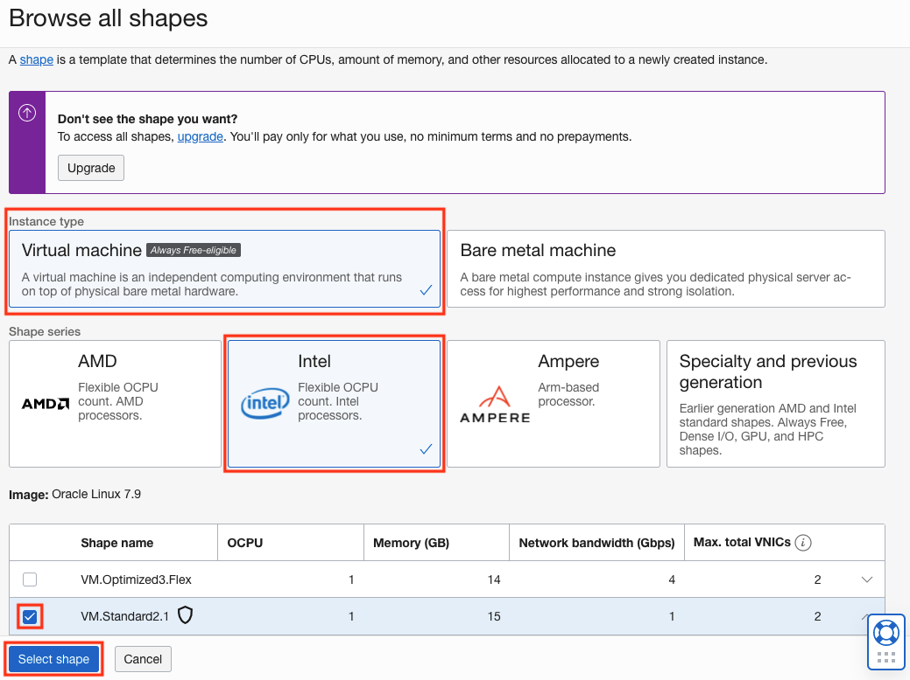

6. Scroll down to the section labeled **Networking** and select the **Edit** button.

    

      - **Virtual cloud network**: Choose the VCN you created in Step 1
      - **Subnet:** Choose the Public Subnet under **Public Subnets** (it should be named Public Subnet-NameOfVCN)
      - **Assign a public IPv4 address**: Check this option

      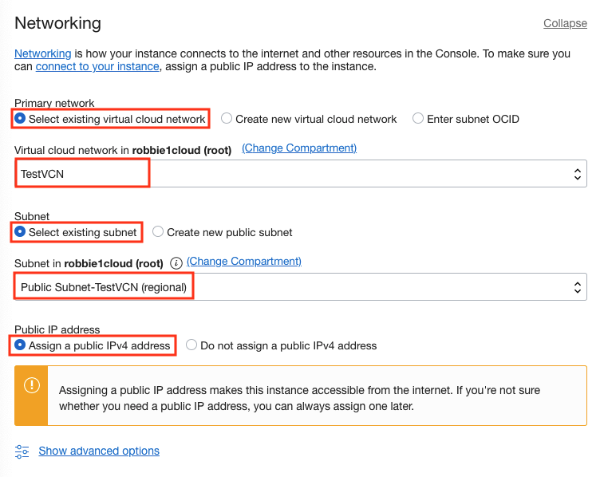 

      - **Add SSH Keys:** Choose 'Paste public keys' and paste the Public Key saved in Lab 1
      - **Boot Volume:** Leave the default, uncheck values      

7. Click **Create**.

    

   **NOTE:** If 'Service limit' error is displayed choose a different shape from VM.Standard2.1, VM.Standard.E2.1, VM.Standard1.1, VM.Standard.B1.1  OR choose a different AD

8.  Wait for the instance to have the **Running** status. Note down the Public IP of the instance. You will need this later.

    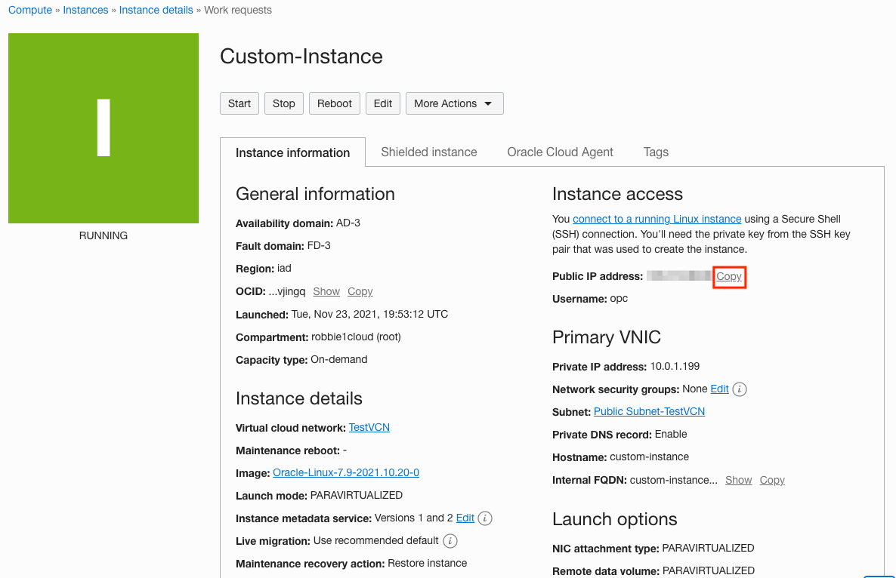

9. In Cloud Shell Terminal, enter:

    ```
    <copy>cd ~/.ssh</copy>
    ```
9.  Enter **ls** and verify your SSH key file exists.

10.  SSH into your compute instance:
    ```
    <copy>ssh -i <sshkeyname> opc@<PUBLIC_IP_OF_COMPUTE></copy>
    ``` 

    **HINT:** If 'Permission denied error' is seen, ensure you are using '-i' in the ssh command. You MUST type the command, do NOT copy and paste ssh command.

11.  Enter 'yes' when prompted for security message.

12.  Verify opc@`<COMPUTE_INSTANCE_NAME>` appears on the prompt.

       

## Task 3: Install httpd on compute instance and create custom image

1. Switch to ssh session to compute install. Install httpd server, Enter Command:
    ```
    <copy>
    sudo yum -y install httpd
    </copy>
    ```

2. Start httpd, Enter command:
    ```
    <copy>
    sudo systemctl start httpd
    </copy>
    ```

3. Verify http status, Enter command:
    ```
    <copy>
    sudo service httpd status
    </copy>
    ```
    

4. We now have installed httpd server on a compute instance and will create a custom image. Switch back to OCI Console window.

5. From OCI services menu, click **Compute** > **Instances**.

    

6. Click your compute instance name and click **Stop**, and **Stop Instance** in the dialog.
     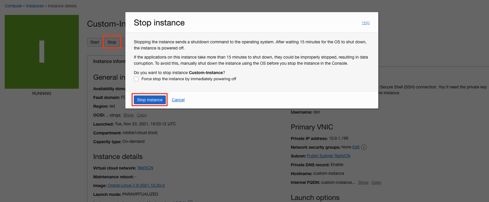

7. Once Stopped, click **Create Custom Image** from the **More Actions** menu
     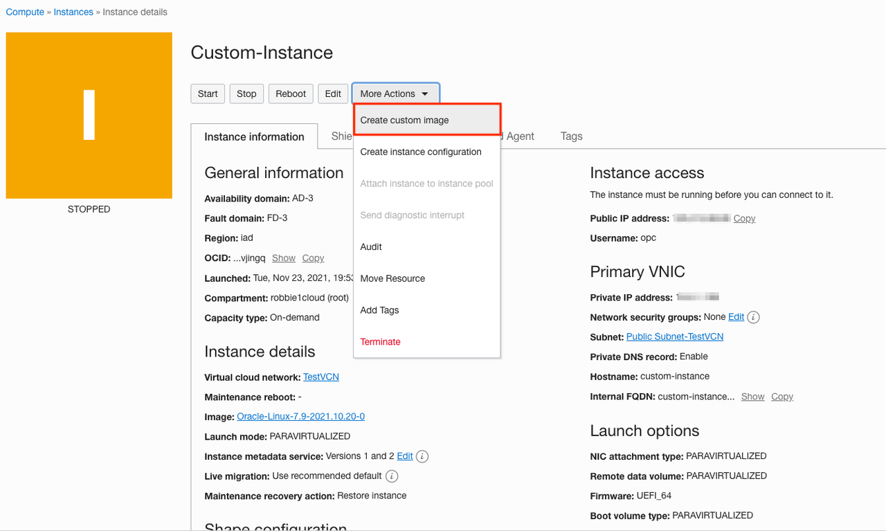

8. Fill out the dialog box and click **Create Custom Image**. 
     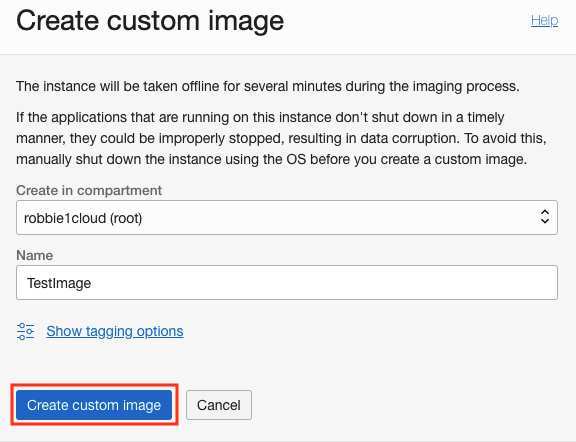

     VMs status will change to **Creating Image**.
     

## Task 4: Start a custom image

1.  Navigate to main Instances page under compute and click **Custom Images**. Locate your custom image, Click the Action icon and then **Create Instance**.
     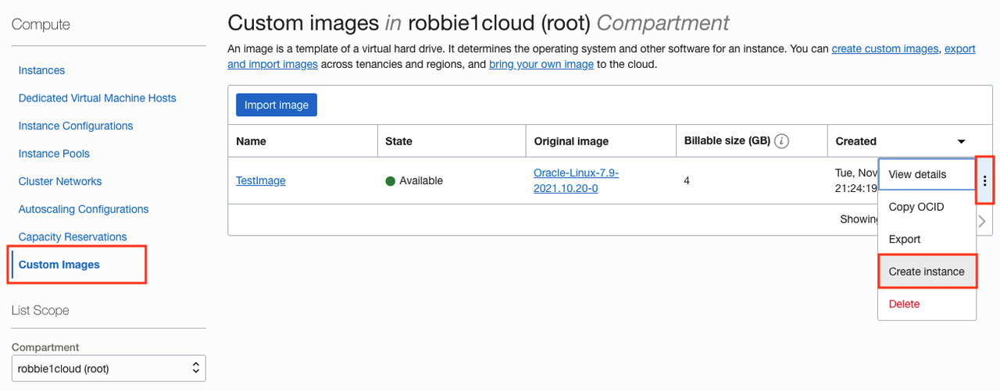

2. Fill out the dialog box and click **Create**.

     
     
     
3. Once the instance is in running state note down it's Public IP address. SSH to the compute instance as we did in Step 2.

    ```
    <copy>ssh -i <sshkeyname> opc@<PUBLIC_IP_OF_COMPUTE></copy>
    ``` 

     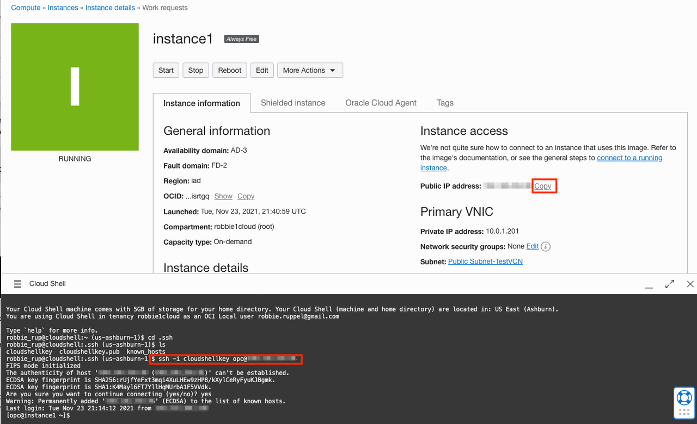

4. Start the httpd service in the custom image:

    ```
    <copy>
    sudo service httpd start
    </copy>
    ```

5. Check the status of httpd service as before.

     

    You have successfully created a custom image with httpd already installed and used this custom image to launch a compute instance and started httpd service. In this new compute instance there was no need to re-install httpd server as it was already present when the custom image was created.

    A compute instance can have a lot more applications installed and this custom image feature facilitates launching new compute instances with these applications pre-installed.

## Task 5: Delete the resources

1. Switch to  OCI console window.

2. From the OCI services menu click **Compute** > **Instances**.

    

3. Locate the first compute instance, click the Action icon and then **Terminate**.
     

4. Make sure Permanently delete the attached Boot Volume is checked, Click **Terminate Instance**. Wait for instance to fully Terminate.
     

5. Repeat the step to delete the second compute instance.

6. From the OCI Services menu click **Compute** > **Custom Images**. 

    

7. Locate the custom image you created. Click the Action icon and then **Delete**.

    

8. From the OCI Services menu, click **Networking** > **Virtual Cloud Networks**. 

    

9. Click on your VCN and click **Terminate**.

    
     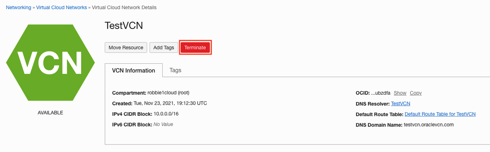

10. Click **Terminate All** in the Confirmation window. Click **Close** once VCN is deleted.
    

*Congratulations! You have successfully completed the lab.*

## Acknowledgements
- **Author** - Flavio Pereira, Larry Beausoleil
- **Adapted by** -  Yaisah Granillo, Cloud Solution Engineer
- **Contributors** - Arabella Yao, Product Manager Intern, DB Product Management
- **Last Updated By/Date** - Kamryn Vinson, November 2021

