# Using Events and Notification

## Introduction

The Oracle Cloud Infrastructure Notifications service broadcasts messages  to distributed components through a publish-subscribe pattern, delivering secure, highly reliable, low latency and durable messages for applications hosted on Oracle Cloud Infrastructure and externally.

The Notifications service enables you to set up communication channels for publishing messages using topics  and subscriptions . When a message is published to a topic, the Notifications service sends the message to all of the topic's subscriptions.
In this lab we will verify notifications when a compute instance is launched and deleted.

Estimated time: 30 minutes

## Task 1: Sign in to OCI Console and configure Notification and Event

1. First, we will create a Notification topic and subscribe to this topic. Click the **Navigation Menu** in the upper left, navigate to **Developer Services**, and select **Notifications**.

	

2. Click **Create Topic** and fill out the dialog box:

      - **Name**: Provide a name
      - **Description** (Optional): Provide a description

    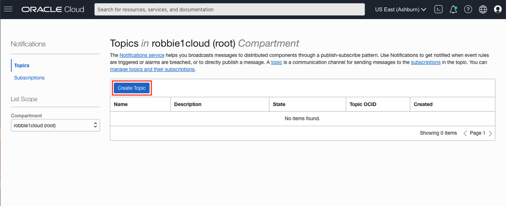  

3. Click **Create**.

    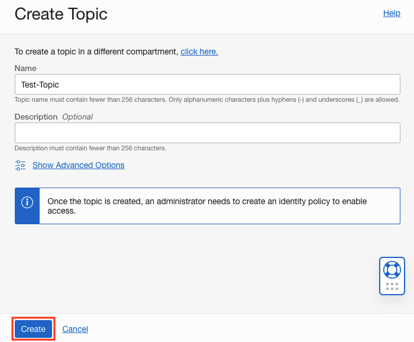  

4. Once the topic state changes to **Active**, Click the topic Name. 

    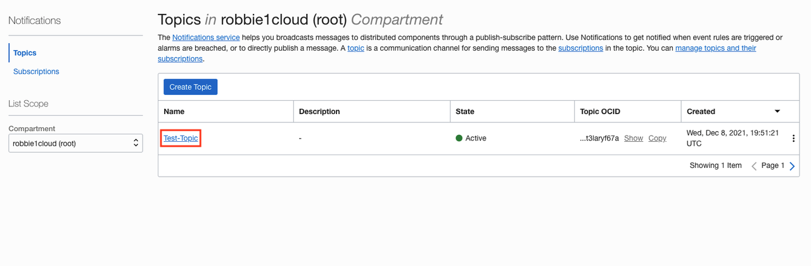

5. Click **Create Subscription** and fill out the dialog box:

      - **PROTOCOL**: Email
      - **EMAIL**: Provide your email id

    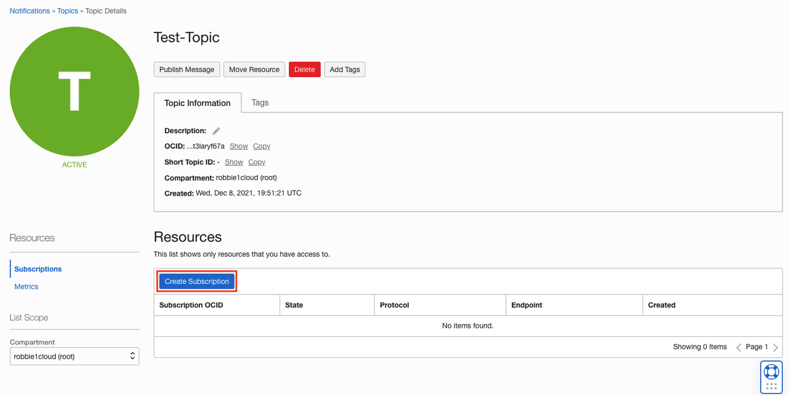

6. Click **Create**.

    

7. Click the Subscription OCID.

    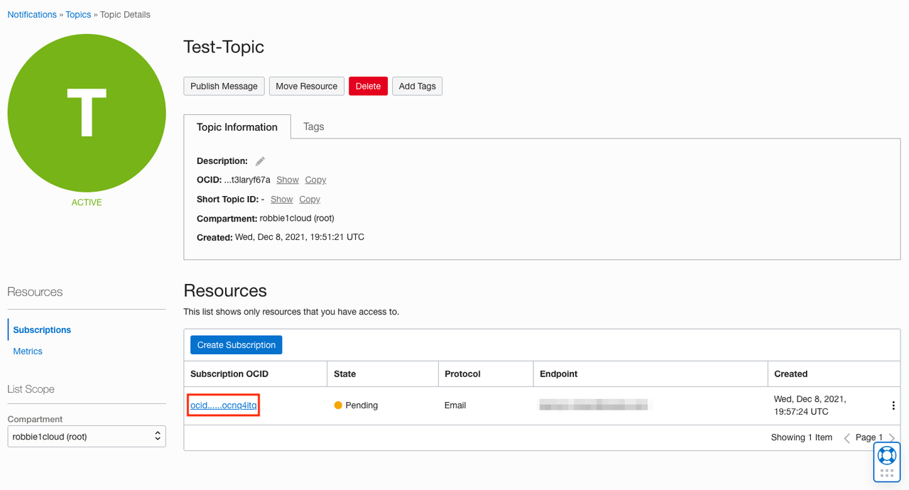

8. The subscription details screen will be displayed with subscription status showing **Pending**.

    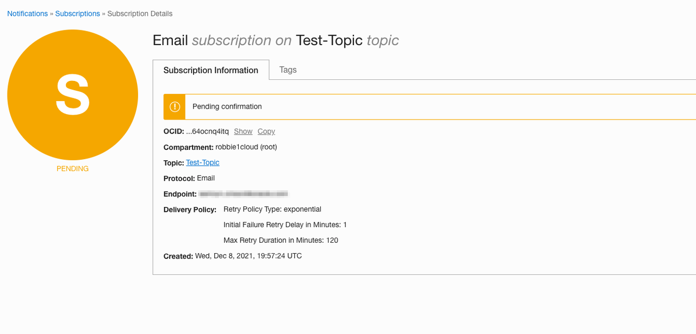

9. Check the email account you specified and click the verification link for this subscription. Switch back to OCI console window and verify the subscription status changed to **Active**. You may need to refresh your browser.

    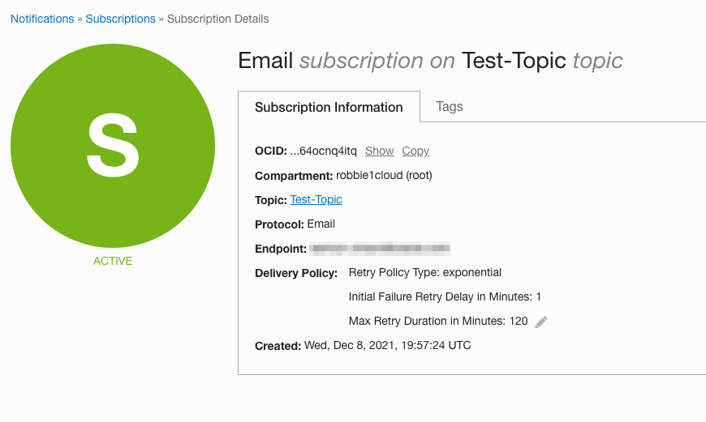

10. You are now subscribed to a Notification topic. Next we will configure Events that will publish messages to this Notification topic.

11. From the OCI Services menu, click **Observability & Management** > **Rules**.

    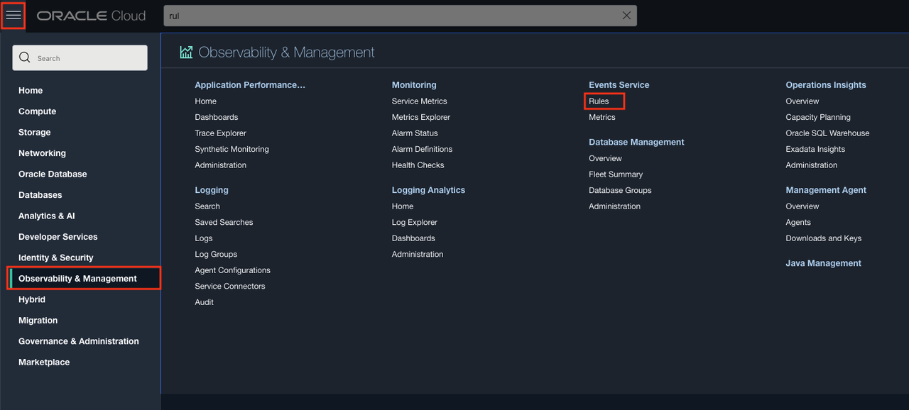

12. Click **Create Rule**, Fill out the dialog box:

    - **DISPLAY NAME** : Provide a name
    - **DESCRIPTION** : Provide a description

    Under **Rule Conditions**

    - Ensure **Event Type** is selected
    - **SERVICE NAME**: Compute
    - **EVENT TYPE** : Choose these 4 Types from the drop down menu. **Instance-Launch Begin**, **Instance-Launch End**, **Instance-Terminate Begin**, **Instance-Terminate End**

    Under **Actions**

    - **ACTION TYPE**: Notifications
    - **NOTIFICATIONS COMPARTMENT**: Choose your compartment
    - **TOPIC**: Choose the topic created earlier

13. Click **Create Rule**.

    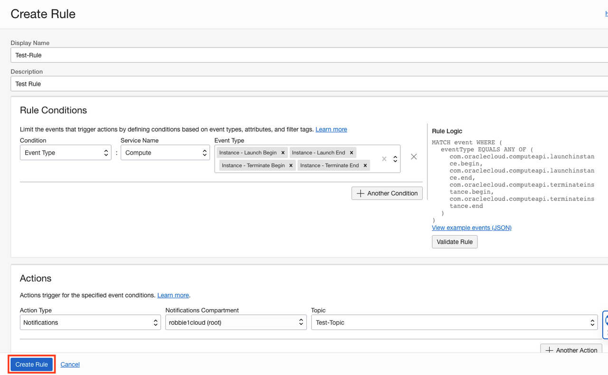

We have now configured Notification service and tied events to it with a specific compartment. When a new compute instance is launched or terminated an email notification will be sent to the email address specified.

## Task 2: Create VCN

1. From the OCI Services menu, click **Networking** > **Virtual Cloud Networks**. 

    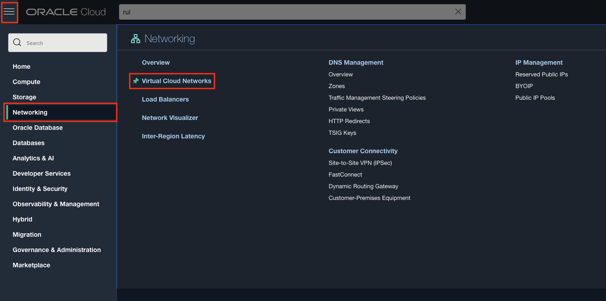

2. Select the compartment assigned to you from the drop down menu on the left part of the screen under Networking and click **Start VCN Wizard**.

    **NOTE:** Ensure the correct Compartment is selected under COMPARTMENT list.

    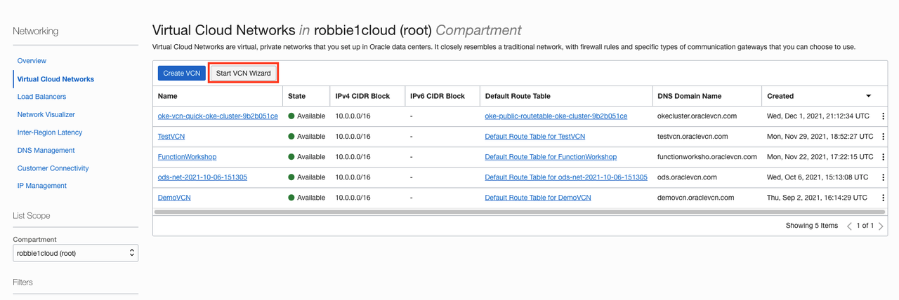    

3. Click **Create VCN with Internet Connectivity** and click **Start VCN Wizard**.

    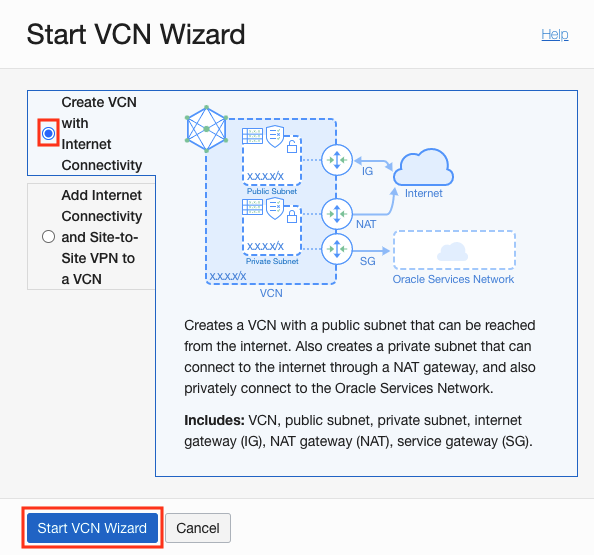

4. Fill out the dialog box:

       - **VCN NAME**: Provide a name
       - **COMPARTMENT**: Ensure your compartment is selected
       - **VCN CIDR BLOCK**: Provide a CIDR block (10.0.0.0/16)
       - **PUBLIC SUBNET CIDR BLOCK**: Provide a CIDR block (10.0.1.0/24)
       - **PRIVATE SUBNET CIDR BLOCK**: Provide a CIDR block (10.0.2.0/24)
       - Click **Next**

    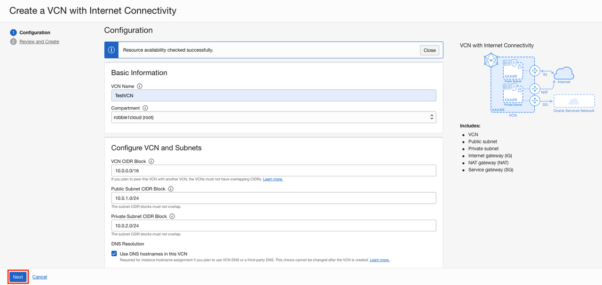       

5. Verify all the information and click **Create**.

    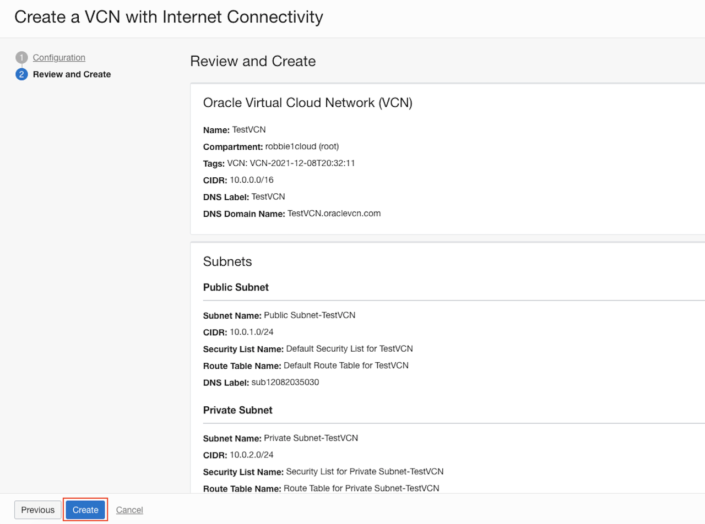

6. This will create a VCN with following components.

    *VCN, Public subnet, Private subnet, Internet gateway (IG), NAT gateway (NAT), Service gateway (SG)*

7. Click **View Virtual Cloud Network** to display your VCN details.

    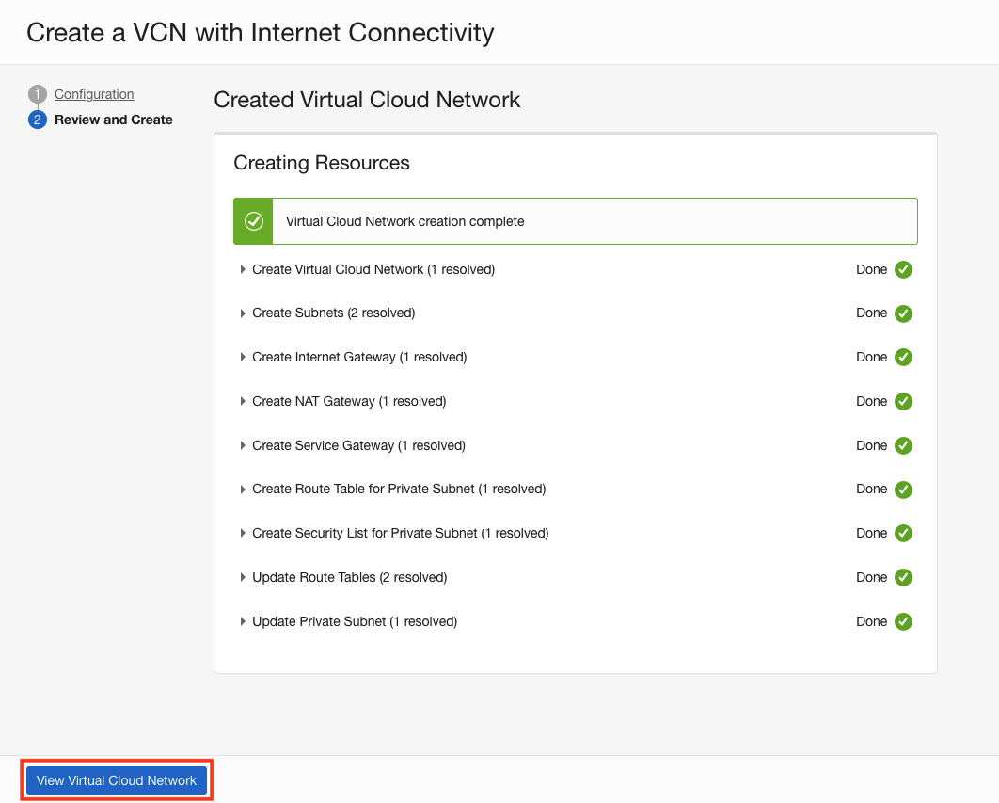

## Task 3: Create compute instance and verify notification

1. From the OCI services menu, click **Compute** > **Instances**.

   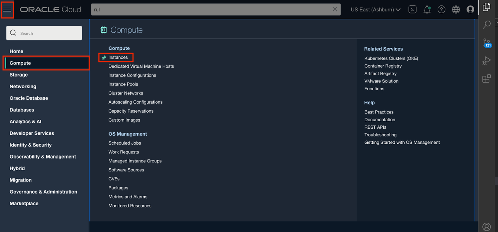

2. Click **Create Instance**. Fill out the dialog box:

      - **Name your instance**: Enter a name
      - **Create in compartment**: Select your compartment
      - **Image and shape**: For the image, we recommend using the Latest Oracle Linux available. For the shape, select a VM shape

      **In the Networking section**
      - **Virtual cloud network**: Choose the VCN
      - **Subnet:** Choose the Public Subnet under **Public Subnets**
      - **Use network security groups to control traffic** : No
      - **Assign a public IPv4 address**: Check this option

   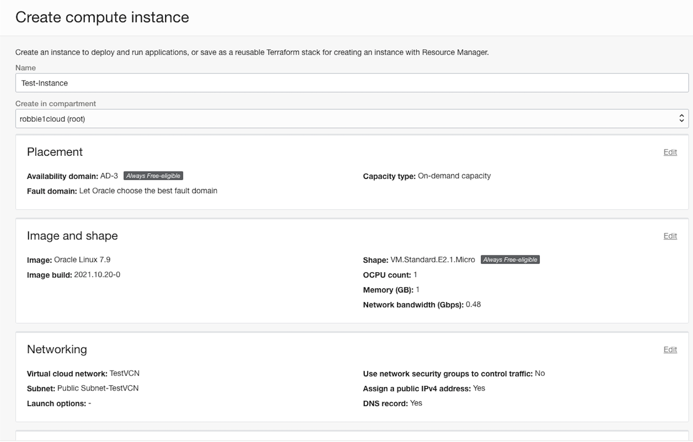

    - **Boot Volume:** Leave the default
    - **Add SSH Keys:** Leave empty

3. Click **Create**.

    **NOTE:** If 'Service limit' error is displayed choose a different shape from VM.Standard2.1, VM.Standard.E2.1, VM.Standard1.1, VM.Standard.B1.1  OR choose a different AD.

   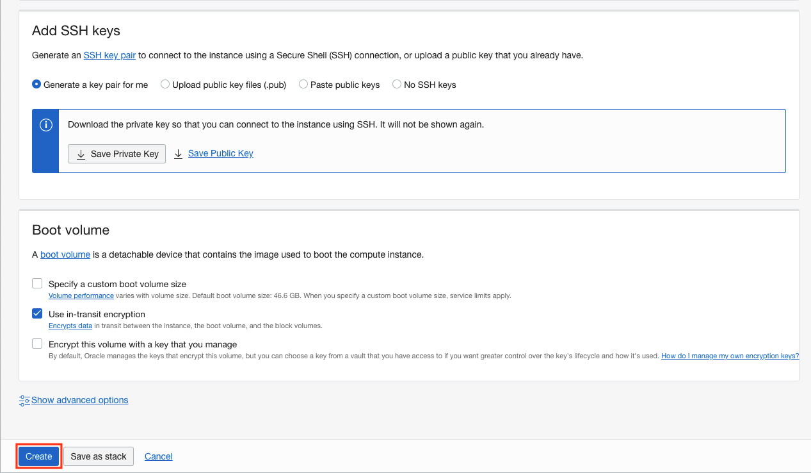

4. Switch to your email account and verify an event indicating compute instance launch was received.

5. Wait for Instance to be in **Running** state.

   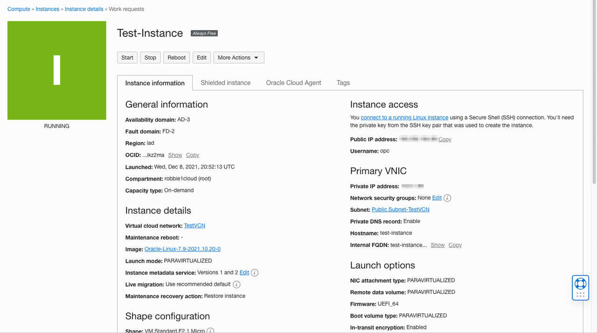

6. Switch to your email account and verify an event indicating compute instance create was received.

## Task 4: Delete the resources

1. From the OCI services menu, click **Compute** > **Instances**.

   

2. Locate your compute instance, click the Action icon and then **Terminate**.

   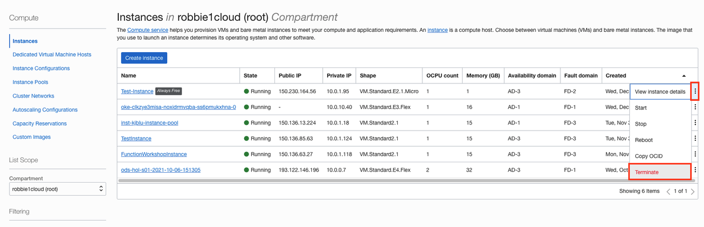

3. Make sure Permanently delete the attached Boot Volume is checked, Click **Terminate Instance**. Wait for instance to fully Terminate.

   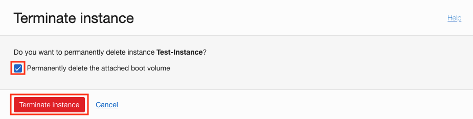

4. Switch to your email account and verify an event indicating compute instance terminate was received.

5. Once the compute instance is fully terminated another email notification will arrive.

6. From the OCI services menu, click **Networking** > **Virtual Cloud Networks**. A list of all VCNs will appear.

   

7. Locate your VCN , Click Action icon and then **Terminate**. Click **Terminate All** in the Confirmation window. Click **Close** once VCN is deleted.

   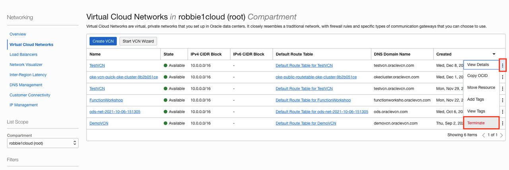

8. Click the **Navigation Menu** in the upper left, navigate to **Developer Services**, and select **Notifications**.

	

9. Click your Topic name. 

   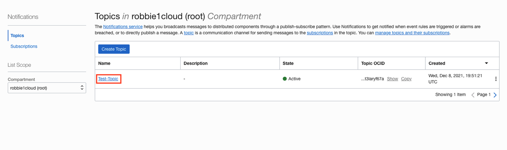

10. Click **Delete**.

   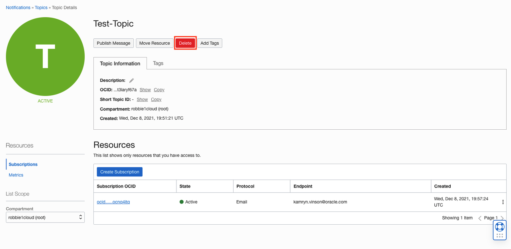

11. From the OCI Services menu, click **Observability & Management** > **Rules**.

   

12. Click the action icon and click **Delete**. 

   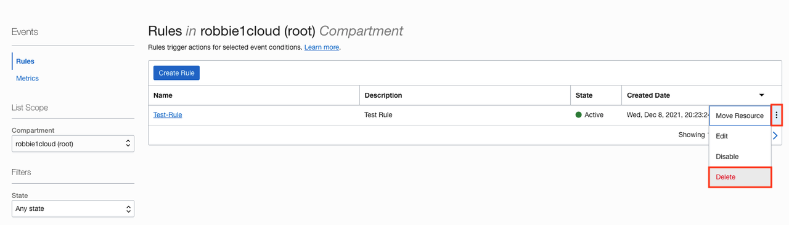

13. In the dialog box type **DELETE** and click **Delete**.

   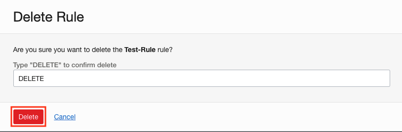

**Congratulations! You have successfully completed the lab.**

## Acknowledgements

- **Author** - Flavio Pereira, Larry Beausoleil
- **Adapted by** -  Yaisah Granillo, Cloud Solution Engineer
- **Contributors** - Arabella Yao, Product Manager, DB Product Management
- **Last Updated By/Date** - Kamryn Vinson, December 2021

