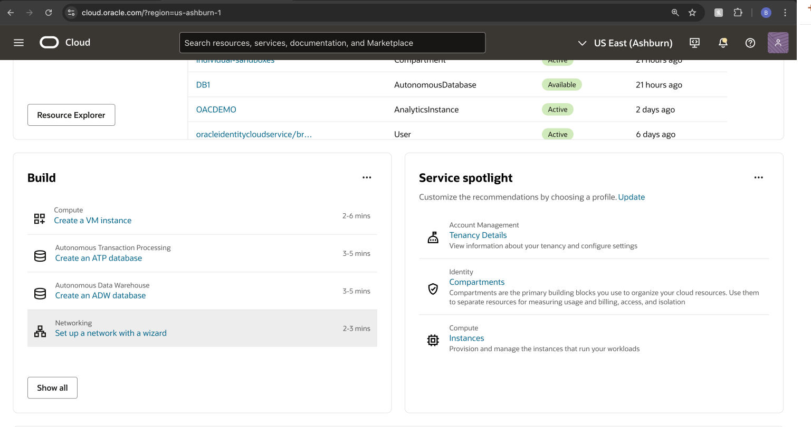
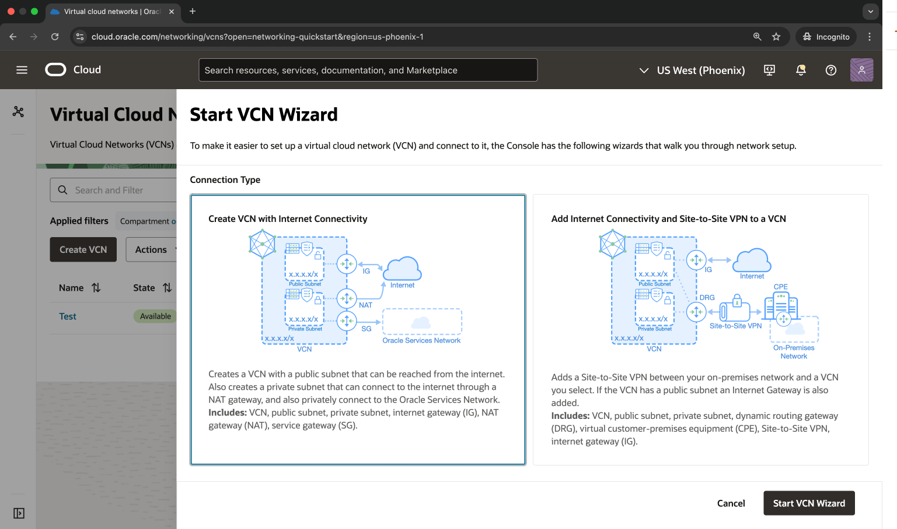
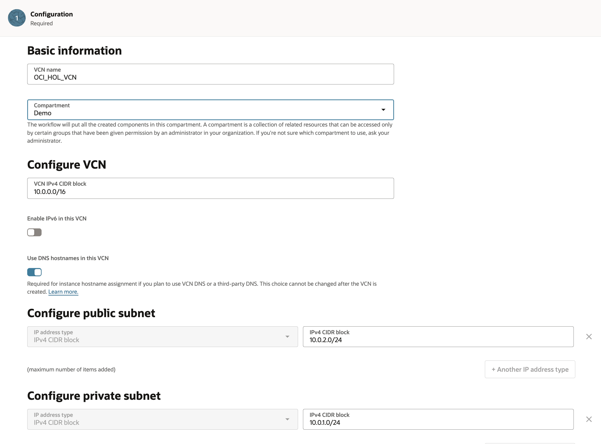
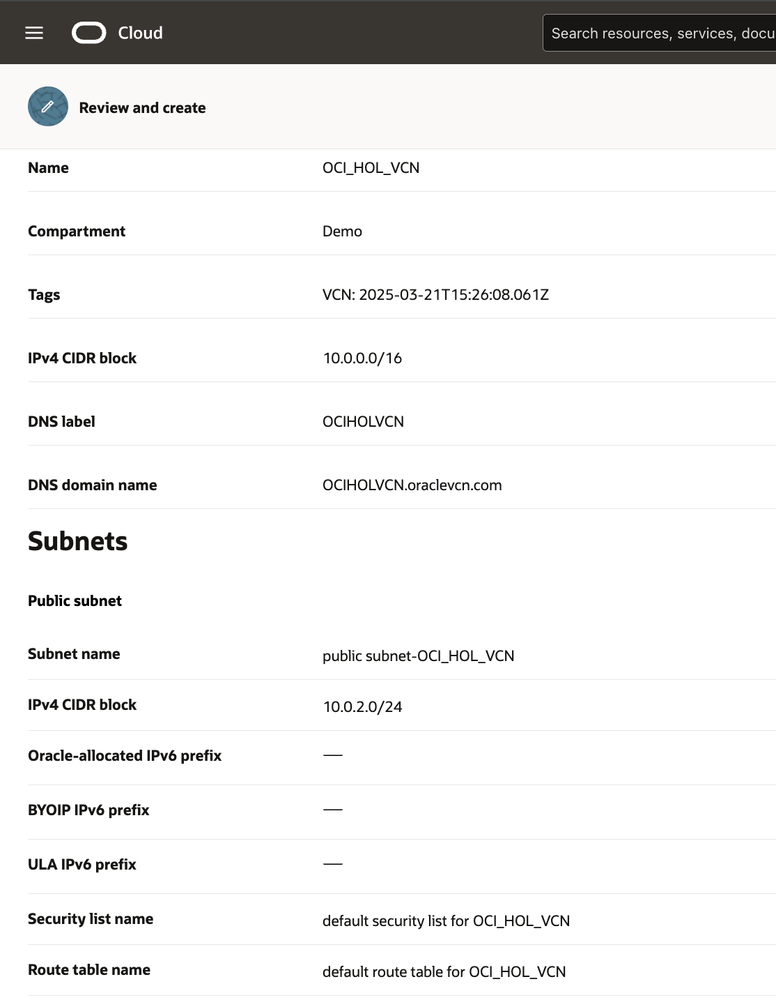
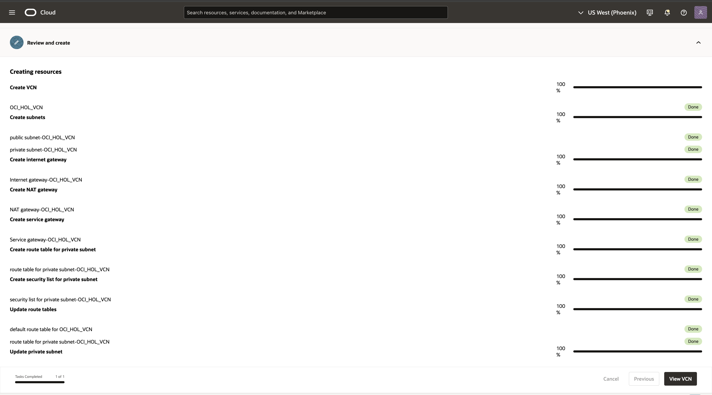

# Create Virtual Cloud Networks

## Introduction

Oracle Cloud Infrastructure (OCI) Compute lets you create multiple Virtual Cloud Networks (VCNs). These VCNs will contain security lists, compute instances, load balancers and many other types of network assets.

Be sure to review [Overview of Networking](https://docs.cloud.oracle.com/iaas/Content/Network/Concepts/overview.htm) to gain a full understanding of the network components and their relationships, or take a look at this video:

Estimated Time: 15 minutes

Here is an instructional video, going through the process of making a VCN:

### Objectives
In this lab, you will:
- Create a virtual cloud network

### Prerequisites

* An Oracle Cloud Account - please view this workshop's LiveLabs landing page to see which environments are supported.

>**Note:** If you have a **Free Trial** account, when your Free Trial expires, your account will be converted to an **Always Free** account. You will not be able to conduct Free Tier workshops unless the Always Free environment is available. 

**[Click here for the Free Tier FAQ page.](https://www.oracle.com/cloud/free/faq.html)**

## Task 1: Create Your VCN

<if type="livelabs">
You are running this workshop in a LiveLabs environment. Our LiveLabs environments use a pre-configured Virtual Cloud Network (VCN), so you will not create a VCN in this workshop. However, you can see how a VCN is created in Oracle Cloud Infrastructure by watching this short video:

 
 </if>

<if type="freetier">
To create a VCN on Oracle Cloud Infrastructure:

1. On the Oracle Cloud Infrastructure Console Home page, under the **Launch Resources** header, click **Set up a network with a wizard**.

    

2. Select **Create VCN with Internet Connectivity**, and then click **Start VCN Wizard**.

    

3. Complete the following fields:

    |                  **Field**              |    **Value**  |
    |----------------------------------------|:------------:|
    |VCN Name |OCI\_HOL\_VCN|
    |Compartment |  Choose the ***Demo*** compartment you created in the ***Identity and Access Management Lab***
    |VCN CIDR Block|10.0.0.0/16|
    |Public Subnet CIDR Block|10.0.2.0/24|
    |Private Subnet CIDR Block|10.0.1.0/24|
    |Use DNS Hostnames In This VCN| Checked|

    Your screen should look similar to the following:

    

     Click the **Next** button at the bottom of the screen.

4. Review your settings to be sure they are correct. Click the **Create** button to create the VCN. 
    

5. It will take a moment to create the VCN and a progress screen will keep you apprised of the workflow.

    

6. Once you see that the creation is complete (see previous screenshot), click the **View Virtual Cloud Network** button.
</if>

### Summary

This VCN will contain all of the other assets that you will create during this set of labs. In real-world situations, you would create multiple VCNs based on their need for access (which ports to open) and who can access them. Both of these concepts are covered in the next lab ***Create a Compute Service***.

## Acknowledgements

- **Author** - Rajeshwari Rai, Prasenjit Sarkar 
- **Contributors** - Oracle LiveLabs QA Team (Kamryn Vinson, QA Intern, Arabella Yao, Product Manager, DB Product Management)
- **Last Updated By/Date** - Arabella Yao, December 2021

