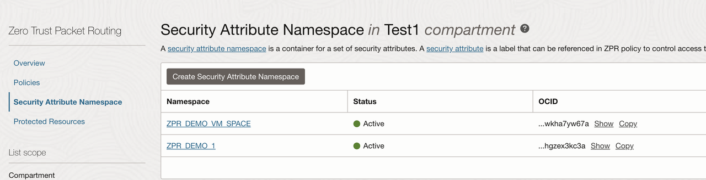

# Save time and make settings clear

## Introduction

Lets examine the benefits of using ZPR over the standard networking configurations.

We can see that we only need to define policies once to give instances access to database or application servers and then we only need to assign ZPR security attributes to those instances to become part of that policy use. We no longer need to deal with sets of IP addresses for those cloud instances. For enabling your employees to jump box onto specific cloud instances, we can give specific VNIC access to those instances and never deal with IP addresses there as well. If you really do need to limit access to just a few people, you still have the option to limit to a few very specific laptop IP addresses.

Estimated Lab Time: 2 minutes

### In this workshop, we did the following

* Created a new ZPR namespace
* Created ZPR security attributes
* Protected a compute instance with ZPR security attributes
* Protected a autonomous database with ZPR security attributes
* Assign security attributes to our VNICs, compute instances and autonomous database
* Created policy to allow limited access to the instance and database resources
* Saw how we had to use the private endpoint of the database with ZPR and how that blocks access from outside of the OCI network

## Task 1: Create a ZPR Namespace

 

 

## Task 2: Create ZPR Attributes

 

## Task 3: Assiging Security Attributes to Resources to protect them

 
 

## Task 4: Creating ZPR Policies

 
 

## Task 5: Private Endpoint use

<!-- I would make it clear that private endpoints has nothing to do with ZPR. A DB can have a private endpoint with out without ZPR. Your explanation makes the two sounds intrisincly linked, when they aren't.-->
 

## Learn More

* [OCI Zero Trust Packet Routing](https://www.oracle.com/security/cloud-security/zero-trust-packet-routing/)
* [ZPR Help documents](https://docs.oracle.com/en-us/iaas/Content/zero-trust-packet-routing/overview.htm)

## Acknowledgements

- **Author** - Jim Smith, Principle Product Manager OCI
- **Contributors** - Dmitry Erastov, Consulting Member of Technical Staff OCI
- **Last Updated By/Date** - Jim Smith, February 2025