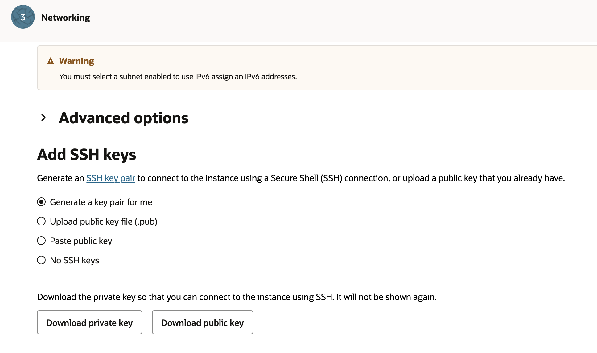
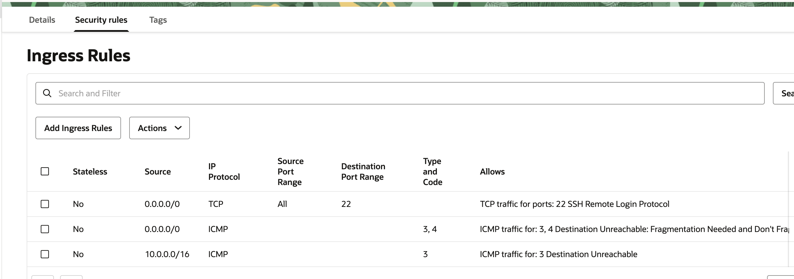
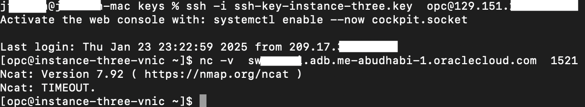

# Limit Access to a Database

## Introduction

<!-- The explanation is generally fine, but for your specific lab use case, it doesn't fit. You explain that we will prevent access from the internet. However, you DB is in a private subnet with public access disabled and therefore isn't internet accessible anywhere. I think you need to re-word your explanation at a little.-->
This lab walks you through the steps needed to protect your database from access that's not from one of your compute instances. This will help prevent someone from the internet from connecting to your database and force your administrators to use approved instances as tagged by your use of ZPR.

Estimated Lab Time: -- 10 minutes

### Using ZPR to Limit Access to your Database

Now lets access your database then use ZPR to protect it and show that you can no longer access it from the internet.

### Objectives

In this lab, you will:

* Connect to your database from a compute instance via SQLPlus
* Protect your database with ZPR
* Show that you can no longer connect to the database
* Add a policy that allows your compute instances to connect with the database
* Show that you can connect to the database from instance one

### Prerequisites (Optional)

This lab assumes you have:

* An Oracle Cloud account or using a livelabs sandbox
* Have already created 2 small compute instances
* Have already created a small autonomous database
* Have created ZPR namespace and some security attributes

> **Note:** - any IP addresses used in image or videos were temporary ones and do not exist for anyone to use.

## Task 1: Verify that you can connect to your database

1. While you would use Oracle SQLPlus to be able to perform administration on the database, we will simply verify that we can or cannot connect to the database for these tests using the Ncat command.

<!-- Where is the user getting these ssh keys from. You haven't explained what keys they are or where they come from, or how the user gets to this screen-->
-- Store the ssh key onto your laptop


* Get the fully qualified domain name (FQDN) of the private endpoint and not the local IP address.


* Make sure that your have allowed traffic to the database and the compute instance. In this test we open it up to all to make this lab simple. In production you would normally set the specific IP addresses only and IP address (or address range).


* Test the connection by running the Ncat command from one of your compute instances. Since the database has a private endpoint you can't connect to that from your laptop. Private endpoints are only available inside your tenancy.
```nc -v <your private endpoint for DB>.oraclecloud.com  1521```


## Task 2: Protect the database

<!-- I think for this tutorial use case you should be more specific with your sec attrs naming and value. For example, you will have seen in my tutorial (https://docs.oracle.com/en/learn/config-oci-zpr/index.html), I was quite prescriptive and meaningful with the sec attrs names and values. -->
1. Now go to ZPR and protect this autonomous database. First, select the database and the private endpoint, and then, next select a security attribute to assign to these resources. You can put another string value into the security attribute value, but remember what you enter as you will need to match that value in your policies.


1. Go back to your ssh compute instance and retest the connection. This will now fail since the database is a protected resource with no policy to allow access to it.


## Task 3: Create a policy to allow access to the database

1. Create a policy to only allow access to the database from one of your compute instances.

You will need to allow your instances and their associated VNICs to access your endpoint on the database. In this example we say that the VCN will allow the safe instances to connect to the database and only with the database connection port of 1521. This assumes that you have also protected your compute instance with a security attribute of safe_instances with a value of 'vm', the database with the attribute auto_db with value of 1 and then finally the VCN with attribute of safe_vcn and value of yes. As we mentioned earlier, you can store any string value in these attributes but now in the policy statements they must match to make the policy work. You can also used pre-defined values within your security attributes to limit the allowed valued.


## Task 4: Remember that you must have a policy to the compute instance

Remember that the compute instance in the above example must be tagged and protected by ZPR so that you can then use that in the policy for database access. You must make sure that you have access to the instance from your laptop. In this policy example we cheated and allowed access to everyone. You would normally only allow access to your computer.


## Task 4: Retest that you can ssh to the compute instance and then connect to the database

Now ssh into your instance so that you can access the database and run the Ncat command again.
```nc -v <your private endpoint for DB>.oraclecloud.com  1521```


## Learn More

* [OCI Zero Trust Packet Routing](https://www.oracle.com/security/cloud-security/zero-trust-packet-routing/)
* [ZPR Help documents](https://docs.oracle.com/en-us/iaas/Content/zero-trust-packet-routing/overview.htm)

## Acknowledgements

- **Author** - Jim Smith, Principle Product Manager OCI
- **Contributors** - Dmitry Erastov, Consulting Member of Technical Staff OCI
- **Last Updated By/Date** - Jim Smith, February 2025