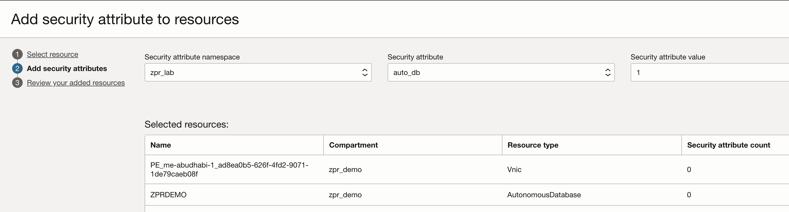
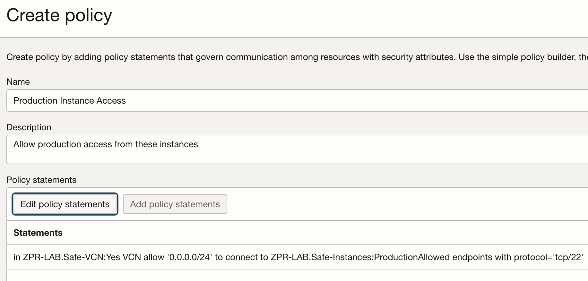

# Limit Access to a Database

## Introduction

This lab walks you through the steps needed to protect your database from access that's not from one of your compute instances. This will help prevent someone not using these instances as a jump box from connecting to your database and force your administrators to use only the approved instances as protected by your use of ZPR attributes.

Estimated Lab Time: -- 10 minutes

### Using ZPR to Limit Access to your Database

Now lets access your database then use ZPR to protect it and show that you can no longer access it from the internet.

### Objectives

In this lab, you will:

* Connect to your database from a compute instance via SQLPlus
* Protect your database with ZPR
* Show that you can no longer connect to the database
* Add a policy that allows your compute instances to connect with the database
* Show that you can connect to the database from instance one

### Prerequisites

This lab assumes you have:

* An Oracle Cloud account or using a livelabs sandbox
* Have already created 2 small compute instances
* Have already created a small autonomous database
* Have created ZPR namespace and some security attributes

> **Note:** - any IP addresses used in image or videos were temporary ones and do not exist for anyone to use.

## Task 1: Verify that you can connect to your database

1. While you would use Oracle SQLPlus to be able to perform administration on the database, we will simply verify that we can or cannot connect to the database for these tests using the Ncat command.
Remember that you downloaded and stored the ssh keys when you created each compute instance. You will now upload the key to instance two to your instance one. This will allow you to use the key from the instance one command line to connect to instance two. If you forgot to download the ssh key or lost the key -- you will need to create a new instance where you make sure to download and store the private key while creating the instance.

-- Store the ssh key onto your laptop


* Get the fully qualified domain name (FQDN) of the private endpoint and not the local IP address.


* Make sure that you have allowed traffic to the database and the compute instance. In this test we open it up to all to make this lab simple. In production you would normally set the specific IP addresses only or a IP address range. It is also a good idea to limit the protocol to port 22 for only ssh use.


* Test the connection by running the Ncat command from one of your compute instances. Since the database has a private endpoint you can't connect to that from your laptop.
```nc -v <your private endpoint for DB>.oraclecloud.com  1521```


## Task 2: Protect the database

<!-- I think for this tutorial use case you should be more specific with your sec attrs naming and value. For example, you will have seen in my tutorial (https://docs.oracle.com/en/learn/config-oci-zpr/index.html), I was quite prescriptive and meaningful with the sec attrs names and values. -->

1. Now go to ZPR and protect this autonomous database. Select the database and the private endpoint and then select the database security attribute to assign to these resources.
Let's choose to use the "Production" security attribute value. Remember what you enter or choose here will need to match the value in your policy statement later.



1. Go back to your ssh compute instance and retest the connection. This will now fail since the database is a protected resource with no policy to allow access to it.


## Task 3: Create a policy to allow access to the database

1. Create a policy to only allow access to the database from one of your compute instances.

You will need to allow your instances to access the private endpoint on the database. In this example we say that the VCN will allow the safe instances to connect to the database over the SQLNET port 1521. This assumes that you have also protected your compute instance with a security attribute of safe-instances with a value of 'vm', the database with the attribute auto_db with value of 1 and then finally the VCN with attribute of safe-vcn and value of yes.


## Task 4: Optional Step - Create ZPR policy allowing SSH access to the compute instances

If you created the policy in the prior lab that allowed instance one to ssh into instance two then you can just ssh into instance one now, ssh into instance two and then run the ncat commend from instance two.

If for some reason you skipped that step then you would need to allow access from the internet to your instance two so that you can log into that instance and then run the ncat command. Of course, you can understand the benefit of only allowing internal OCI instances to access your production instances and you would not normally do this step. This is only to highlight another method to show the connection to the database.

The compute instance in the above example must be associated with a ZPR attribute so that you may reference it in a ZPR policy to allow access to the database. Hence instance two becomes protected just from that step. You must then allow access to instance two from either other instances that meet some security attribute value or from a computer inside say you private network. In this policy example we cheated and allowed access to all IP addresses. You would normally only allow access to your specific computer, your private network or some set of OCI instances that you are running.
 need to write ZPR policy allowing access to the compute instance from all IP addresses to make sure that you can access that host from your laptop. In this policy example we cheated and allowed access to all IP addresses. You would normally only allow access to your computer or your network.



## Task 5: Retest that you can ssh to the compute instance and then connect to the database

Now ssh into your instance so that you can access the database and run the Ncat command again.
```nc -v <your private endpoint for DB>.oraclecloud.com  1521```


## Learn More

* [OCI Zero Trust Packet Routing](https://www.oracle.com/security/cloud-security/zero-trust-packet-routing/)
* [ZPR Help documents](https://docs.oracle.com/en-us/iaas/Content/zero-trust-packet-routing/overview.htm)

## Acknowledgements

- **Author** - Jim Smith, Principle Product Manager OCI
- **Contributors** - Dmitry Erastov, Consulting Member of Technical Staff OCI
- **Last Updated By/Date** - Jim Smith, February 2025