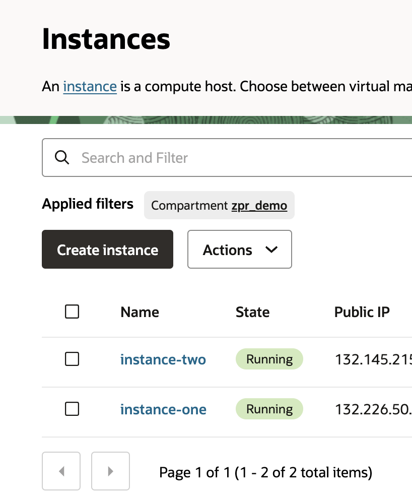
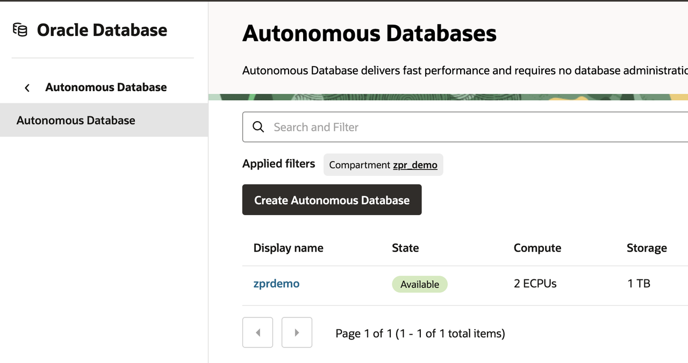
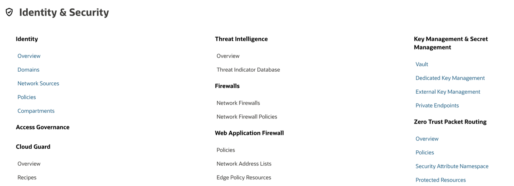
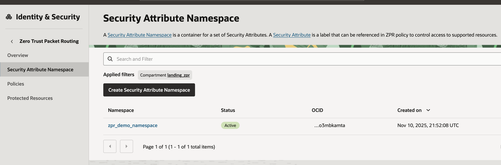

# Create ZPR Namespace and attributes

## Introduction

Estimated Time: -- 10 minutes

### About Zero Trust Packet Routing

Prevent unauthorized access to data by managing network security policy separately from the underlying network architecture with Oracle Cloud Infrastructure (OCI) Zero Trust Packet Routing. Using an easily understood and intent-based policy language, security administrators can define specific access pathways for data. Traffic that is not explicitly allowed by policy cannot travel the network, improving security while simplifying the work of security, network, and audit teams.

### Objectives

In this lab, you will:

* Navigate to the ZPR screen
* Create one namespace
* Define two attributes

### Prerequisites

This lab assumes you have:

* An Oracle Cloud account or using a livelabs sandbox
* Have already created 2 small compute instances
* Have already created a small autonomous database

## Task 1: Verify that you have 2 compute instances and a database ready

Take note of the names of these resources and the IP addresses so that your can ssh.

## Task 2: Create a new namespace

1. Navigate to the ZPR overview

 

1. Navigate to ZPR Security Attribute Namespace

  

  

1. Create a new Namespace

  

## Task 3: Create new security attributes

1. Select the ZPR namespace that you have created

1. Create a security attribute for instances, VCNs and for the database. In this lab we are using: 'auto_db', 'safe_instances' and 'safe_vcn'. You can use anything that makes sense for you.

  

## Learn More

* [OCI Zero Trust Packet Routing](https://www.oracle.com/security/cloud-security/zero-trust-packet-routing/)
* [ZPR Help documents](https://docs.oracle.com/en-us/iaas/Content/zero-trust-packet-routing/overview.htm)

## Acknowledgements

* **Author** - Jim Smith, Principle Product Manager OCI
* **Contributors** - Dmitry Erastov, Consulting Member of Technical Staff OCI
* **Last Updated By/Date** - Jim Smith, January 2025
