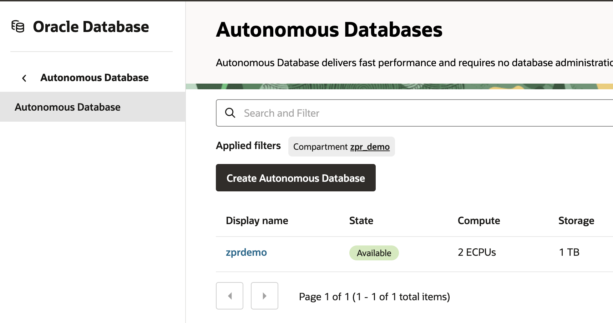
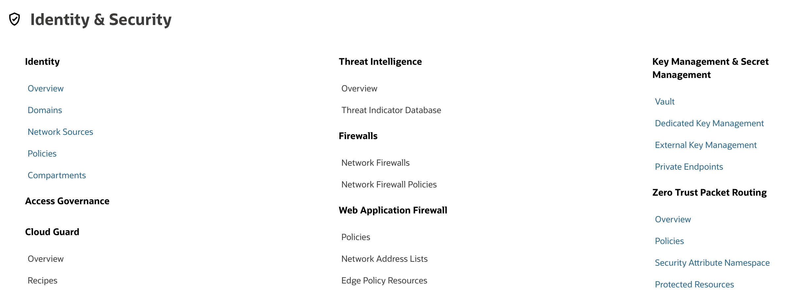
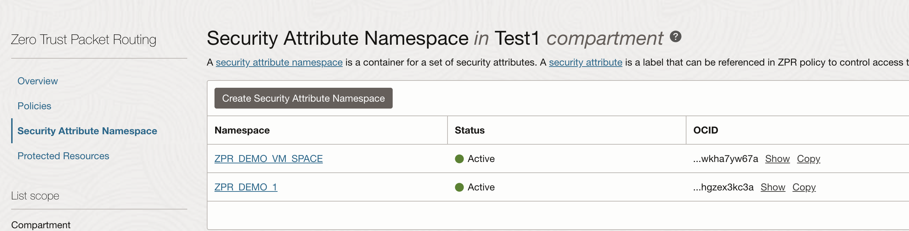

# Create ZPR Namespace and attributes

## Introduction

Estimated Time: -- 10 minutes

### About Zero Trust Packet Routing

<!-- I don't like this paragraph. It is just a repeat from the introduction. For me, this paragraph should be about what this particular lab is going to do, i.e., explain in detail, as well as why you are doing it, and at the end of this lab, what you will have done.-->

Prevent unauthorized access to data by managing network security policy separately from the underlying network architecture with Oracle Cloud Infrastructure (OCI) Zero Trust Packet Routing. Using an easily understood and intent-based policy language, security administrators can define specific access pathways for data. Traffic that is not explicitly allowed by policy cannot traverse the network, improving security while simplifying the work of security, network, and audit teams.

### Objectives

In this lab, you will:

* Navigate to the ZPR screen
* Create one namespace
* Define two attributes

### Prerequisites

This lab assumes you have:

* An Oracle Cloud account or using a livelabs sanvdbox
* Have already created 2 small compute instances
* Have already created a small autonomous database

## Task 1: Verify that you have 2 compute instances and a database ready

Take note of the names of these resources and the IP addresses so that your can ssh.

## Task 2: Create a new namespace

<!-- I'm surprised each tasks doesn't start with a short explanation of what you are doing in this task and why, e.g., why is the user creating a namespace, and more importantly, what even is a namespace -->

1. Navigate to the ZPR overview
<!--- I think all the screenshots where you are telling people where to go, should highlight the option. For example, you tell people to go to the ZPR Overview page then provide the screenshot below. You should highlight (e.g., draw a red box around) the Overview option -->

 

1. Navigate to ZPR Security Attribute Namespace

  

  

1. Create a new Namespace

  

## Task 3: Create new security attributes

1. Select the ZPR namespace that you have created

1. Create a security attribute for instances, VCNs and for the database. In this lab we are using: 'auto_db', 'safe_instances' and 'safe_vcn'. You can use anything that makes sense for you.

<!-- Similar to above, why are we creating these three and why these names. I think you need some explanation -->

  

## Learn More

* [OCI Zero Trust Packet Routing](https://www.oracle.com/security/cloud-security/zero-trust-packet-routing/)
* [ZPR Help documents](https://docs.oracle.com/en-us/iaas/Content/zero-trust-packet-routing/overview.htm)

## Acknowledgements

- **Author** - Jim Smith, Principle Product Manager OCI
- **Contributors** - Dmitry Erastov, Consulting Member of Technical Staff OCI
- **Last Updated By/Date** - Jim Smith, February 2025
