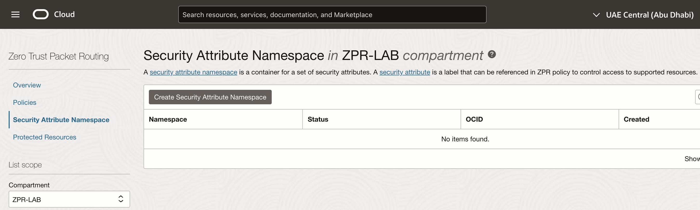

# Create ZPR Namespace and attributes

## Introduction

Estimated Time: -- 10 minutes

### About Zero Trust Packet Routing

A security attribute namespace is a container for a set of security attributes. Security attribute namespaces let you logically organize and secure security attributes. A security attribute is a label that can be referenced in ZPR policy to control access to supported resources. For example, you may want to limit security attribute management for a set of resources to users in a particular group. You would achieve this using a custom ZPR namespace. Once these attributes have been defined into your namespace we will apply them in the next lab.

### Objectives

In this lab, you will:

* Navigate to the ZPR console
* Create one namespace
* Define two attributes

You should use a ZPR namespace to store and organize your attributes into groups that make the most sense to your use case. While you can just create your attributes in the default ZPR namespace, it's good practice to create different namespaces to help you organize into groups based on the purpose like an application or database as examples.

### Prerequisites

This lab assumes you have:

* An Oracle Cloud account or using a livelabs sandbox
* Have already created 2 small compute instances
* Have already created a small autonomous database

## Task 1: Verify that you have 2 compute instances and a database ready

Take note of the names and IP addresses of your resources so you can successfully ssh into them.

## Task 2: Create a new namespace

1. Navigate to the ZPR console

 

1. Navigate to ZPR Security Attribute Namespace

  

1. Create a new Namespace

  

## Task 3: Create new security attributes

1. Select the ZPR namespace that you have created

1. Create a security attribute for instances, VCNs and for the database. In this lab we want to have specific attributes that will cover your database, instances and then your associated vcn. So you can use similar attribute names like: 'special-db', 'safe-instances' and 'safe-vcn'. You can use anything that makes sense for you to keep these three resource types separated.

  

- Create vcn attribute
  

- Create instances attribute
  

- Create database attribute
  

## Learn More

* [OCI Zero Trust Packet Routing](https://www.oracle.com/security/cloud-security/zero-trust-packet-routing/)
* [ZPR Help documents](https://docs.oracle.com/en-us/iaas/Content/zero-trust-packet-routing/overview.htm)

## Acknowledgements

- **Author** - Jim Smith, Principle Product Manager OCI
- **Contributors** - Dmitry Erastov, Consulting Member of Technical Staff OCI
- **Last Updated By/Date** - Jim Smith, February 2025