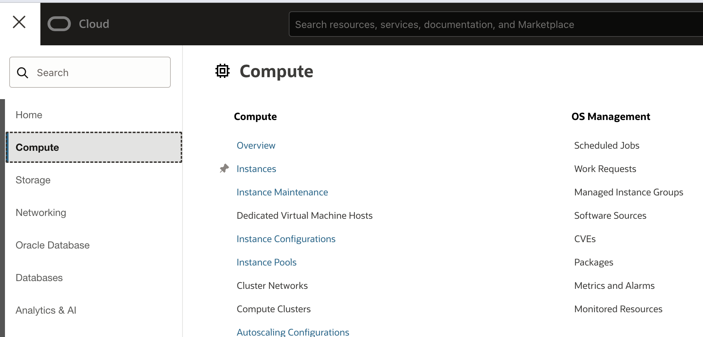
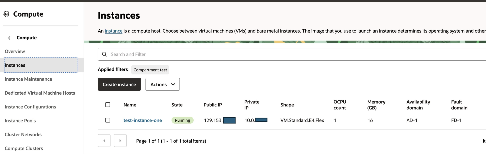
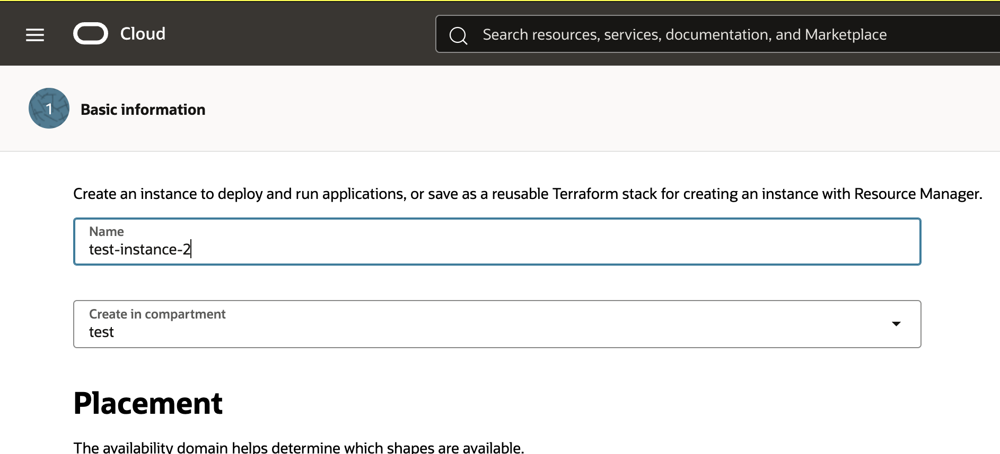
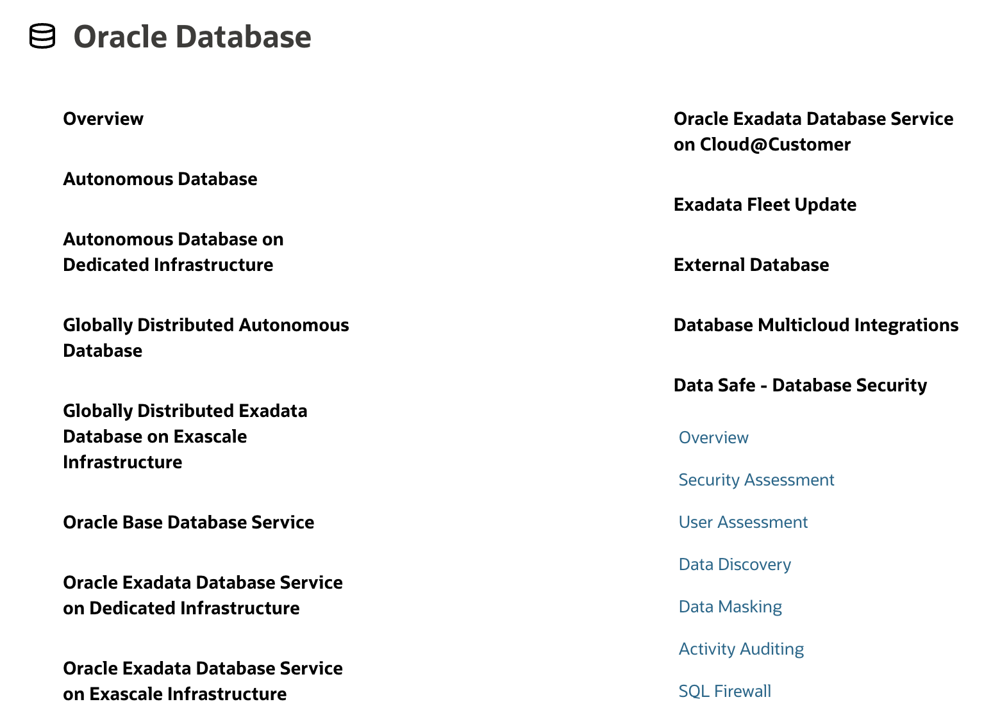
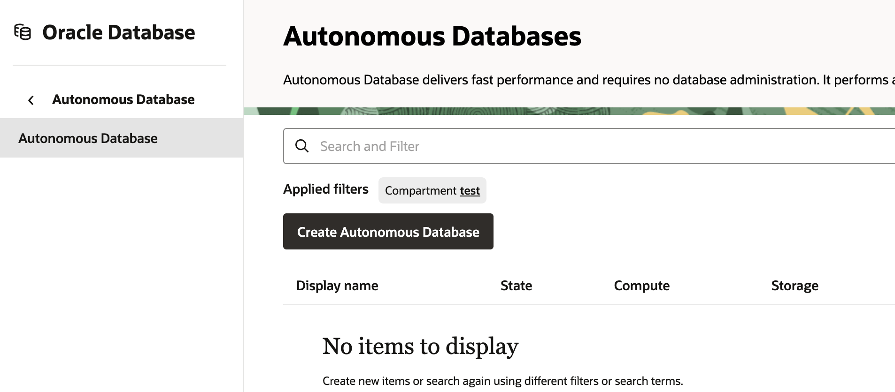
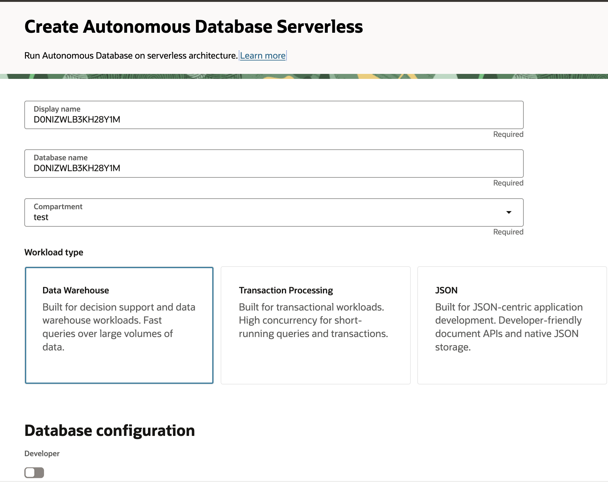

# Create 2 Instances and an autonomous database

## Introduction

Create 2 small compute instances and a small autonomous database in your tenancy.
Estimated Time: -- 5 minutes

### What resources are needed?

You will need to create 2 compute instances and a database. You will in a later lab protect the database and one instance with ZPR attributes and polices.

### Objectives

In this lab, you will:

* Create 2 compute instances
* Create an autonomous database

## Task 1: Create Instance one and two

1. Navigate to compute

 

 

1. Create an instance with a recent version Oracle Linux, store the ssh key for this instance and make sure that you allow an external IP address

  

  **Note:** Make sure that you store the ssh key for the instance

  

1. Create instance two with the same requirements as you used for instance one

## Task 2: Create an Autonomous Database

1. Navigate to Database

  

  

1. Create a new Autonomous database

  

  Make sure that you allow access from everywhere for this example. You might never do this in your production setting but this is easy for showing access and blocking access in your lab work.

  

## Acknowledgements

- **Author** - Jim Smith, Principle Product Manager OCI
- **Contributors** - Dmitry Erastov, Consulting Member of Technical Staff OCI
- **Last Updated By/Date** - Jim Smith, February 2025
