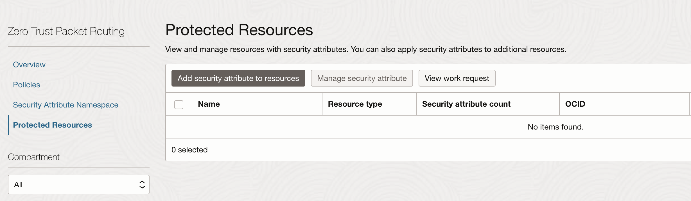
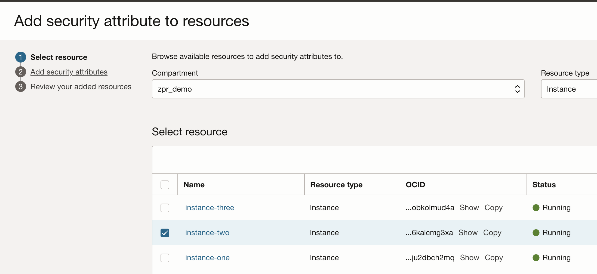

# Limit Access to a compute host

## Introduction

Estimated Lab Time: -- 10 minutes

### About Zero Trust Packet Routing Protection
<!-- I don't like this paragraph. It is just a repeat from the introduction. For me, this paragraph should be about what this particular lab is going to do, i.e., explain in detail, as well as why you are doing it, and at the end of this lab, what you will have done.-->
Prevent unauthorized access to an instance by managing network security policy separately from the underlying network architecture with Oracle Cloud Infrastructure (OCI) Zero Trust Packet Routing.

### Objectives

In this lab, you will:

* ssh into both your lab instances from your computer
* ssh into instance one and then ssh into instance two from instance one
* Navigate to the ZPR policy screen
* Write a ZPR policy that protects instance two
* See that you can no longer ssh into instance two from instance one or your computer
* Create a ZPR policy to allow instance one to access instance two

### Prerequisites

This lab assumes you have:

* An Oracle Cloud account or using a livelabs sandbox
* Have already created 2 small compute instances
* Have already created a small autonomous database
* Have created ZPR namespace and some security attributes

> **Note:** - any IP addresses used in image or videos were temporary ones and do not exist for anyone to use.

## Task 1: ssh into both instances

It's a good idea to keep the ssh keys for your instances in the same place. Make sure that you copy the key for instance two onto your instance one.
Let's ssh from your computer into both instances and then also ssh into instance two from instance one.

* Copy the ssh key for instance two to instance one

 ```
  <copy>
  smith@smith-mac keys % scp -i ssh-key-instance-one.key ssh-key-instance-two.key opc@xxx.xxx.xxx.xxx:/home/opc/two.key

  ssh-key-instance-two.key              100% 1675    22.3KB/s   00:00
  </copy>
  ```

* ssh into instance two and then exit that session.

 ```
  <copy>smith@smith-mac keys % ssh -i ssh-key-instance-two.key  opc@xxx.xxx.xxx.two
    Last login: Fri Dec  6 23:00:28 2024 from yyy.yyy.yyy.yyy
    [opc@instance-two ~]$ ls -ls
    total 0
    [opc@instance-two ~]$ pwd
    /home/opc
    [opc@instance-two ~]$ exit
    logout
    </copy>
  ```
* ssh into instance one and while in that session also ssh into instance two
  ```
  <copy>smith@smith-mac keys % ssh -i ssh-key-instance-one.key  opc@xxx.xxx.xxx.one
    Last login: Fri Dec  6 22:00:00 2024 from yyy.yyy.yyy.yyy
    [opc@instance-one ~]$ ls -ls
    total 0
    [opc@instance-one ~]$ pwd
    /home/opc
    ssh -i ssh-key-instance-two.key  opc@xxx.internal.ip.two
    [opc@instance-two ~] exit
    logout
    [opc@instance-one ~] exit
    logout
    </copy>
  ```

## Task 2: Navigate to the ZPR policy screen and protect instance two

1. Navigate to ZPR Protected Resources

  

1. Add a security attribute to a resource. In this case we will choose instance two and associate that with the safe_instance attribute. Once this is completed it will then block connections from everywhere to instance two.

  

<!-- I think you need screenshots for all steps of the flow and the final screenshot to show that instance two is not listed under Protected Resources -->

## Task 3: Try to ssh into instance 2

Try to ssh from your laptop and also try from your first compute instance.
```
  <copy>smith@smith-mac keys % ssh -i ssh-key-instance-two.key  opc@xxx.xxx.xxx.two
    ssh: connect to host xxx.xxx.xxx.two port 22: Connection refused
    </copy>


  <copy>smith@smith-mac keys % ssh -i ssh-key-instance-one.key  opc@xxx.xxx.xxx.one
    Last login: Fri Dec  6 22:00:00 2024 from yyy.yyy.yyy.yyy
    [opc@instance-one ~]$ ls -ls
    total 0
    [opc@instance-one ~]$ pwd
    /home/opc
    ssh -i ssh-key-instance-two.key  opc@xxx.internal.ip.two
    ssh: connect to host xxx.internal.ip.two port 22: Connection refused
    [opc@instance-one ~] exit
    logout
    </copy>
  ```

## Task 4: Navigate to the ZPR policy screen and configure access to instance two

<!-- The step below is what I would expect every step to look like, with a detailed explanation -->
1. Navigate to ZPR policies screen and create a policy to allow instance one to connect to instance two. This will allow just this one instance to connect to instance two. This is how you can control who/what can access your compute instances. Reviewing these policies allow you to know exactly what's going to be able to communicate with a given instance.
**Note:** Currently - you must allow the security rule to allow ingress for at least port 22. In later releases we will not need to worry about this setting as ZPR will fully control this access.

<!-- As a security practicioner, even for a lab I wouldn't be advocating the creation of a 0.0.0.0/0 Any Protocols inbound rule. I would limit it to 22 at least.-->
  

<!-- Wrong screenshot. You need a policy screenshot-->
  

<!-- Wrong step. You have already added the sec attr, now you are defining the policy-->
1. Select the resource - instance two and then select the security attribute that you want to add to your resource.

  

## Task 5: Try to ssh into instance 2

```
  <copy>smith@smith-mac keys % ssh -i ssh-key-instance-two.key  opc@xxx.xxx.xxx.two
    ssh: connect to host xxx.xxx.xxx.two port 22: Connection refused
    </copy>


  <copy>smith@smith-mac keys % ssh -i ssh-key-instance-one.key  opc@xxx.xxx.xxx.one
    Last login: Fri Dec  6 22:00:00 2024 from yyy.yyy.yyy.yyy
    [opc@instance-one ~]$ ls -ls
    total 0
    [opc@instance-one ~]$ pwd
    /home/opc
    ssh -i ssh-key-instance-two.key  opc@xxx.internal.ip.two
    [opc@instance-two ~] exit
    logout
    [opc@instance-one ~] exit
    logout
    </copy>
  ```

> **Note:** that you can now only log into instance two from instance one. All connections attempts from the internet are blocked as well as from all other OCI compute instances.

## Learn More

* [OCI Zero Trust Packet Routing](https://www.oracle.com/security/cloud-security/zero-trust-packet-routing/)
* [ZPR Help documents](https://docs.oracle.com/en-us/iaas/Content/zero-trust-packet-routing/overview.htm)

## Acknowledgements

* **Author** - Jim Smith, Principle Product Manager OCI
* **Contributors** - Dmitry Erastov, Consulting Member of Technical Staff OCI
* **Last Updated By/Date** - Jim Smith, January 2025